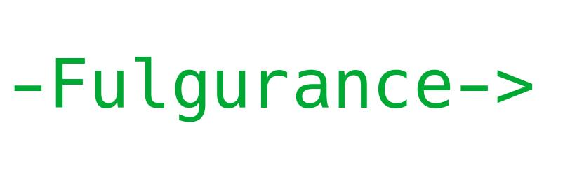
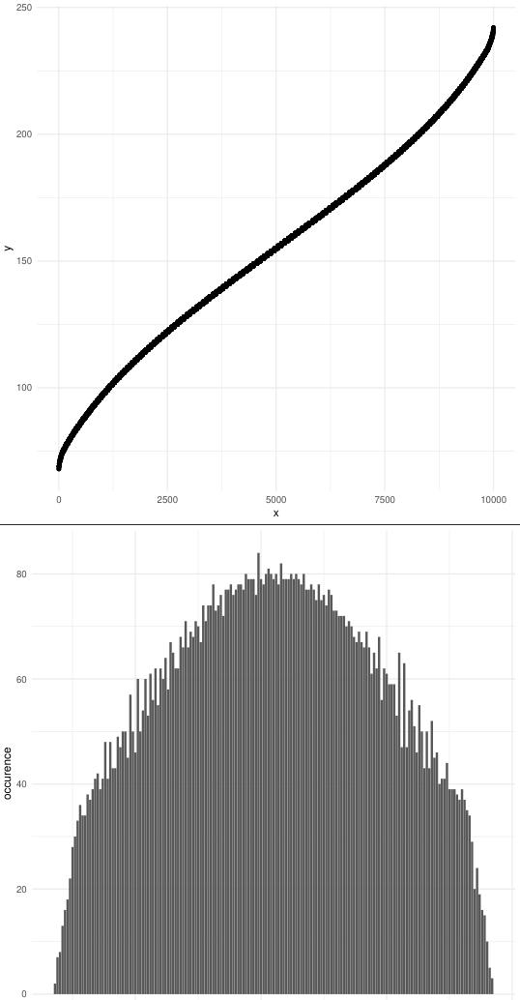
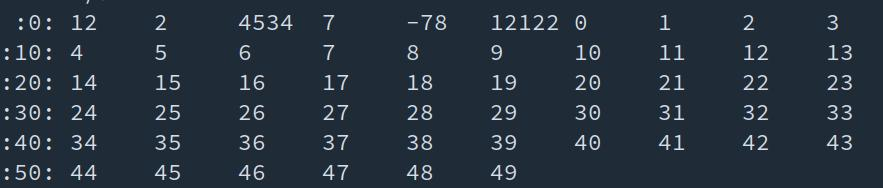
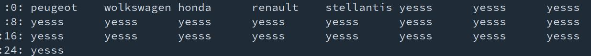
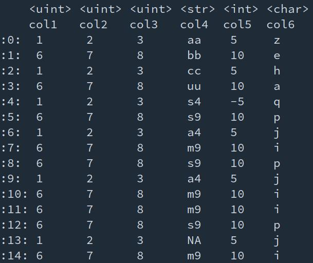
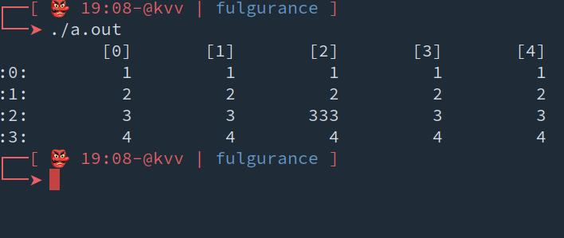
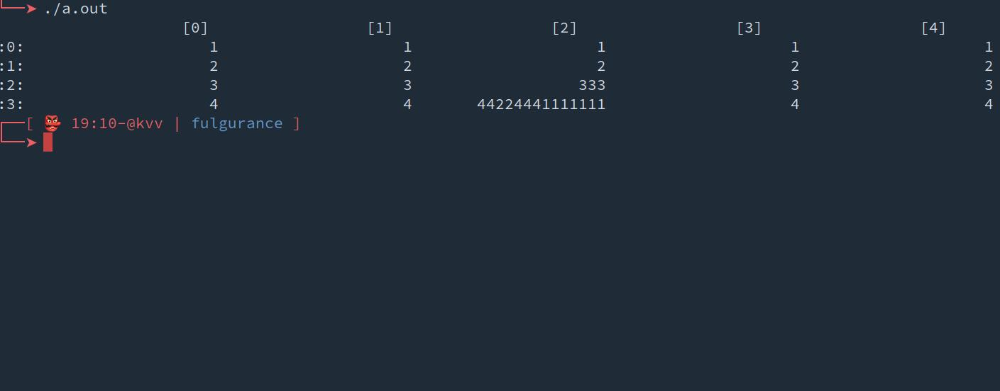
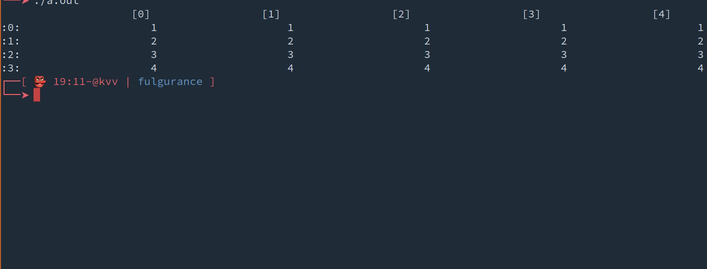

<body>

<i><b>README</b></i>
 

<a><i>Table Of Contents</i></a>  <ul>
<a href="#INTRODUCTION" style="margin-left:0px;">INTRODUCTION</a>
 
<b><li style="margin-left:20px; color: #2c4786;">Commun functions  </li></b>
<b><li style="margin-left:40px; color: #2c4786;">On elements</li></b>
<b><li style="margin-left:60px; color: #2c4786;">Standard operations</li></b>
<a href="#mod" style="margin-left:80px;">mod</a>
 
<a href="#int_lngth" style="margin-left:80px;">int_lngth</a>
 
<a href="#roundout" style="margin-left:80px;">roundout</a>
 
<a href="#roundin" style="margin-left:80px;">roundin</a>
 
<a href="#randint" style="margin-left:80px;">randint</a>
 
<a href="#logn" style="margin-left:80px;">logn</a>
 
<a href="#Facto" style="margin-left:80px;">Facto</a>
 
<a href="#Comb" style="margin-left:80px;">Comb</a>
 
<b><li style="margin-left:60px; color: #2c4786;">String to int, float, double</li></b>
<a href="#si" style="margin-left:80px;">si</a>
 
<a href="#sf" style="margin-left:80px;">sf</a>
 
<a href="#sf2" style="margin-left:80px;">sf2</a>
 
<a href="#stod" style="margin-left:80px;">stod</a>
 
<b><li style="margin-left:60px; color: #2c4786;">Int, double, to string</li></b>
<a href="#itos" style="margin-left:80px;">itos</a>
 
<b><li style="margin-left:60px; color: #2c4786;">RegEx</li></b>
<a href="#regex_match" style="margin-left:80px;">regex_match</a>
 
<a href="#regex_grep" style="margin-left:80px;">regex_grep</a>
 
<a href="#regex_subout" style="margin-left:80px;">regex_subout</a>
 
<a href="#regex_subout_all" style="margin-left:80px;">regex_subout_all</a>
 
<a href="#regex_subin" style="margin-left:80px;">regex_subin</a>
 
<a href="#regex_subin_all" style="margin-left:80px;">regex_subin_all</a>
 
<b><li style="margin-left:40px; color: #2c4786;">Can be num ?</li></b>
<a href="#can_be_nb" style="margin-left:60px;">can_be_nb</a>
 
<a href="#can_be_flt_dbl" style="margin-left:60px;">can_be_flt_dbl</a>
 
<b><li style="margin-left:40px; color: #2c4786;">On std::vector&lt;Type&gt;</li></b>
<b><li style="margin-left:60px; color: #2c4786;">Statistical functions</li></b>
<a href="#sum" style="margin-left:80px;">sum</a>
 
<a href="#Mean" style="margin-left:80px;">Mean</a>
 
<a href="#quantile" style="margin-left:80px;">quantile</a>
 
<a href="#med" style="margin-left:80px;">med</a>
 
<a href="#cor" style="margin-left:80px;">cor</a>
 
<a href="#Sd" style="margin-left:80px;">Sd</a>
 
<b><li style="margin-left:80px; color: #2c4786;">Uniform distribution</li></b>
<a href="#dunif" style="margin-left:100px;">dunif</a>
 
<a href="#punif" style="margin-left:100px;">punif</a>
 
<a href="#qunif" style="margin-left:100px;">qunif</a>
 
<a href="#runif" style="margin-left:100px;">runif</a>
 
<b><li style="margin-left:80px; color: #2c4786;">Normal distribution</li></b>
<a href="#rnorm" style="margin-left:100px;">rnorm</a>
 
<a href="#rnorm2 " style="margin-left:100px;">rnorm2 </a>
 
<a href="#qnorm1" style="margin-left:100px;">qnorm1</a>
 
<a href="#qnorm2" style="margin-left:100px;">qnorm2</a>
 
<a href="#dnorm" style="margin-left:100px;">dnorm</a>
 
<a href="#pnorm" style="margin-left:100px;">pnorm</a>
 
<b><li style="margin-left:80px; color: #2c4786;">Binomial</li></b>
<a href="#dbinom " style="margin-left:100px;">dbinom </a>
 
<a href="#pbinom " style="margin-left:100px;">pbinom </a>
 
<a href="#qbinom" style="margin-left:100px;">qbinom</a>
 
<a href="#rbinom " style="margin-left:100px;">rbinom </a>
 
<b><li style="margin-left:80px; color: #2c4786;">Poisson</li></b>
<a href="#dpois" style="margin-left:100px;">dpois</a>
 
<a href="#ppois" style="margin-left:100px;">ppois</a>
 
<a href="#qpois" style="margin-left:100px;">qpois</a>
 
<a href="#rpois" style="margin-left:100px;">rpois</a>
 
<b><li style="margin-left:80px; color: #2c4786;">Exponential distribution</li></b>
<a href="#dexp" style="margin-left:100px;">dexp</a>
 
<a href="#pexp" style="margin-left:100px;">pexp</a>
 
<a href="#qexp" style="margin-left:100px;">qexp</a>
 
<a href="#rexp" style="margin-left:100px;">rexp</a>
 
<b><li style="margin-left:80px; color: #2c4786;">Cauchy</li></b>
<a href="#dcauchy" style="margin-left:100px;">dcauchy</a>
 
<a href="#pcauchy" style="margin-left:100px;">pcauchy</a>
 
<a href="#qcauchy " style="margin-left:100px;">qcauchy </a>
 
<a href="#rcauchy" style="margin-left:100px;">rcauchy</a>
 
<b><li style="margin-left:80px; color: #2c4786;">Gamma distribution</li></b>
<a href="#dgamma" style="margin-left:100px;">dgamma</a>
 
<a href="#pgamma" style="margin-left:100px;">pgamma</a>
 
<a href="#qgamma" style="margin-left:100px;">qgamma</a>
 
<a href="#rgamma" style="margin-left:100px;">rgamma</a>
 
<b><li style="margin-left:80px; color: #2c4786;">Beta distribution</li></b>
<a href="#dbeta" style="margin-left:100px;">dbeta</a>
 
<a href="#pbeta" style="margin-left:100px;">pbeta</a>
 
<a href="#qbeta" style="margin-left:100px;">qbeta</a>
 
<a href="#rbeta" style="margin-left:100px;">rbeta</a>
 
<b><li style="margin-left:80px; color: #2c4786;">Chi Square distribution</li></b>
<a href="#dchisq" style="margin-left:100px;">dchisq</a>
 
<a href="#pchisq" style="margin-left:100px;">pchisq</a>
 
<a href="#qchisq" style="margin-left:100px;">qchisq</a>
 
<a href="#rchisq" style="margin-left:100px;">rchisq</a>
 
<a href="#test_chisq_fit" style="margin-left:100px;">test_chisq_fit</a>
 
<a href="#test_chisq_independance" style="margin-left:100px;">test_chisq_independance</a>
 
<b><li style="margin-left:80px; color: #2c4786;">Geometric distributions</li></b>
<a href="#dgeom" style="margin-left:100px;">dgeom</a>
 
<a href="#pgeom" style="margin-left:100px;">pgeom</a>
 
<a href="#qgeom" style="margin-left:100px;">qgeom</a>
 
<a href="#rgeom" style="margin-left:100px;">rgeom</a>
 
<b><li style="margin-left:80px; color: #2c4786;">Hypergeometric distribution</li></b>
<a href="#dhyper" style="margin-left:100px;">dhyper</a>
 
<a href="#phyper" style="margin-left:100px;">phyper</a>
 
<a href="#qhyper" style="margin-left:100px;">qhyper</a>
 
<a href="#rhyper" style="margin-left:100px;">rhyper</a>
 
<b><li style="margin-left:60px; color: #2c4786;">Min - Max</li></b>
<a href="#min" style="margin-left:80px;">min</a>
 
<a href="#max" style="margin-left:80px;">max</a>
 
<b><li style="margin-left:60px; color: #2c4786;">Mixing </li></b>
<b><li style="margin-left:80px; color: #2c4786;">Heuristic (slightly slower)</li></b>
<a href="#mixout" style="margin-left:100px;">mixout</a>
 
<a href="#mixin" style="margin-left:100px;">mixin</a>
 
<b><li style="margin-left:80px; color: #2c4786;">Deterministic (slightly faster)</li></b>
<a href="#mixoutd" style="margin-left:100px;">mixoutd</a>
 
<a href="#mixind" style="margin-left:100px;">mixind</a>
 
<b><li style="margin-left:60px; color: #2c4786;">Print</li></b>
<a href="#print_nvec" style="margin-left:80px;">print_nvec</a>
 
<a href="#print_svec" style="margin-left:80px;">print_svec</a>
 
<b><li style="margin-left:60px; color: #2c4786;">Parts </li></b>
<a href="#getpart" style="margin-left:80px;">getpart</a>
 
<b><li style="margin-left:80px; color: #2c4786;">Add parts to existing stl vector</li></b>
<a href="#partout" style="margin-left:100px;">partout</a>
 
<a href="#partin" style="margin-left:100px;">partin</a>
 
<b><li style="margin-left:60px; color: #2c4786;">Absolute values</li></b>
<a href="#abs_vin" style="margin-left:80px;">abs_vin</a>
 
<a href="#abs_vout" style="margin-left:80px;">abs_vout</a>
 
<a href="#abs_voutb" style="margin-left:80px;">abs_voutb</a>
 
<b><li style="margin-left:60px; color: #2c4786;">Match</li></b>
<a href="#matchl" style="margin-left:80px;">matchl</a>
 
<a href="#match" style="margin-left:80px;">match</a>
 
<a href="#match_max" style="margin-left:80px;">match_max</a>
 
<a href="#match_min" style="margin-left:80px;">match_min</a>
 
<b><li style="margin-left:60px; color: #2c4786;">Grep</li></b>
<a href="#grep" style="margin-left:80px;">grep</a>
 
<a href="#grepl" style="margin-left:80px;">grepl</a>
 
<b><li style="margin-left:60px; color: #2c4786;">Unique</li></b>
<a href="#unique" style="margin-left:80px;">unique</a>
 
<b><li style="margin-left:60px; color: #2c4786;">Reverse</li></b>
<a href="#reverse_out" style="margin-left:80px;">reverse_out</a>
 
<a href="#reverse_in" style="margin-left:80px;">reverse_in</a>
 
<a href="#reverse_out_standard" style="margin-left:80px;">reverse_out_standard</a>
 
<b><li style="margin-left:60px; color: #2c4786;">Repetition of elements</li></b>
<a href="#rep" style="margin-left:80px;">rep</a>
 
<b><li style="margin-left:60px; color: #2c4786;">Sequence/Range of elements</li></b>
<a href="#seq " style="margin-left:80px;">seq </a>
 
<b><li style="margin-left:60px; color: #2c4786;">Comparisons to booleans </li></b>
<a href="#comp2" style="margin-left:80px;">comp2</a>
 
<b><li style="margin-left:80px; color: #2c4786;">Variadic / Indefinite number of arguments - Compv Class</li></b>
<a href="#Compv.to_comp()" style="margin-left:100px;">Compv.to_comp()</a>
 
<b><li style="margin-left:60px; color: #2c4786;">Bool and indices conversions</li></b>
<a href="#bool_to_idx" style="margin-left:80px;">bool_to_idx</a>
 
<a href="#idx_to_bool" style="margin-left:80px;">idx_to_bool</a>
 
<b><li style="margin-left:60px; color: #2c4786;">Lower</li></b>
<a href="#lowercomp2" style="margin-left:80px;">lowercomp2</a>
 
<b><li style="margin-left:60px; color: #2c4786;">Greater</li></b>
<a href="#greatercomp2" style="margin-left:80px;">greatercomp2</a>
 
<b><li style="margin-left:60px; color: #2c4786;">Any - All</li></b>
<a href="#any" style="margin-left:80px;">any</a>
 
<a href="#all" style="margin-left:80px;">all</a>
 
<b><li style="margin-left:60px; color: #2c4786;">Sorting algorithms </li></b>
<a href="#sort_descin" style="margin-left:80px;">sort_descin</a>
 
<a href="#sort_ascin" style="margin-left:80px;">sort_ascin</a>
 
<a href="#sort_descout" style="margin-left:80px;">sort_descout</a>
 
<a href="#sort_ascout" style="margin-left:80px;">sort_ascout</a>
 
<b><li style="margin-left:60px; color: #2c4786;">Remove range of elements</li></b>
<a href="#rm_ordered" style="margin-left:80px;">rm_ordered</a>
 
<a href="#rm_unordered" style="margin-left:80px;">rm_unordered</a>
 
<b><li style="margin-left:60px; color: #2c4786;">Sets (Union - Diff - Removing shared elements)</li></b>
<a href="#union2" style="margin-left:80px;">union2</a>
 
<b><li style="margin-left:80px; color: #2c4786;">Variadic / Indefinite number of arguments - Unionv Class</li></b>
<a href="#Unionv.to_union()" style="margin-left:100px;">Unionv.to_union()</a>
 
<a href="#intersect2" style="margin-left:80px;">intersect2</a>
 
<b><li style="margin-left:80px; color: #2c4786;">Variadic / Indefinite number of arguments - Intersectv Class</li></b>
<a href="#Intersectv.to_intersect() " style="margin-left:100px;">Intersectv.to_intersect() </a>
 
<a href="#diff2" style="margin-left:80px;">diff2</a>
 
<b><li style="margin-left:80px; color: #2c4786;">Variadic / Indefinite number of arguments - Diffv Class</li></b>
<a href="#Diffv.to_diff()" style="margin-left:100px;">Diffv.to_diff()</a>
 
<a href="#rm_shared_in" style="margin-left:80px;">rm_shared_in</a>
 
<a href="#rm_shared_out" style="margin-left:80px;">rm_shared_out</a>
 
<b><li style="margin-left:80px; color: #2c4786;">Variadic / Indefinite number of arguments - Rm_sharedv Class</li></b>
<a href="#Rm_sharedv.to_rm()" style="margin-left:100px;">Rm_sharedv.to_rm()</a>
 
<b><li style="margin-left:40px; color: #2c4786;">Finding closest elements in stl vector</li></b>
<a href="#closest_idx" style="margin-left:60px;">closest_idx</a>
 
<b><li style="margin-left:40px; color: #2c4786;">String and vectors conversions</li></b>
<b><li style="margin-left:60px; color: #2c4786;">Collapse (vector to string)</li></b>
<a href="#ncollapse" style="margin-left:80px;">ncollapse</a>
 
<a href="#scollapse" style="margin-left:80px;">scollapse</a>
 
<b><li style="margin-left:60px; color: #2c4786;">Split (string to vector)</li></b>
<a href="#split" style="margin-left:80px;">split</a>
 
<b><li style="margin-left:60px; color: #2c4786;">Merge strings of 2 vectors</li></b>
<a href="#merge_strv" style="margin-left:80px;">merge_strv</a>
 
<b><li style="margin-left:60px; color: #2c4786;">Occurence of elements in vectors</li></b>
<a href="#occu" style="margin-left:80px;">occu</a>
 
<a href="#desc_occu" style="margin-left:80px;">desc_occu</a>
 
<a href="#asc_occu" style="margin-left:80px;">asc_occu</a>
 
<b><li style="margin-left:40px; color: #2c4786;">Others</li></b>
<a href="#pct_to_idx" style="margin-left:60px;">pct_to_idx</a>
 
<a href="#diff_mean" style="margin-left:60px;">diff_mean</a>
 
<b><li style="margin-left:20px; color: #2c4786;">The Dataframe Object</li></b>
<a href="#Dataframe" style="margin-left:40px;">Dataframe</a>
 
<a href="#Dataframe.readf" style="margin-left:40px;">Dataframe.readf</a>
 
<a href="#Dataframe.writef" style="margin-left:40px;">Dataframe.writef</a>
 
<a href="#Dataframe.display" style="margin-left:40px;">Dataframe.display</a>
 
<a href="#Dataframe.idx_dataframe" style="margin-left:40px;">Dataframe.idx_dataframe</a>
 
<a href="#Dataframe.name_dataframe" style="margin-left:40px;">Dataframe.name_dataframe</a>
 
<a href="#Dataframe.idx_colint" style="margin-left:40px;">Dataframe.idx_colint</a>
 
<a href="#Dataframe.name_colint" style="margin-left:40px;">Dataframe.name_colint</a>
 
<a href="#Dataframe.idx_colstr" style="margin-left:40px;">Dataframe.idx_colstr</a>
 
<a href="#Dataframe.name_colstr" style="margin-left:40px;">Dataframe.name_colstr</a>
 
<a href="#Dataframe.idx_colchr" style="margin-left:40px;">Dataframe.idx_colchr</a>
 
<a href="#Dataframe.name_colchr" style="margin-left:40px;">Dataframe.name_colchr</a>
 
<a href="#Dataframe.idx_matrint" style="margin-left:40px;">Dataframe.idx_matrint</a>
 
<a href="#Dataframe.name_matrint" style="margin-left:40px;">Dataframe.name_matrint</a>
 
<a href="#Dataframe.idx_matrstr" style="margin-left:40px;">Dataframe.idx_matrstr</a>
 
<a href="#Dataframe.name_matrstr" style="margin-left:40px;">Dataframe.name_matrstr</a>
 
<a href="#Dataframe.idx_matrchr" style="margin-left:40px;">Dataframe.idx_matrchr</a>
 
<a href="#Dataframe.name_matrchr" style="margin-left:40px;">Dataframe.name_matrchr</a>
 
<a href="#Dataframe.get_nrow" style="margin-left:40px;">Dataframe.get_nrow</a>
 
<a href="#Dataframe.get_ncol" style="margin-left:40px;">Dataframe.get_ncol</a>
 
<a href="#Dataframe.get_rowname" style="margin-left:40px;">Dataframe.get_rowname</a>
 
<a href="#Dataframe.get_colname" style="margin-left:40px;">Dataframe.get_colname</a>
 
<a href="#Dataframe.set_rowname" style="margin-left:40px;">Dataframe.set_rowname</a>
 
<a href="#Dataframe.set_colname" style="margin-left:40px;">Dataframe.set_colname</a>
 
<a href="#Dataframe.replace_colint" style="margin-left:40px;">Dataframe.replace_colint</a>
 
<a href="#Dataframe.replace_colstr" style="margin-left:40px;">Dataframe.replace_colstr</a>
 
<a href="#Dataframe.replace_colchr" style="margin-left:40px;">Dataframe.replace_colchr</a>
 
<a href="#Dataframe.add_colint" style="margin-left:40px;">Dataframe.add_colint</a>
 
<a href="#Dataframe.add_colstr" style="margin-left:40px;">Dataframe.add_colstr</a>
 
<a href="#Dataframe.add_colchr" style="margin-left:40px;">Dataframe.add_colchr</a>
 
<a href="#Dataframe.rm_col" style="margin-left:40px;">Dataframe.rm_col</a>
 
<a href="#Dataframe.rm_row" style="margin-left:40px;">Dataframe.rm_row</a>
 
<a href="#Dataframe.transform_inner" style="margin-left:40px;">Dataframe.transform_inner</a>
 
<a href="#Dataframe.transform_excluding" style="margin-left:40px;">Dataframe.transform_excluding</a>
 
<a href="#Dataframe.merge_inner" style="margin-left:40px;">Dataframe.merge_inner</a>
 
<a href="#Dataframe.merge_excluding" style="margin-left:40px;">Dataframe.merge_excluding</a>
 
<a href="#Dataframe.merge_excluding_both" style="margin-left:40px;">Dataframe.merge_excluding_both</a>
 
<a href="#Dataframe.merge_all" style="margin-left:40px;">Dataframe.merge_all</a>
 
<b><li style="margin-left:20px; color: #2c4786;">Operations on matrices like 2d vectors std::vector&lt;std::vector&lt;Type&gt;&gt;</li></b>
<b><li style="margin-left:40px; color: #2c4786;">Read matrix from file</li></b>
<a href="#read_matr" style="margin-left:60px;">read_matr</a>
 
<a href="#write_matr" style="margin-left:60px;">write_matr</a>
 
<b><li style="margin-left:40px; color: #2c4786;">Sum elements for each rows and columns</li></b>
<a href="#sum_nxp" style="margin-left:60px;">sum_nxp</a>
 
<b><li style="margin-left:40px; color: #2c4786;">Transposition</li></b>
<a href="#t" style="margin-left:60px;">t</a>
 
<a href="#t_in_square" style="margin-left:60px;">t_in_square</a>
 
<a href="#t_in" style="margin-left:60px;">t_in</a>
 
<b><li style="margin-left:40px; color: #2c4786;">Print</li></b>
<a href="#print_nmatr" style="margin-left:60px;">print_nmatr</a>
 
<a href="#print_smatr" style="margin-left:60px;">print_smatr</a>
 
<b><li style="margin-left:40px; color: #2c4786;">Absolute values</li></b>
<a href="#abs_matrin" style="margin-left:60px;">abs_matrin</a>
 
<a href="#abs_matrout" style="margin-left:60px;">abs_matrout</a>
 
<b><li style="margin-left:40px; color: #2c4786;">Determinant</li></b>
<a href="#det_small" style="margin-left:60px;">det_small</a>
 
<b><li style="margin-left:40px; color: #2c4786;">Apply any function on indefinite numbers of same type vectors</li></b>
<a href="#Fapply2d object" style="margin-left:60px;">Fapply2d object</a>
 
<a href="#Fapply2d.set_args" style="margin-left:60px;">Fapply2d.set_args</a>
 
<a href="#Fapply2d.fapply2d" style="margin-left:60px;">Fapply2d.fapply2d</a>
 
<a href="#Fapply2d.reinitiate" style="margin-left:60px;">Fapply2d.reinitiate</a>
 
<b><li style="margin-left:20px; color: #2c4786;">Geographical coordinates manipulation</li></b>
<a href="#geo_min" style="margin-left:40px;">geo_min</a>
 
<b><li style="margin-left:20px; color: #2c4786;">Fulgurance Tools</li></b>
<a href="#Parser_tokenizer_full" style="margin-left:40px;">Parser_tokenizer_full</a>
 
<a href="#is_intricated" style="margin-left:40px;">is_intricated</a>
 
<a href="#is_symetric" style="margin-left:40px;">is_symetric</a>
 
<a href="#all_comb" style="margin-left:40px;">all_comb</a>
 
<a href="#all_comb_iter" style="margin-left:40px;">all_comb_iter</a>
 
<a href="#all_comb_iterdq" style="margin-left:40px;">all_comb_iterdq</a>
 
<a href="#bool_gen" style="margin-left:40px;">bool_gen</a>
 
<b><li style="margin-left:40px; color: #2c4786;">Binary conversions</li></b>
<a href="#int_to_binarydq" style="margin-left:60px;">int_to_binarydq</a>
 
<a href="#binarydq_to_int" style="margin-left:60px;">binarydq_to_int</a>
 
<b><li style="margin-left:40px; color: #2c4786;">Unique string from int</li></b>
<a href="#letter_to_nb" style="margin-left:60px;">letter_to_nb</a>
 
<a href="#nb_to_letter" style="margin-left:60px;">nb_to_letter</a>
 
</ul> 

 
<h1 style="color: #2c4786;"><b id="INTRODUCTION">INTRODUCTION:</b></h1>

Stylished documentation is available <a href="https://julienlargetpiet.tech/static/files/fulgurance.html">here</a>

In current development.

This framework provides functions for statistical analysis, machine learning, parsing and data manipulation with its own implementation of matrices and dataframes. Other tools can be found at fulgurance_tools part.

The framework is developped with C++ 14 but should work properly with 11 and 17 and furthers.

The main branch provides algorithms developped on the top of stl vector, but a deque version is coming.
<h2 style="color: #2c4786;">Philosophy</h2>
Dataframes implementation is a class. All functions that will transform 'voidly' (internaly) the relative data are built in the class. All functions that copy and transform the relative data are extern to classes.

Matrices are stl 2D vectors.
 

<h1 style="color:#2c4786;">Commun functions  </h1>
<h2 style="color:#2c4786;">On elements</h2>
<h3 style="color:#2c4786;">Standard operations</h3>
<h2 id="mod" style="test-align: left;">mod</h2>
<h3>#Usage</h3>

<code>template &lt;typename T&gt; double mod(T &amp;dividend, T &amp;divider)</code>

<h3>#Description</h3>

Returns the mod of 2 number (int, float or double)

<h3>#Arguments</h3>
<table><tr><th>Name</th><th>Definition</th></tr><tr><th>
a </th><th> is an the dividend (int, float, double)</th></tr>
<tr><th>b </th><th> is the divider (int, float, double)</th></tr>
</table>
 
<h3>#Example(s)</h3>

<code>float a = 45.216;</code>
 <code>float b = 3.2164;</code>
 <code>mod(a, b)</code>
 <code>0.186401</code>

 

<h2 id="int_lngth" style="test-align: left;">int_lngth</h2>
<h3>#Usage</h3>

<code>int int_lngth(const int &x)</code>

<h3>#Description</h3>

Returns the length of an int.

<h3>#Arguments</h3>
<table><tr><th>Name</th><th>Definition</th></tr><tr><th>
x </th><th> is an int</th></tr>
</table>
 
<h3>#Example(s)</h3>

<code>int a = 896;</code>
 <code>int_lngth(a);</code>
 <code>3</code>

 

<h2 id="roundout" style="test-align: left;">roundout</h2>
<h3>#Usage</h3>

<code>template &lt;typename T&gt; T roundout(T x, int n)</code>

<h3>#Description</h3>

Returns a rounded value with decimal precision.

<h3>#Arguments</h3>
<table><tr><th>Name</th><th>Definition</th></tr><tr><th>
x </th><th> is an int, float, double</th></tr>
<tr><th>n </th><th> is an int indicating the decimal precision</th></tr>
</table>
 
<h3>#Example(s)</h3>

<code>float x = 34.476;</code>
 <code>int n = 2;</code>
 <code>float out = roundout(x, n);</code>
 <code>34.48</code>
 <code>n = 0;</code>
 <code>out = roundout(x, n);</code>
 <code>34</code>
 <code>n = -1;</code>
 <code>out = roundout(x, n)</code>
 <code>30</code>

 

<h2 id="roundin" style="test-align: left;">roundin</h2>
<h3>#Usage</h3>

<code>template &lt;typename T&gt; void roundin(T &x, int n)</code>

<h3>#Description</h3>

Transforms the input value to a rounded value with decimal precision.

<h3>#Arguments</h3>
<table><tr><th>Name</th><th>Definition</th></tr><tr><th>
x </th><th> is an int, float, double</th></tr>
<tr><th>n </th><th> is an int indicating the decimal precision</th></tr>
</table>
 
<h3>#Example(s)</h3>

<code>float x = 34.476</code>
 <code>int n = 2;</code>
 <code>roundin(x, n);</code>
 <code>34.48</code>
 <code>n = 0;</code>
 <code>x = 67.754;</code>
 <code>roundin(x, n);</code>
 <code>68</code>
 <code>n = -1;</code>
 <code>roundin(x, n);</code>
 <code>70</code>

 

<h2 id="randint" style="test-align: left;">randint</h2>
<h3>#Usage</h3>

<code>auto randint(const int &min, const int max, int seed = -1)</code>

<h3>#Description</h3>

Returns a pseudo-random number between min and max.

<h3>#Arguments</h3>
<table><tr><th>Name</th><th>Definition</th></tr><tr><th>
min </th><th> is an int</th></tr>
<tr><th>max </th><th> is a max</th></tr>
<tr><th>seed </th><th> is an int that determines the pseudo-random output, defaults to -1, so the seed will be randomly picked up by default, if you want to determine the output, choose a seed between 0 and 9.</th></tr>
</table>
 
<h3>#Example(s)</h3>

<code>int min = -300;</code>
 <code>int max = 100;</code>
 <code>randint(min, max);</code>
 <code>-14</code>
 <code>randint(min, max);</code>
 <code>-231</code>
 <code>// If you want to generate a float just do:</code>
 <code>double x = randint(min, max);</code>
 <code>min = 0;</code>
 <code>max = 900;</code>
 <code>x += randint(min, max) / 1000;</code>
 <code>-13.257</code>

 

<h2 id="logn" style="test-align: left;">logn</h2>
<h3>#Usage</h3>

<code>template &lt;typename T, typename T2&gt; double logn(T &val, T2 &base) </code>

<h3>#Description</h3>

Returns the logarithm of any positive number to any base. This generalizes the <code>log(value) / log(base)</code> method.

<h3>#Arguments</h3>
<table><tr><th>Name</th><th>Definition</th></tr><tr><th>
val </th><th> is the value of the logarith base n (must be positive)</th></tr>
<tr><th>base </th><th> is the base of the logarithm</th></tr>
</table>
 
<h3>#Example(s)</h3>

<code>double val = 2.63;</code>
 <code>int base = 10;</code>
 <code>logn(val, base);</code>
 <code>0.419956 </code>
 <code>base = 2;</code>
 <code>1.39506 </code>

 

<h2 id="Facto" style="test-align: left;">Facto</h2>
<h3>#Usage</h3>

<code>unsigned int Facto(unsigned int x)</code>

<h3>#Description</h3>

Returns the factorial of a positive integer.

<h3>#Arguments</h3>
<table><tr><th>Name</th><th>Definition</th></tr><tr><th>
x </th><th> is a unsigned integer</th></tr>
</table>
 
<h3>#Example(s)</h3>

<code>Facto(7);</code>
 <code>5040</code>
 <code>Facto(0);</code>
 <code>1</code>

 

<h2 id="Comb" style="test-align: left;">Comb</h2>
<h3>#Usage</h3>

<code>double Comb(double r, double n)</code>

<h3>#Description</h3>

Returns the result of the combination formula for given parameters.

<h3>#Arguments</h3>
<table><tr><th>Name</th><th>Definition</th></tr><tr><th>
r </th><th> is the number of objects choosen among the set </th></tr>
<tr><th>n </th><th> is the number of objects in the set</th></tr>
</table>
 
<h3>#Example(s)</h3>

<code>Comb(2, 5);</code>
 <code>10</code>
 <code>Comb(5, 12);</code>
 <code>792</code>

 

<h3 style="color:#2c4786;">String to int, float, double</h3>
<h2 id="si" style="test-align: left;">si</h2>
<h3>#Usage</h3>

<code>int si(const std::string &x)</code>

<h3>#Description</h3>

Returns a std::string that can be converted to an int, to an int.

<h3>#Arguments</h3>
<table><tr><th>Name</th><th>Definition</th></tr><tr><th>
x </th><th> is a stl string that can be converted to an int</th></tr>
</table>
 
<h3>#Example(s)</h3>

<code>std::string a = "341";</code>
 <code>int out = si(a);</code>
 <code>341</code>

 

<h2 id="sf" style="test-align: left;">sf</h2>
<h3>#Usage</h3>

<code>float sf(const std::string &x)</code>

<h3>#Description</h3>

Returns a converted std::string that can be converted to a float, to a float. Produces the same results than <code>stof</code>.

<h3>#Arguments</h3>
<table><tr><th>Name</th><th>Definition</th></tr><tr><th>
x </th><th> is a stl string that can be converted to a float</th></tr>
</table>
 
<h3>#Example(s)</h3>

<code>std::string a = "44.23";</code>
 <code>float out = sf(a);</code>
 <code>44.23</code>

 

<h2 id="sf2" style="test-align: left;">sf2</h2>
<h3>#Usage</h3>

<code>float sf2(const std::string &x)</code>

<h3>#Description</h3>

Returns a converted std::string that can be converted to a float, to a float. Uses another algorithm than <code>edm1_sf</code>.

<h3>#Arguments</h3>
<table><tr><th>Name</th><th>Definition</th></tr><tr><th>
x </th><th> is a stl string that can be converted to a float</th></tr>
</table>
 
<h3>#Example(s)</h3>

<code>std::string a = "44.23";</code>
 <code>float out = sf2(a);</code>
 <code>44.23</code>

 

<h2 id="stod" style="test-align: left;">stod</h2>
<h3>#Usage</h3>

<code>double stod(const std::string &x)</code>

<h3>#Description</h3>

Returns a converted std::string, that can be converted to a double, to a double.

<h3>#Arguments</h3>
<table><tr><th>Name</th><th>Definition</th></tr><tr><th>
x </th><th> is a stl string</th></tr>
</table>
 
<h3>#Example(s)</h3>

<code>std::string a = "4566.132214";</code>
 <code>double out = stod(a);</code>
 <code>4566.132214</code>

 

<h3 style="color:#2c4786;">Int, double, to string</h3>
<h2 id="itos" style="test-align: left;">itos</h2>
<h3>#Usage</h3>

<code>std::string itos(unsigned int x) </code>

<h3>#Description</h3>

Returns the input integer as a std string.

<h3>#Arguments</h3>
<table><tr><th>Name</th><th>Definition</th></tr><tr><th>
</th><th> is an unsigned int</th></tr>
</table>
 
<h3>#Example(s)</h3>

<code>itos(45897);</code>
 <code>"45897"</code>

 

<h3 style="color:#2c4786;">RegEx</h3>
<h2 id="regex_match" style="test-align: left;">regex_match</h2>
<h3>#Usage</h3>

<code>std::map&lt;std::vector&lt;unsigned int&gt;, std::map&lt;bool, std::string&gt;&gt; regex_match(std::string &searched, std::string &x)</code>

<h3>#Description</h3>

Performs a match with the regex flavor.

This library provides an entirely new RegEx flavor. 

Read documentation in README_RegEx.md file for details about synthax.

<h3>#Arguments</h3>
<table><tr><th>Name</th><th>Definition</th></tr><tr><th>
searched </th><th> is the regular expression</th></tr>
<tr><th>x </th><th> is the text to search into</th></tr>
</table>
 
<h3>#Example(s)</h3>

<code>std::string inpt_str = "Le radiateur fonctionne bien.";</code>
 <code>std::string searched = "[A-Z a-z][A-Z{+1}a-z{+1} {+1}]{?bien}[A-Z{0}]{+1}";</code>
 <code></code>
 <code>std::map&lt;std::vector&lt;int&gt;, std::map&lt;bool, std::string&gt;&gt; out_mp = regex_match(searched, inpt_str);</code>
 <code>std::map&lt;std::vector&lt;int&gt;, std::map&lt;bool, std::string&gt;&gt;::iterator out_it = out_mp.begin();</code>
 <code>std::vector&lt;int&gt; idx_v = out_it-&gt;first;</code>
 <code>std::map&lt;bool, std::string&gt;::iterator rslt_mp = out_it-&gt;second.begin();</code>
 <code>std::string rtn_str = rslt_mp-&gt;second;</code>
 <code>bool is_found = rslt_mp-&gt;first;</code>
 <code>if (is_found) {</code>
 <code>  std::cout &lt;&lt; idx_v[0] &lt;&lt; "\n";</code>
 <code>  std::cout &lt;&lt; idx_v[1] &lt;&lt; "\n";</code>
 <code>  std::cout &lt;&lt; is_found &lt;&lt; "\n";</code>
 <code>  std::cout &lt;&lt; rtn_str &lt;&lt; "\n";</code>
 <code>} else {</code>
 <code>  std::cout &lt;&lt; "not found\n";</code>
 <code>};</code>
 <code></code>
 <code>0</code>
 <code>28</code>
 <code>1</code>
 <code>Le radiateur fonctionne bien.</code>

 

<h2 id="regex_grep" style="test-align: left;">regex_grep</h2>
<h3>#Usage</h3>

<code>std::map&lt;std::vector&lt;int&gt;, std::vector&lt;std::string&gt;&gt; regex_grep(std::string &searched, std::string &x)</code>

<h3>#Description</h3>

Performs a grep with the regex flavor.

This library provides an entirely new RegEx flavor. 

Read documentation in README_RegEx.md file for details about synthax.

<h3>#Arguments</h3>
<table><tr><th>Name</th><th>Definition</th></tr><tr><th>
searched </th><th> is the input regular expression</th></tr>
<tr><th>x </th><th> is the text to search into</th></tr>
</table>
 
<h3>#Example(s)</h3>

<code>std::string inpt_str = "MMMLe radiateur fonctionne bien.";</code>
 <code>std::string searched = "[A-Z a-z][A-Z{+1}a-z{+1} {+1}]{?bien}[A-Z{0}]{+1}";</code>
 <code></code>
 <code>std::map&lt;std::vector&lt;int&gt;, std::vector&lt;std::string&gt;&gt; out_mp2 = regex_search_all(searched, inpt_str);</code>
 <code>std::map&lt;std::vector&lt;int&gt;, std::vector&lt;std::string&gt;&gt;::iterator out_it2 = out_mp2.begin();</code>
 <code>std::vector&lt;int&gt; idx_v2 = out_it2-&gt;first;</code>
 <code>std::vector&lt;std::string&gt; str_v2 = out_it2-&gt;second;</code>
 <code>for (int i = 0; i &lt; str_v2.size(); ++i) {</code>
 <code>  std::cout &lt;&lt; "idx: " &lt;&lt; idx_v2[i] &lt;&lt; " str: " &lt;&lt; str_v2[i] &lt;&lt; "\n";</code>
 <code>};</code>
 <code>idx: 31 str: Le radiateur fonctionne bien.</code>
 <code>idx: 31 str:  radiateur fonctionne bien.</code>
 <code>idx: 31 str:  fonctionne bien.</code>
 <code>idx: 31 str: e radiateur fonctionne bien.</code>
 <code>idx: 31 str: r fonctionne bien.</code>
 <code>idx: 31 str: e bien.</code>

 

<h2 id="regex_subout" style="test-align: left;">regex_subout</h2>
<h3>#Usage</h3>

<code>std::string regex_subout(std::string &searched, std::string &replacer, std::string x)</code>

<h3>#Description</h3>

Substituates the first pattern matched by the regular expression, to a replacement pattern.

<h3>#Arguments</h3>
<table><tr><th>Name</th><th>Definition</th></tr><tr><th>
searched </th><th> is the regular expression</th></tr>
<tr><th>replacer </th><th> is the replacement pattern</th></tr>
<tr><th>x </th><th> is the input string to replace searched by replacer into</th></tr>
</table>
 
<h3>#Example(s)</h3>

<code>std::string inpt_str = "MMMLe radiateur fonctionne bien.... C'est un bon radiateur.";</code>
 <code>std::string rplcd = " moteur ";</code>
 <code>std::string searched = " a-z{9}[ .]";</code>
 <code>std::string out_txt = regex_subout(searched, rplcd, inpt_str);</code>
 <code>std::cout &lt;&lt; out_txt &lt;&lt; "\n";</code>
 <code>MMMLe moteur fonctionne bien.... C'est un bon radiateur.</code>

 

<h2 id="regex_subout_all" style="test-align: left;">regex_subout_all</h2>
<h3>#Usage</h3>

<code>std::string regex_subout_all(std::string &searched, std::string &replacer, std::string x)</code>

<h3>#Description</h3>

Substituates all patterns matched by the regular expression, to a replacement pattern.

<h3>#Arguments</h3>
<table><tr><th>Name</th><th>Definition</th></tr><tr><th>
searched </th><th> is the regular expression</th></tr>
<tr><th>replacer </th><th> is the replacement pattern</th></tr>
<tr><th>x </th><th> is the input string to replace searched by replacer into</th></tr>
</table>
 
<h3>#Example(s)</h3>

<code>std::string inpt_str = "MMMLe radiateur fonctionne bien.... C'est un bon radiateur.";</code>
 <code>std::string rplcd = " moteur ";</code>
 <code>std::string searched = " a-z{9}[ .]";</code>
 <code>std::string out_txt = regex_subout_all(searched, rplcd, inpt_str);</code>
 <code>std::cout &lt;&lt; out_txt &lt;&lt; "\n";</code>
 <code>MMMLe moteur fonctionne bien.... C'est un bon moteur.</code>

 

<h2 id="regex_subin" style="test-align: left;">regex_subin</h2>
<h3>#Usage</h3>

<code>void regex_subin(std::string &searched, std::string &replacer, std::string &x)</code>

<h3>#Description</h3>

Substituates the first pattern matched by the regular expression, to a replacement pattern.

<h3>#Arguments</h3>
<table><tr><th>Name</th><th>Definition</th></tr><tr><th>
searched </th><th> is the regular expression</th></tr>
<tr><th>replacer </th><th> is the replacement pattern</th></tr>
<tr><th>x </th><th> is the input string to replace searched by replacer into</th></tr>
</table>
 
<h3>#Example(s)</h3>

<code>std::string inpt_str = "MMMLe radiateur fonctionne bien.... C'est un bon radiateur.";</code>
 <code>std::string rplcd = " moteur ";</code>
 <code>std::string searched = " a-z{9}[ .]";</code>
 <code>regex_subin(searched, rplcd, inpt_str);</code>
 <code>std::cout &lt;&lt; inpt_str &lt;&lt; "\n";</code>
 <code>MMMLe moteur fonctionne bien.... C'est un bon radiateur.</code>

 

<h2 id="regex_subin_all" style="test-align: left;">regex_subin_all</h2>
<h3>#Usage</h3>

<code>void regex_subin_all(std::string &searched, std::string &replacer, std::string &x)</code>

<h3>#Description</h3>

Substituates all patterns matched by the regular expression, to a replacement pattern.

<h3>#Arguments</h3>
<table><tr><th>Name</th><th>Definition</th></tr><tr><th>
searched </th><th> is the regular expression</th></tr>
<tr><th>replacer </th><th> is the replacement pattern</th></tr>
<tr><th>x </th><th> is the input string to replace searched by replacer into</th></tr>
</table>
 
<h3>#Example(s)</h3>

<code>std::string inpt_str = "MMMLe radiateur fonctionne bien.... C'est un bon radiateur.";</code>
 <code>std::string rplcd = " moteur ";</code>
 <code>std::string searched = " a-z{9}[ .]";</code>
 <code>regex_subin_all(searched, rplcd, inpt_str);</code>
 <code>std::cout &lt;&lt; inpt_str &lt;&lt; "\n";</code>
 <code>MMMLe moteur fonctionne bien.... C'est un bon moteur.</code>

 

<h2 style="color:#2c4786;">Can be num ?</h2>
<h2 id="can_be_nb" style="test-align: left;">can_be_nb</h2>
<h3>#Usage</h3>

<code>bool can_be_nb(std::string &x)</code>

<h3>#Description</h3>

Returns a boolean, 1 if the input <code>std::string</code> can be converted to a number (int, float...), 0 if not.

<h3>#Arguments</h3>
<table><tr><th>Name</th><th>Definition</th></tr><tr><th>
x </th><th> is the input std</th><th></th><th>string </th></tr>
</table>
 
<h3>#Example(s)</h3>

<code>std::string inpt_str = "15.69596";</code>
 <code>bool rslt = can_be_nb(inpt_str);</code>
 <code>std::cout &lt;&lt; rslt &lt;&lt; "\n";</code>
 <code></code>
 <code>1</code>
 <code></code>
 <code>inpt_str = "1569596";</code>
 <code>rslt = can_be_nb(inpt_str);</code>
 <code>std::cout &lt;&lt; rslt &lt;&lt; "\n";</code>
 <code></code>
 <code>1</code>
 <code></code>
 <code>inpt_str = "1569T596";</code>
 <code>rslt = can_be_nb(inpt_str);</code>
 <code>std::cout &lt;&lt; rslt &lt;&lt; "\n";</code>
 <code></code>
 <code>0</code>
 <code></code>
 <code>inpt_str = "15.69.596";</code>
 <code>rslt = can_be_nb(inpt_str);</code>
 <code>std::cout &lt;&lt; rslt &lt;&lt; "\n";</code>
 <code></code>
 <code>0</code>
 <code></code>

 

<h2 id="can_be_flt_dbl" style="test-align: left;">can_be_flt_dbl</h2>
<h3>#Usage</h3>

<code>bool can_be_flt_dbl(std::string &x)</code>

<h3>#Description</h3>

Returns a boolean, 1 if the input <code>std::string</code> can be converted to a float or double, 0 if not.

<h3>#Arguments</h3>
<table><tr><th>Name</th><th>Definition</th></tr><tr><th>
x </th><th> is the input std</th><th></th><th>string </th></tr>
</table>
 
<h3>#Example(s)</h3>

<code>std::string inpt_str = "15.69596";</code>
 <code>bool rslt = can_be_flt_dbl(inpt_str);</code>
 <code>std::cout &lt;&lt; rslt &lt;&lt; "\n";</code>
 <code></code>
 <code>1</code>
 <code></code>
 <code>inpt_str = "1569596";</code>
 <code>rslt = can_be_flt_dbl(inpt_str);</code>
 <code>std::cout &lt;&lt; rslt &lt;&lt; "\n";</code>
 <code></code>
 <code>0</code>
 <code></code>
 <code>inpt_str = "1569T596";</code>
 <code>rslt = can_be_flt_dbl(inpt_str);</code>
 <code>std::cout &lt;&lt; rslt &lt;&lt; "\n";</code>
 <code></code>
 <code>0</code>
 <code></code>
 <code>inpt_str = "15.69.596";</code>
 <code>rslt = can_be_flt_dbl(inpt_str);</code>
 <code>std::cout &lt;&lt; rslt &lt;&lt; "\n";</code>
 <code></code>
 <code>0</code>
 <code></code>

 

<h2 style="color:#2c4786;">On std::vector&lt;Type&gt;</h2>
<h3 style="color:#2c4786;">Statistical functions</h3>
<h2 id="sum" style="test-align: left;">sum</h2>
<h3>#Usage</h3>

<code>template &lt;typename T&gt; T sum(const std::vector&lt;T&gt; &x)</code>

<h3>#Description</h3>

Returns the sum of all elements in a vector (int, float, double, bool).

<h3>#Arguments</h3>
<table><tr><th>Name</th><th>Definition</th></tr><tr><th>
x </th><th> is a stl vector (int, float, double, bool)</th></tr>
</table>
 
<h3>#Example(s)</h3>

<code>std::vector&lt;double&gt; vec = {1.434, 22.3322, 32423.097};</code>
 <code>double out = sum(vec);</code>
 <code>32446.8632 </code>

 

<h2 id="Mean" style="test-align: left;">Mean</h2>
<h3>#Usage</h3>

<code>template &lt;typename T&gt; T Mean(const std::vector&lt;T&gt; &x) </code>

<h3>#Description</h3>

Returns the mean of all elements in a vector (int, float, double, bool).

<h3>#Arguments</h3>
<table><tr><th>Name</th><th>Definition</th></tr><tr><th>
x </th><th> is a stl vector (int, float, double, bool)</th></tr>
</table>
 
<h3>#Example(s)</h3>

<code>std::vector&lt;int&gt; vec = {1, 4, 2};</code>
 <code>double out = Mean(vec);</code>
 <code>2.333333</code>

 

<h2 id="quantile" style="test-align: left;">quantile</h2>
<h3>#Usage</h3>

<code>template &lt;typename T, typename T2&gt; double quantile(std::vector&lt;T&gt; &x, T2 &prob, double precision = 0.001)</code>

<h3>#Description</h3>

Returns the quantile value for a given probability between 0 and 1 for an input stl vector (int, float, double, bool). If you just want to calculate median, the <code>med()</code> function is more straight forward.

<h3>#Arguments</h3>
<table><tr><th>Name</th><th>Definition</th></tr><tr><th>
x </th><th> stl vector (int, float, double, bool), must be ascendly sorted</th></tr>
<tr><th>prob </th><th> is the probability(float, double)</th></tr>
<tr><th>precision </th><th> is a double value representing the accuracy of the result. The lower the value is, higher the accuracy will be.</th></tr>
</table>
 
<h3>#Example(s)</h3>

<code>std::vector&lt;int&gt; vec = {1, 2, 3, 4, 5, 6, 7, 8, 9, 10};</code>
 <code>std::vector&lt;int&gt; vec2 = {1, 2, 3, 4};</code>
 <code>double prob = 0.89;</code>
 <code>quantile(vec2, prob);</code>
 <code>3.67188</code>
 <code>prob = 0.65;</code>
 <code>quantile(vec, prob);</code>
 <code>6.84375 </code>

 

<h2 id="med" style="test-align: left;">med</h2>
<h3>#Usage</h3>

<code>template &lt;typename T&gt; double med(std::vector&lt;T&gt; &x)</code>

<h3>#Description</h3>

Returns the median of a stl vector (int, float, double, bool). 

<h3>#Arguments</h3>
<table><tr><th>Name</th><th>Definition</th></tr><tr><th>
x </th><th> is an stl vector (int, float, double, bool), must be ascendly sorted</th></tr>
</table>
 
<h3>#Example(s)</h3>

<code>std::vector&lt;int&gt; vec = {1, 2, 3, 4};</code>
 <code>double out = med(vec);</code>
 <code>2.5</code>

 

<h2 id="cor" style="test-align: left;">cor</h2>
<h3>#Usage</h3>

<code>template &lt;typename T, typename T2&gt; double cor(const std::vector&lt;T&gt; &x, const std::vector&lt;T2&gt; &x2)</code>

<h3>#Description</h3>

Returns the correlation between two variables / two stl vectors (int, float, double, bool)

<h3>#Arguments</h3>
<table><tr><th>Name</th><th>Definition</th></tr><tr><th>
x </th><th> is an stl vector (int, float, double, bool)</th></tr>
<tr><th>x2 </th><th> is an stl vector (int, float, double, bool)</th></tr>
</table>
 
<h3>#Example(s)</h3>

<code>std::vector&lt;int&gt; vec1 = {1, 2, 3, 4, 5, 6};</code>
 <code>std::vector&lt;int&gt; vec2 = {-6, -5, -4, -3, -2, -1};</code>
 <code>double out = cor(vec1, vec2);</code>
 <code>1</code>

 

<h2 id="Sd" style="test-align: left;">Sd</h2>
<h3>#Usage</h3>

<code>template &lt;typename T&gt; double Sd(std::vector&lt;T&gt; &x)</code>

<h3>#Description</h3>

Returns the standard deviation of a stl vector (int, float, double, bool).

<h3>#Arguments</h3>
<table><tr><th>Name</th><th>Definition</th></tr><tr><th>
x </th><th> is an stl vector (int, float, double, bool)</th></tr>
</table>
 
<h3>#Example(s)</h3>

<code>std::vector&lt;int&gt; vec = {1, 2, 2, 3, 3, 3, 4, 4, 5};</code>
 <code>double out = Sd(vec);</code>
 <code>1.224745</code>

 

<h4 style="color:#2c4786;">Uniform distribution</h4>
<h2 id="dunif" style="test-align: left;">dunif</h2>
<h3>#Usage</h3>

<code>template &lt;typename T&gt; std::vector&lt;double&gt; dunif(std::vector&lt;T&gt; &x, double &min, double &max)</code>

<h3>#Description</h3>

Returns the probability distribution of the uniform distribution.

<h3>#Arguments</h3>
<table><tr><th>Name</th><th>Definition</th></tr><tr><th>
x </th><th> is a vector containing all the values you want the probability from</th></tr>
<tr><th>min </th><th> is the minimum of the uniform distribution </th></tr>
<tr><th>max </th><th> is the maximum of the uniform distribution</th></tr>
</table>
 
<h3>#Example(s)</h3>

<code>double min = -2;</code>
 <code>double max = 10;</code>
 <code>std::vector&lt;double&gt; vec = {-7, -2, 3.5, 8, 12, 56};</code>
 <code>std::vector&lt;double&gt; out = dunif(vec, min, max);</code>
 <code>print_nvec(out);</code>
 <code>:0: 0 0.0833333 0.0833333 0.0833333 0 0</code>

 

<h2 id="punif" style="test-align: left;">punif</h2>
<h3>#Usage</h3>

<code>template &lt;typename T&gt; std::vector&lt;double&gt; punif(std::vector&lt;T&gt; &x, double &min, double &max, double step = 0.01)</code>

<h3>#Description</h3>

Returns the cumulative probablity distribution of the uniform distribution.

<h3>#Arguments</h3>
<table><tr><th>Name</th><th>Definition</th></tr><tr><th>
x </th><th> is a vector containing the values you want the cumulative probability from, must be ascendly sorted</th></tr>
<tr><th>min </th><th> is the minimum of the probability distribution</th></tr>
<tr><th>max </th><th> is the maximum of the probability distribution</th></tr>
<tr><th>step </th><th> the lower it is, the more accurate the result gets</th></tr>
</table>
 
<h3>#Example(s)</h3>

<code>double min = -2;</code>
 <code>double max = 10;</code>
 <code>std::vector&lt;double&gt; vec = {-7, -2, 3.5, 8, 12, 56};</code>
 <code>std::vector&lt;double&gt; out = punif(vec, min, max);</code>
 <code>print_nvec(out);</code>
 <code>:0: 0 0.000833333 0.459167 0.834167 1 1</code>

 

<h2 id="qunif" style="test-align: left;">qunif</h2>
<h3>#Usage</h3>

<code>std::vector&lt;double&gt; qunif(std::vector&lt;double&gt; &x, double &min, double &max)</code>

<h3>#Description</h3>

Returns the quantile of the uniform distribution.

<h3>#Arguments</h3>
<table><tr><th>Name</th><th>Definition</th></tr><tr><th>
x </th><th> is the probability vector </th></tr>
<tr><th>min </th><th> is the minimum of the uniform distribution</th></tr>
<tr><th>max </th><th> is the maximum of the uniform distribution</th></tr>
</table>
 
<h3>#Example(s)</h3>

<code>double min = -2;</code>
 <code>double max = 10;</code>
 <code>std::vector&lt;double&gt; vec = {-7, -2, 3.5, 8, 12, 56};</code>
 <code>std::vector&lt;double&gt; vec2 = {0.2, 0.4, 0.5, 0.6, 0.75};</code>
 <code>std::vector&lt;double&gt; out = qunif(vec2, min, max);</code>
 <code>print_nvec(out);</code>
 <code>:0: 3.6 5.2 6 6.8 8</code>

 

<h2 id="runif" style="test-align: left;">runif</h2>
<h3>#Usage</h3>

<code>std::vector&lt;double&gt; unif(unsigned int &n, double &min, double &max, double noise = 0.1, int seed = -1)</code>

<h3>#Description</h3>

Returns a stl double vector containing pseudo-random uniform distribution between a min and max.

<h3>#Arguments</h3>
<table><tr><th>Name</th><th>Definition</th></tr><tr><th>
n </th><th> is the number of elements of the output stl vector</th></tr>
<tr><th>min </th><th> is the minimum of the uniform distribution</th></tr>
<tr><th>max </th><th> is the maximum of the uniform distribution</th></tr>
<tr><th>noise </th><th> is the noise in the returnde uniform distribution </th></tr>
<tr><th>seed </th><th> is an int, controlling the output values, defaults to -1, so by default the function returns pseudo-random uniform distribution. If you want to manually control the output, enter a positive int for this parameter.</th></tr>
</table>
 
<h3>#Example(s)</h3>

<code>unsigned int n = 1500;</code>
 <code>double min = 1;</code>
 <code>double max = 55;</code>
 <code>std::vector&lt;double&gt; out = unif(n, min, max);</code>
 <code>print_nvec(out);</code>
 <code>:0: 1  1.03701  1.07557  1.10951  1.14757  1.18151  1.21957  1.25351  1.29157  1.32551  1.36357  1.39751  1.43557  1.46951  1.50757  1.54151  1.57957  1.61351  1.65157  1.68551  1.72357  1.75751  1.79557  1.82951  </code>
 <code>...</code>
 <code>:1475: 54.1015 54.1396 54.1735 54.2116 54.2455 54.2836 54.3175 54.3556 54.3895 54.4276 54.4615 54.4996 54.5335 54.5716 54.6055 54.6436 54.6775 54.7156 54.7495 54.7876 54.8215 54.8596 54.8935 54.9316 </code>
 <code>:1500: 55</code>

 

<h4 style="color:#2c4786;">Normal distribution</h4>
<h2 id="rnorm" style="test-align: left;">rnorm</h2>
<h3>#Usage</h3>

<code>std::vector&lt;double&gt; rnorm(unsigned int &n, double &mean, double &sd, double noise = 0.05, int seed = -1) </code>

<h3>#Description</h3>

Returns a pseudo-random normal distribution as a double stl vector. Note, if you can it is preferable to choose the smallest standard deviation possible to increase speed. Example: N(14, 10) -&gt; N(1.4, 1).

<h3>#Arguments</h3>
<table><tr><th>Name</th><th>Definition</th></tr><tr><th>
n </th><th> is the number of elements in the output stl vector</th></tr>
<tr><th>mean </th><th> is the mean of the normal distribution</th></tr>
<tr><th>sd </th><th> is the standard deviation of the normal distribution</th></tr>
<tr><th>noise </th><th> is the noise, defaults to 0.05</th></tr>
<tr><th>seed </th><th> is an int that dictates the result, defaults to -1, so by default the output is pseudo-random</th></tr>
</table>
 
<h3>#Example(s)</h3>

<code>unsigned int n = 10000;</code>
 <code>double sd = 250;</code>
 <code>double mean = 155;</code>
 <code>std::vector&lt;double&gt; out;</code>
 <code>double result;</code>
 <code>out = rnorm(n, mean, sd);</code>
 <code>Sd(out);</code>
 <code>250.6228</code>
 <code>Mean(out);</code>
 <code>154.9945</code>
 
 

 

<h2 id="rnorm2 " style="test-align: left;">rnorm2 </h2>
<h3>#Usage</h3>

<code>std::vector&lt;double&gt; rnorm2(unsigned int &n, double &mean, double &sd, double noise = 0.05, int seed = -1)</code>

<h3>#Description</h3>

Same as <code>norm()</code>, but faster and less accurate.

<h3>#Arguments</h3>
<table><tr><th>Name</th><th>Definition</th></tr><tr><th>
n </th><th> is the number of elements in the output stl vector</th></tr>
<tr><th>mean </th><th> is the mean of the normal distribution</th></tr>
<tr><th>sd </th><th> is the standard deviation of the normal distribution</th></tr>
<tr><th>noise </th><th> is the noise, defaults to 0.05</th></tr>
<tr><th>seed </th><th> is an int that dictates the result, defaults to -1, so by default the output is pseudo-random</th></tr>
</table>
 
<h3>#Example(s)</h3>

<code>unsigned int n = 10000;</code>
 <code>double sd = 50;</code>
 <code>double mean = 155;</code>
 <code>std::vector&lt;double&gt; out;</code>
 <code>double result;</code>
 <code>out = rnorm2(n, mean, sd);</code>
 <code>Sd(out);</code>
 <code>42.06729</code>
 <code>Mean(out);</code>
 <code>155.0009</code>
 
 

 

<h2 id="qnorm1" style="test-align: left;">qnorm1</h2>
<h3>#Usage</h3>

<code>template &lt;typename T, typename T2&gt; double qnorm1(T &mean, T2 &sd, double &val, double offset_prob = 0.05)</code>

<h3>#Description</h3>

Returns the quantile value for a given theoretical normal distribution. There is an offset probability input that tells the most offset probability the function has to takein count in order to return the quantile value.

<h3>#Arguments</h3>
<table><tr><th>Name</th><th>Definition</th></tr><tr><th>
mean </th><th> is the mean of the normal distribution</th></tr>
<tr><th>sd </th><th> is the standard deviation of the normal distribution</th></tr>
<tr><th>val </th><th> is the quantile percentage (between 0 and 1)</th></tr>
<tr><th>offset_prob </th><th> is the probability from which is no longer not taken in count by the function in order to return a coherent value</th></tr>
</table>
 
<h3>#Example(s)</h3>

<code>double mean = 12;</code>
 <code>double sd = 2;</code>
 <code>std::vector&lt;double&gt; vec = {0.33, 0.40, 0.45, 0.5, 0.55};</code>
 <code>std::vector&lt;double&gt; out = qnorm1(vec, mean, sd);</code>
 <code>print_nvec(out);</code>
 <code>:0: 10.8688 11.3346 11.6673 12 12.3327 </code>

 

<h2 id="qnorm2" style="test-align: left;">qnorm2</h2>
<h3>#Usage</h3>

<code>template &lt;typename T, typename T2&gt; double qnorm1(T &mean, T2 &sd, double &val, double offset_prob = 0.05)</code>

<h3>#Description</h3>

Returns the quantile value for a given theoretical normal distribution. This algorithm may be more precise than qnorm1 but takes slightly longer times to compute.

<h3>#Arguments</h3>
<table><tr><th>Name</th><th>Definition</th></tr><tr><th>
mean </th><th> is the mean of the normal distribution</th></tr>
<tr><th>sd </th><th> is the standard deviation of the normal distribution</th></tr>
<tr><th>x </th><th> are the quantile percentage (between 0 and 1), must be ascendly sorted</th></tr>
<tr><th>step </th><th> is the accuracy, the lower it is, the more precise it gets</th></tr>
</table>
 
<h3>#Example(s)</h3>

<code>double mean = 12;</code>
 <code>double sd = 2;</code>
 <code>std::vector&lt;double&gt; vec = {0.33, 0.40, 0.45, 0.5, 0.55};</code>
 <code>std::vector&lt;double&gt; out = qnorm2(vec, mean, sd);</code>
 <code>print_nvec(out);</code>
 <code>:0: 9.92 10.85 11.48 12.11 12.74 </code>

 

<h2 id="dnorm" style="test-align: left;">dnorm</h2>
<h3>#Usage</h3>

<code>template &lt;typename T&gt; std::vector&lt;double&gt; dnorm(std::vector&lt;T&gt; &x, double &mean, double &sd, double step = 1)</code>

<h3>#Description</h3>

Returns the density function of a given normal distribution as an stl double vector.

<h3>#Arguments</h3>
<table><tr><th>Name</th><th>Definition</th></tr><tr><th>
x </th><th> is an stl vector of values you want the probability from</th></tr>
<tr><th>mean </th><th> is the mean of the normal distribution</th></tr>
<tr><th>sd </th><th> is the standard deviation of the normal distribution</th></tr>
<tr><th>step </th><th> the step of each element you want the probability from, see examples. Defaults to 1, so it ouputs the same result as the <code>dnorm()</code> function in R by default.</th></tr>
</table>
 
<h3>#Example(s)</h3>

<code>double mean = 12;</code>
 <code>double sd = 2;</code>
 <code>std::vector&lt;double&gt; vec = {1, 8.5, 9, 9.5, 10, 10.5, 11, 11.5, 12, 12.5, 13, 13.5, 14};</code>
 <code>std::vector&lt;double&gt; vec2 = {9, 10, 11, 12, 13, 14};</code>
 <code>std::vector&lt;double&gt; out = dnorm(vec, mean, sd, 0.5);</code>
 <code>print_nvec(out);</code>
 <code>:0: 0.0323794 0.0456623 0.0604927 0.0752844 0.0880163 0.096667 0.0997356 0.096667 0.0880163 0.0752844 0.0604927 </code>
 <code>out = dnorm(vec2, mean, sd, 1);</code>
 <code>:0: 0.0647588 0.120985 0.176033 0.199471 0.176033 0.120985 </code>

 

<h2 id="pnorm" style="test-align: left;">pnorm</h2>
<h3>#Usage</h3>

<code>template &lt;typename T&gt; std::vector&lt;double&gt; pnorm(std::vector&lt;T&gt; &x, double &mean, double &sd, double step = 0.01)</code>

<h3>#Description</h3>

Returns the cumulative distribution function of a given normal distribution.

<h3>#Arguments</h3>
<table><tr><th>Name</th><th>Definition</th></tr><tr><th>
x </th><th> is an stl vector containing all the elements you want the function distribution to be calculated with, must be ascendly sorted</th></tr>
<tr><th>mean </th><th> is the mean of the normal distribution</th></tr>
<tr><th>sd </th><th> is the standard deviation of the normal distribution</th></tr>
<tr><th>step </th><th> the lower it is the higher the accuracy is</th></tr>
</table>
 
<h3>#Example(s)</h3>

<code>double mean = 15;</code>
 <code>double sd = 2;</code>
 <code>std::vector&lt;double&gt; vec = {13, 13.5, 14, 14.5, 15, 15.5, 16, 18};</code>
 <code>std::vector&lt;double&gt; out = pnorm(vec, mean, sd);</code>
 <code>print_nvec(out);</code>
 <code>:0: 0.00120985 0.0693298 0.151367 0.24421 0.342947 0.441622 0.534291 0.774818</code>

 

<h4 style="color:#2c4786;">Binomial</h4>
<h2 id="dbinom " style="test-align: left;">dbinom </h2>
<h3>#Usage</h3>

<code>std::vector&lt;double&gt; dbinom(std::vector&lt;unsigned int&gt; &k, unsigned int &n, double &p)</code>

<h3>#Description</h3>

Returns the probability function of a binomial distribution as an stl double vector.

<h3>#Arguments</h3>
<table><tr><th>Name</th><th>Definition</th></tr><tr><th>
x </th><th> is an stl unsigned int vector containing all the x's</th></tr>
<tr><th>n </th><th> is the size of the set</th></tr>
<tr><th>p </th><th> is the probability of success</th></tr>
</table>
 
<h3>#Example(s)</h3>

<code>std::vector&lt;unsigned int&gt; vec = {39, 40, 41, 42, 43, 44, 45, 46, 47, 48};</code>
 <code>unsigned int n = 100;</code>
 <code>double p = 0.45;</code>
 <code>std::vector&lt;double&gt; out = dbinom(vec, n, p); </code>
 <code>print_nvec(out);</code>
 <code> :0: 0.03875 0.0483929 0.0580423 0.066859 0.0739653 0.0785867 0.0801904 0.0785867 0.0739653 0.066859 0.0580423 0.0483929</code>

 

<h2 id="pbinom " style="test-align: left;">pbinom </h2>
<h3>#Usage</h3>

<code>std::vector&lt;double&gt; pbinom(std::vector&lt;unsigned int&gt; &k, unsigned int &n, double &p)</code>

<h3>#Description</h3>

Returns the cumulative distribution function of <b>range</b> P(X = {x1,x2...}) as an stl double vector.

<h3>#Arguments</h3>
<table><tr><th>Name</th><th>Definition</th></tr><tr><th>
k </th><th> is an stl unsigned int vector containing all the k's, must be ascendly sorted</th></tr>
<tr><th>n </th><th> is the size of the set</th></tr>
<tr><th>p </th><th> is the probability of success</th></tr>
</table>
 
<h3>#Example(s)</h3>

<code>unsigned int n = 10;</code>
 <code>double p = 0.5;</code>
 <code>std::vector&lt;unsigned int&gt; vec = {3, 5, 7};</code>
 <code>std::vector&lt;double&gt; out = pbinom(vec, n, p);</code>
 <code>print_nvec(out);</code>
 <code>:0: 0.117188 0.568359 0.890625</code>

 

<h2 id="qbinom" style="test-align: left;">qbinom</h2>
<h3>#Usage</h3>

<code>std::vector&lt;unsigned int&gt; qbinom(std::vector&lt;double&gt; &pvec, unsigned int &n, double &p)</code>

<h3>#Description</h3>

Returns the quantiles of a binomial distribution. 

<h3>#Arguments</h3>
<table><tr><th>Name</th><th>Definition</th></tr><tr><th>
pvec </th><th> is an stl vector of probabilities, must be ascendly sorted</th></tr>
<tr><th>n </th><th> is size of the set, as an unsigned int</th></tr>
<tr><th>p </th><th> is the probability of success, as a double</th></tr>
</table>
 
<h3>#Example(s)</h3>

<code>std::vector&lt;double&gt; vec3 = {0.3, 0.4, 0.5, 0.6, 0.7};</code>
 <code>unsigned int n = 100;</code>
 <code>double prob = 0.55;</code>
 <code>std::vector&lt;unsigned int&gt; out = qbinom(vec3, n, prob);</code>
 <code>print_nvec(out);</code>
 <code>:0: 47 48 50 51 52 54</code>

 

<h2 id="rbinom " style="test-align: left;">rbinom </h2>
<h3>#Usage</h3>

<code>std::vector&lt;unsigned int&gt; rbinom(unsigned int &n, unsigned int size, double p)</code>

<h3>#Description</h3>

Returns pseudo-random values of binomial distribution.

<h3>#Arguments</h3>
<table><tr><th>Name</th><th>Definition</th></tr><tr><th>
n </th><th> is the number of observations</th></tr>
<tr><th>size </th><th> is the size of the individuals</th></tr>
<tr><th>p </th><th> is the probability of success</th></tr>
</table>
 
<h3>#Example(s)</h3>

<code>unsigned int size = 100;</code>
 <code>double p = 0.5;</code>
 <code>unsigned int n = 60;</code>
 <code>std::vector&lt;unsigned int&gt; out = rbinom(n, size, p);</code>
 <code>print_nvec(out);</code>
 <code>:25: 50 50 50 50 50 50 50 50 50 50 50 50 50 50 </code>
 <code>50 50 50 50 50 50 50 50 50 50</code>
 <code>:50: 50 50 50 50 50 50 50 50 50 50</code>
 <code>Mean(out);</code>
 <code>49</code>
 <code>Sd(out);</code>
 <code>5.90141</code>
 <code>std::sqrt(size * p * (1 - p));</code>
 <code>5</code>

 

<h4 style="color:#2c4786;">Poisson</h4>
<h2 id="dpois" style="test-align: left;">dpois</h2>
<h3>#Usage</h3>

<code>std::vector&lt;double&gt; dpois(std::vector&lt;int&gt; &k, int &lambda)</code>

<h3>#Description</h3>

Returns the poisson probability distribution. 

<h3>#Arguments</h3>
<table><tr><th>Name</th><th>Definition</th></tr><tr><th>
k </th><th> is the vector containing the k values</th></tr>
<tr><th>lambda </th><th> is the mean</th></tr>
</table>
 
<h3>#Example(s)</h3>

<code>int lambda = 500;</code>
 <code>std::vector&lt;int&gt; vec2 = {492, 500, 520};</code>
 <code>std::vector&lt;double&gt; out = dpois(vec2, lambda);</code>
 <code>print_nvec(out);</code>
 <code>:0: 0.0167352 0.0178412 0.0119593</code>

 

<h2 id="ppois" style="test-align: left;">ppois</h2>
<h3>#Usage</h3>

<code>std::vector&lt;double&gt; ppois(std::vector&lt;int&gt; &k, int &lambda)</code>

<h3>#Description</h3>

Returns the poisson cumulative probability distribution. 

<h3>#Arguments</h3>
<table><tr><th>Name</th><th>Definition</th></tr><tr><th>
k </th><th> is the vector containing the k values</th></tr>
<tr><th>lambda </th><th> is the mean</th></tr>
</table>
 
<h3>#Example(s)</h3>

<code>int lambda = 500;</code>
 <code>std::vector&lt;int&gt; vec2 = {492, 500, 520};</code>
 <code>std::vector&lt;double&gt; out = ppois(vec2, lambda);</code>
 <code>print_nvec(out);</code>
 <code>:0: 0.0167352 0.157008 0.468481</code>

 

<h2 id="qpois" style="test-align: left;">qpois</h2>
<h3>#Usage</h3>

<code>std::vector&lt;unsigned int&gt; qpois(std::vector&lt;double&gt; &p, int &lambda)</code>

<h3>#Description</h3>

Returns the quantile of the poisson distribution

<h3>#Arguments</h3>
<table><tr><th>Name</th><th>Definition</th></tr><tr><th>
p </th><th> is the vector of probabilities</th></tr>
<tr><th>lambda </th><th> is the mean</th></tr>
</table>
 
<h3>#Example(s)</h3>

<code>std::vector&lt;double&gt; vec = {0.22, 0.5, 0.7};</code>
 <code>int lambda = 500;</code>
 <code>std::vector&lt;unsigned int&gt; out = qpois(vec, lambda);</code>
 <code>:0: 483 500 512</code>

 

<h2 id="rpois" style="test-align: left;">rpois</h2>
<h3>#Usage</h3>

<code>std::vector&lt;unsigned int&gt; rpois(unsigned int &n, unsigned int lambda)</code>

<h3>#Description</h3>

<h3>#Arguments</h3>
<table><tr><th>Name</th><th>Definition</th></tr><tr><th>
n </th><th> is the number of observations</th></tr>
<tr><th>lambda </th><th> is the mean</th></tr>
</table>
 
<h3>#Example(s)</h3>

<code>unsigned int lambda = 100;</code>
 <code>unsigned int n = 60;</code>
 <code>std::vector&lt;unsigned int&gt; out = rpois(n, lambda);</code>
 <code>print_nvec(out);</code>
 <code> :0: 114 86  86  86  115 115 85  </code>
 <code>85  85  116 116 84  84  119 119 </code>
 <code>83  83  120 120 79  79  133 133 67</code>
 <code>:25: 100 100 100 100 100 100 100 </code>
 <code>100 100 100 100 100 100 100 100 100 </code>
 <code>100 100 100 100 100 100 100 100</code>
 <code>:50: 101 101 101 101 101 101 101 101 </code>
 <code>101 101</code>
 <code>Mean(out);</code>
 <code>99</code>
 <code>Sd(out);</code>
 <code>13.0799</code>
 <code>std::sqrt(lambda);</code>
 <code>10</code>

 

<h4 style="color:#2c4786;">Exponential distribution</h4>
<h2 id="dexp" style="test-align: left;">dexp</h2>
<h3>#Usage</h3>

<code>std::vector&lt;double&gt; dexp(std::vector&lt;double&gt; &x, double &rate)</code>

<h3>#Description</h3>

Returns the probability distribution of the exponential distribution

<h3>#Arguments</h3>
<table><tr><th>Name</th><th>Definition</th></tr><tr><th>
x </th><th> is the vector containing the values you want the probability from</th></tr>
<tr><th>rate </th><th> is the rate value for the exponential distribution, given by 1 / mean</th></tr>
</table>
 
<h3>#Example(s)</h3>

<code>double rate = 0.2;</code>
 <code>std::vector&lt;double&gt; vec = {1, 2, 3, 4, 5, 6};</code>
 <code>std::vector&lt;double&gt; out = dexp(vec, rate);</code>
 <code>print_nvec(out);</code>
 <code>:0: 0.163746 0.134064 0.109762 0.0898658 0.0735759 0.0602388</code>

 

<h2 id="pexp" style="test-align: left;">pexp</h2>
<h3>#Usage</h3>

<code>std::vector&lt;double&gt; pexp(std::vector&lt;double&gt; &x, double &rate, double step = 0.01)</code>

<h3>#Description</h3>

Returns the cumulative probability distribution for the exponential distribution.

<h3>#Arguments</h3>
<table><tr><th>Name</th><th>Definition</th></tr><tr><th>
x </th><th> is the vector of the values you want the cumulative probability distribution from, must be ascendly sorted</th></tr>
<tr><th>rate </th><th> is the rate for the exponential distribution</th></tr>
<tr><th>step </th><th> the lower it is the more accurate the result will be</th></tr>
</table>
 
<h3>#Example(s)</h3>

<code>:0: 0.00163746 0.148559 0.271287 0.37067 0.452038 0.518657</code>

 

<h2 id="qexp" style="test-align: left;">qexp</h2>
<h3>#Usage</h3>

<code>std::vector&lt;double&gt; qexp(std::vector&lt;double&gt; &p, double &rate)</code>

<h3>#Description</h3>

Returns the quantile of the exponential probability distribution

<h3>#Arguments</h3>
<table><tr><th>Name</th><th>Definition</th></tr><tr><th>
p </th><th> is the vector of probabilities</th></tr>
<tr><th>rate </th><th> is the rate of the exponential distribution</th></tr>
</table>
 
<h3>#Example(s)</h3>

<code>double rate = 0.2;</code>
 <code>std::vector&lt;double&gt; vec2 = {0.1, 0.2, 0.3, 0.4, 0.5, 0.75};</code>
 <code>std::vector&lt;double&gt; out = qexp(vec2, rate);</code>
 <code>print_nvec(out);</code>
 <code>:0: 0.526803 1.11572 1.78337 2.55413 3.46574 6.93147</code>

 

<h2 id="rexp" style="test-align: left;">rexp</h2>
<h3>#Usage</h3>

<code>std::vector&lt;double&gt; rexp(unsigned int &n, double rate)</code>

<h3>#Description</h3>

Returns a pseudo-random distribution of the exponential distribution

<h3>#Arguments</h3>
<table><tr><th>Name</th><th>Definition</th></tr><tr><th>
n </th><th> is the number of observations</th></tr>
<tr><th>rate </th><th> is the rate of the exponential distribution</th></tr>
</table>
 
<h3>#Example(s)</h3>

<code>double rate = 0.2;</code>
 <code>unsigned int n = 100;</code>
 <code>std::vector&lt;double&gt; out = rexp(n, rate);</code>
 <code>print_nvec(out);</code>
 <code>:0: 13.2 13.2 2.79385  2.79385  2.79385  </code>
 <code>13.6804 13.6804 4.10504  4.10504  15.9378 </code>
 <code>15.9378 5.60406  5.60406  21.5331 21.5331 </code>
 <code>10.4864 10.4864 5.20657  5.20657  5.20657  </code>
 <code>5.20657  5.20657  5.20657  5.20657</code>
 <code>:25: 5.20657  5.20657  5.20657  5.20657  5.20657  </code>
 <code>4.80913  4.80913  4.80913  4.80913  4.80913  4.80913  </code>
 <code>4.80913  4.80913  4.80913  4.80913  4.80913  4.80913  </code>
 <code>4.80913  4.80913  5.3978  5.3978  5.3978  5.3978  5.3978</code>
 <code>:50: 5.3978  5.3978  5.3978  5.3978  5.3978  4.57492  </code>
 <code>4.57492  4.57492  4.57492  4.57492  4.57492  4.57492</code>
 <code>4.57492  4.57492  4.57492  4.57492  4.57492  5.58841  </code>
 <code>5.63733  5.63733  5.63733  5.63733  5.63733  5.63733</code>
 <code>:75: 5.63733  5.63733  4.35393  4.35393  4.35393  4.35393  </code>
 <code>4.35393  4.35393  4.35393  4.35393  4.35393  4.35393  </code>
 <code>4.35393  5.82063  5.82063  5.82063  5.82063  5.82063  </code>
 <code>5.82063  5.82063  5.82063  4.19025  4.19025  4.19025</code>
 <code>:100: 4.19025</code>
 <code>Mean(out);</code>
 <code>5.94307</code>
 <code>Sd(out);</code>
 <code>4.29426</code>

 

<h4 style="color:#2c4786;">Cauchy</h4>
<h2 id="dcauchy" style="test-align: left;">dcauchy</h2>
<h3>#Usage</h3>

<code>std::vector&lt;double&gt; dcauchy(std::vector&lt;double&gt; &x, double location = 0, double scale = 1)</code>

<h3>#Description</h3>

Returns the probability distribution of the cauchy distribution.

<h3>#Arguments</h3>
<table><tr><th>Name</th><th>Definition</th></tr><tr><th>
x </th><th> is the vector of values you want the probability from</th></tr>
<tr><th>location </th><th> is the x coordinate</th></tr>
<tr><th>scale </th><th> is the t coordinate</th></tr>
</table>
 
<h3>#Example(s)</h3>

<code>double location = 0;</code>
 <code>double scale = 1;</code>
 <code>std::vector&lt;double&gt; vec = {-2, -1, 0, 1, 2, 4};</code>
 <code>std::vector&lt;double&gt; out = dcauchy(vec, location, scale);</code>
 <code>print_nvec(out);</code>
 <code>:0: 0.063662 0.159155 0.31831 0.159155 0.063662 0.0187241</code>

 

<h2 id="pcauchy" style="test-align: left;">pcauchy</h2>
<h3>#Usage</h3>

<code>std::vector&lt;double&gt; pcauchy(std::vector&lt;double&gt; &x, double location = 0, double scale = 1)</code>

<h3>#Description</h3>

Returns the cumulative probability distribution of the cauchy distribution (starts from first value).

<h3>#Arguments</h3>
<table><tr><th>Name</th><th>Definition</th></tr><tr><th>
x </th><th> is the vector of values you want the cumulative probability from</th></tr>
<tr><th>location </th><th> is the x coordinate</th></tr>
<tr><th>scale </th><th> is the t coordinate</th></tr>
<tr><th>step </th><th> the lowest it is the more accurate the result gets</th></tr>
</table>
 
<h3>#Example(s)</h3>

<code>double location = 0;</code>
 <code>double scale = 1;</code>
 <code>std::vector&lt;double&gt; vec = {-2, -1, 0, 1, 2, 4};</code>
 <code>std::vector&lt;double&gt; out = pcauchy(vec, location, scale);</code>
 <code>print_nvec(out);</code>
 <code>:0: 0.000634083 0.10305 0.35305 0.60305 0.705467 0.775071 </code>

 

<h2 id="qcauchy " style="test-align: left;">qcauchy </h2>
<h3>#Usage</h3>

<code>std::vector&lt;double&gt; qcauchy(std::vector&lt;double&gt; &p, double location = 0, double scale = 1)</code>

<h3>#Description</h3>

Returns the quantile of the cauchy probability distribution

<h3>#Arguments</h3>
<table><tr><th>Name</th><th>Definition</th></tr><tr><th>
p </th><th> is the vector containing the probabilities</th></tr>
<tr><th>location </th><th> is the x coordiante</th></tr>
<tr><th>scale </th><th> is the y coordinate</th></tr>
</table>
 
<h3>#Example(s)</h3>

<code>double location = 0;</code>
 <code>double scale = 1;</code>
 <code>std::vector&lt;double&gt; vec = {0.1, 0.25, 0.4, 0.5, 0.63, 0.78};</code>
 <code>std::vector&lt;double&gt; out = qcauchy(vec, location, scale);</code>
 <code>print_nvec(out);</code>
 <code>:0: -3.07768 -1 -0.32492 0  0.432739  1.20879</code>

 

<h2 id="rcauchy" style="test-align: left;">rcauchy</h2>
<h3>#Usage</h3>

<code>std::vector&lt;double&gt; rcauchy(unsigned int n, double x = 0, double y = 1)</code>

<h3>#Description</h3>

Returns a pseudo-random generation of numbers following a cauchy distribution.

<h3>#Arguments</h3>
<table><tr><th>Name</th><th>Definition</th></tr><tr><th>
n </th><th> is the number of numbers to generate</th></tr>
<tr><th>x </th><th> is the x coordinate</th></tr>
<tr><th>y </th><th> is the y coordinate</th></tr>
</table>
 
<h3>#Example(s)</h3>

<code>int ref_min = -2;</code>
 <code>double location = -4;</code>
 <code>double scale = 8;</code>
 <code>unsigned int n = 100;</code>
 <code>std::vector&lt;double&gt; out = rcauchy(n, location, scale);</code>
 <code>std::vector&lt;bool&gt; out2 = supcmp(out, ref_min);</code>
 <code>sum(out2);</code>
 <code>42 </code>

 

<h4 style="color:#2c4786;">Gamma distribution</h4>
<h2 id="dgamma" style="test-align: left;">dgamma</h2>
<h3>#Usage</h3>

<code>std::vector&lt;double&gt; dgamma(std::vector&lt;double&gt; &x, double &shape, double &rate)</code>

<h3>#Description</h3>

Returns the gamma density probability distribution. Uses a normal law of mean = 1/rate * shape and sd = 1/rate * sqrt(shape) to approximate for shape value greater than 171

<h3>#Arguments</h3>
<table><tr><th>Name</th><th>Definition</th></tr><tr><th>
x </th><th> is the input vector composed of the x values</th></tr>
<tr><th>shape </th><th> is the alpha value</th></tr>
<tr><th>rate </th><th> is the rate value (lambda or 1/theta)</th></tr>
</table>
 
<h3>#Example(s)</h3>

<code>std::vector&lt;double&gt; vec = {6444, 6666, 6888};</code>
 <code>double shape = 3333;</code>
 <code>double rate = 0.5;</code>
 <code>std::vector&lt;double&gt; out = dgamma(vec, shape, rate);</code>
 <code>print_nvec(out);</code>
 <code>:0: 0.000544178 0.00345511 0.000544178</code>

 

<h2 id="pgamma" style="test-align: left;">pgamma</h2>
<h3>#Usage</h3>

<code>std::vector&lt;double&gt; pgamma(std::vector&lt;double&gt; &x, double &shape, double &rate, double step)</code>

<h3>#Description</h3>

Returns the gamma cmulative probability distribution between an interval (first x value to last x value)

<h3>#Arguments</h3>
<table><tr><th>Name</th><th>Definition</th></tr><tr><th>
x </th><th> is the input x values, must be ascendly sorted</th></tr>
<tr><th>shape </th><th> is the alpha value</th></tr>
<tr><th>rate </th><th> is the lambda value, 1/theta</th></tr>
<tr><th>step </th><th> the lower it is, the more accurate the result will be at a computational cost</th></tr>
</table>
 
<h3>#Example(s)</h3>

<code>std::vector&lt;double&gt; vec = {6444, 6555, 6666, 6888};</code>
 <code>double shape = 3333;</code>
 <code>double rate = 0.5;</code>
 <code>double step = 0.1;</code>
 <code>std::vector&lt;double&gt; out = pgamma(vec, shape, rate, step);</code>
 <code>print_nvec(out);</code>
 <code>:0: 5.44178e-05 0.141121 0.473211 0.946151</code>

 

<h2 id="qgamma" style="test-align: left;">qgamma</h2>
<h3>#Usage</h3>

<code>std::vector&lt;double&gt; qgamma(std::vector&lt;double&gt; &x, double &shape, double &rate, double step)</code>

<h3>#Description</h3>

Returns the quantile value of the gamma probability distribution

<h3>#Arguments</h3>
<table><tr><th>Name</th><th>Definition</th></tr><tr><th>
x </th><th> is the input vector of probabilities, must be ascendly sorted</th></tr>
<tr><th>shape </th><th> is the alpha value</th></tr>
<tr><th>rate </th><th> is the lambda value (1 / theta)</th></tr>
<tr><th>step </th><th> the lower it is, the more accurate the result will be at a cmputational cost</th></tr>
</table>
 
<h3>#Example(s)</h3>

<code>std::vector&lt;double&gt; vec = {0.26, 0.45, 0.5, 0.6, 0.88};</code>
 <code>double shape = 3333;</code>
 <code>double rate = 0.5;</code>
 <code>double step = 0.1;</code>
 <code>std::vector&lt;double&gt; out = qgamma(vec, shape, rate, step);</code>
 <code>print_nvec(out);</code>
 <code>:0: 6591.86 6651.56 6666.06 6695.36 6801.76</code>

 

<h2 id="rgamma" style="test-align: left;">rgamma</h2>
<h3>#Usage</h3>

<code>std::vector&lt;double&gt; rgamma(unsigned int &n, double &shape, double &rate, double step)</code>

<h3>#Description</h3>

Generates pseudo-random variables that follow a gamma probability distribution

<h3>#Arguments</h3>
<table><tr><th>Name</th><th>Definition</th></tr><tr><th>
n </th><th> is the number of observations, more than 1</th></tr>
<tr><th>shape </th><th> is the alpha value</th></tr>
<tr><th>rate </th><th> is the lambda (1 / theta)</th></tr>
<tr><th>step </th><th> the lower it is, the more the result will be accurate, at a computational cost</th></tr>
</table>
 
<h3>#Example(s)</h3>

<code>unsigned int n = 100;</code>
 <code>double shape = 3333;</code>
 <code>double rate = 0.25;</code>
 <code>double step = 0.01;</code>
 <code>std::vector<double> out = rgamma(n, shape, rate, step);</code>
 <code>print_nvec(out);</code>
 <code>:0: 12794.8 12857.7 12897.7 12927.7 12952.2 12973 12991.2 </code>
 <code>13007.5 13022.4 13036.1 13048.8 13060.7 13071.9 13082.5 13092.7</code>
 <code>13102.4 13111.7 13120.6 13129.3 13137.7 13145.8 13153.7 13161.4</code>
 <code>13168.9</code>
 <code>:25: 13183.4 13190.5 13197.4 13204.2 13210.9 13217.5 13224 13230.4</code>
 <code>13236.8 13243 13249.2 13255.4 13261.5 13267.5 13273.5 13279.5</code>
 <code>13285.4 13291.3 13297.1 13303 13308.8 13314.6 13320.4 13326.2</code>
 <code>:50: 13337.8 13343.6 13349.4 13355.2 13361 13366.9 13372.7 13378.6</code>
 <code>13384.6 13390.5 13396.5 13402.6 13408.6 13414.8 13421 13427.3</code>
 <code>13433.6 13440 13446.5 13453.1 13459.8 13466.6 13473.5 13480.6</code>
 <code>:75: 13495.1 13502.6 13510.3 13518.2 13526.4 13534.7 13543.4 </code>
 <code>13552.4 13561.7 13571.3 13581.5 13592.1 13603.3 13615.3 13628 </code>
 <code>13641.6 13656.5 13672.8 13691 13711.9 13736.3 13766.3 13806.3</code>
 <code>13869.2</code>
 <code>:100: 13276.2</code>

 

<h4 style="color:#2c4786;">Beta distribution</h4>
<h2 id="dbeta" style="test-align: left;">dbeta</h2>
<h3>#Usage</h3>

<code>std::vector&lt;double&gt; dbeta(std::vector&lt;double&gt; &x, double &a, double &b, double normalisation_step = 1)</code>

<h3>#Description</h3>

Returns the beta density probability distribution

<h3>#Arguments</h3>
<table><tr><th>Name</th><th>Definition</th></tr><tr><th>
x </th><th> is the vector of the probabilities</th></tr>
<tr><th>a </th><th> is alpha, number of successes</th></tr>
<tr><th>b </th><th> is beta, the number of failures</th></tr>
<tr><th>normalisation_step </th><th> is the probability unit of the x vector</th></tr>
</table>
 
<h3>#Example(s)</h3>

<code>double a = 40;</code>
 <code>double b = 60;</code>
 <code>std::vector&lt;double&gt; vec = {0, 0.1, 0.2, 0.3, 0.4, 0.5, 0.6, 0.7, 0.8, 1};</code>
 <code>double step = 0.005;</code>
 <code>std::vector&lt;double&gt; out = dbeta(vec, a, b, step);</code>
 <code>print_nvec(out);</code>
 <code>:0: 0 1.24746e-15 1.1697e-06 0.00428754 0.0410157 </code>
 <code>0.00547615 1.23346e-05 1.87358e-10 1.06384e-18 0</code>

 

<h2 id="pbeta" style="test-align: left;">pbeta</h2>
<h3>#Usage</h3>

<code>std::vector&lt;double&gt; pbeta(std::vector&lt;double&gt; &x, double &a, double &b, double step = 0.01)</code>

<h3>#Description</h3>

Returns the beta cumulative probability distribution, of an interval of the first input value to the last input value (from the input vector of probabilities)

<h3>#Arguments</h3>
<table><tr><th>Name</th><th>Definition</th></tr><tr><th>
x </th><th> is the vector of the probabilities, must be ascendly sorted</th></tr>
<tr><th>a </th><th> is alpha, the number of successes</th></tr>
<tr><th>b </th><th> is beta, the number of failures</th></tr>
<tr><th>step </th><th> the lower this value is, the more accurate the result will be at a computational cost</th></tr>
</table>
 
<h3>#Example(s)</h3>

<code>double a = 40;</code>
 <code>double b = 60;</code>
 <code>std::vector&lt;double&gt; vec = {0, 0.1, 0.2, 0.3, 0.4, 0.5, 0.6, 0.7, 0.8, 1};</code>
 <code>double step = 0.005;</code>
 <code>std::vector&lt;double&gt; out = pbeta(vec, a, b, step);</code>
 <code>print_nvec(out);</code>
 <code>:0: 0 2.65054e-16 1.23119e-06 0.0129867 0.468685 0.974149 </code>
 <code>0.999966 1 1 1</code>

 

<h2 id="qbeta" style="test-align: left;">qbeta</h2>
<h3>#Usage</h3>

<code>std::vector&lt;double&gt; qbeta(std::vector&lt;double&gt; &x, double &a, double &b, double step = 0.01)</code>

<h3>#Description</h3>

Returns the quantile of given probabilities according to the beta probability distribution

<h3>#Arguments</h3>
<table><tr><th>Name</th><th>Definition</th></tr><tr><th>
x </th><th> is the vector of probabilities you want the probabilities from</th></tr>
<tr><th>a </th><th> is alpha, the number of successes</th></tr>
<tr><th>b </th><th> is beta, the number of failures</th></tr>
<tr><th>step </th><th> the lower this value is, the more accurate the result will be at a computational cost</th></tr>
</table>
 
<h3>#Example(s)</h3>

<code>double a = 40;</code>
 <code>double b = 60;</code>
 <code>std::vector&lt;double&gt; vec = {0.3, 0.55, 0.9, 0.99};</code>
 <code>double step = 0.005;</code>
 <code>std::vector&lt;double&gt; out = qbeta(vec2, a, b, step);</code>
 <code>print_nvec(out);</code>

 

<h2 id="rbeta" style="test-align: left;">rbeta</h2>
<h3>#Usage</h3>

<code>std::vector&lt;double&gt; rbeta(unsigned int &n, double &a, double &b, double step = 0.01)</code>

<h3>#Description</h3>

Returns pseudo-ranomly value that follow a beta probability distribution

<h3>#Arguments</h3>
<table><tr><th>Name</th><th>Definition</th></tr><tr><th>
n </th><th> is the number of observations, values to generate</th></tr>
<tr><th>a </th><th> is alpha, the number of successes</th></tr>
<tr><th>b </th><th> is beta, the number of failures</th></tr>
<tr><th>step </th><th> the lower this value is, the more accurate the result will be. Have to be lowered if the output starts having clone values, it can happen when n is very high</th></tr>
</table>
 
<h3>#Example(s)</h3>

<code>double a = 40;</code>
 <code>double b = 60;</code>
 <code>std::vector&lt;double&gt; vec = {0.3, 0.55, 0.9, 0.99};</code>
 <code>double step = 0.005;</code>
 <code>unsigned int n = 100;</code>
 <code>std::vector&lt;double&gt; out = rbeta(n, a, b, step);</code>
 <code>print_nvec(out);</code>
 <code>:0: 0.29716 0.31027 0.31901 0.32338 0.32775 0.33212</code>
 <code>0.33649 0.34086 0.34086 0.34523 0.34523 0.3496 0.35397</code>
 <code>0.35397 0.35397 0.35834 0.35834 0.36271 0.36271 0.36708</code>
 <code>0.36708 0.36708 0.37145 0.37145</code>
 <code>:25: 0.37582 0.37582 0.37582 0.38019 0.38019 0.38019 </code>
 <code>0.38456 0.38456 0.38456 0.38893 0.38893 0.38893 0.38893</code>
 <code>0.3933 0.3933 0.3933 0.39767 0.39767 0.39767 0.39767 </code>
 <code>0.40204 0.40204 0.40204 0.40641</code>
 <code>:50: 0.40641 0.40641 0.41078 0.41078 0.41078 0.41515 </code>
 <code>0.41515 0.41515 0.41515 0.41952 0.41952 0.41952 0.42389</code>
 <code>0.42389 0.42389 0.42389 0.42826 0.42826 0.42826 0.43263</code>
 <code>0.43263 0.43263 0.437 0.437</code>
 <code>:75: 0.44137 0.44137 0.44574 0.44574 0.44574 0.45011 0.45011</code>
 <code>0.45448 0.45448 0.45448 0.45885 0.46322 0.46322 0.46759</code>
 <code>0.46759 0.47196 0.47633 0.47633 0.4807 0.48507 0.49381 0.49818</code>
 <code>0.50692 0.52003</code>
 <code>:100: 0.3933</code>

 

<h4 style="color:#2c4786;">Chi Square distribution</h4>
<h2 id="dchisq" style="test-align: left;">dchisq</h2>
<h3>#Usage</h3>

<code>std::vector&lt;double&gt; dchisq(std::vector&lt;double&gt; &x, double &degf)</code>

<h3>#Description</h3>

Returns the chi square density probability function

<h3>#Arguments</h3>
<table><tr><th>Name</th><th>Definition</th></tr><tr><th>
x </th><th> is the input vector of quantiles</th></tr>
<tr><th>degf </th><th> is the degree of freedom</th></tr>
</table>
 
<h3>#Example(s)</h3>

<code>std::vector&lt;double&gt; vec = {180, 200, 210, 250, 290, 310};</code>
 <code>double degf = 240;</code>
 <code>std::vector&lt;double&gt; out = dchisq(vec, degf);</code>
 <code>print_nvec(out);</code>
 <code>:0: 0.000263702 0.00333664 0.00747074 0.0157848 </code>
 <code>0.00152353 0.000193457</code>

 

<h2 id="pchisq" style="test-align: left;">pchisq</h2>
<h3>#Usage</h3>

<code>std::vector&lt;double&gt; pchisq(std::vector&lt;double&gt; &x, double &degf, double step = 0.05)</code>

<h3>#Description</h3>

Returns the chi square cumulative probability function

<h3>#Arguments</h3>
<table><tr><th>Name</th><th>Definition</th></tr><tr><th>
x </th><th> is the input vector of quantiles, must be ascendly sorted</th></tr>
<tr><th>degf </th><th> is the degree of freedom</th></tr>
<tr><th>step </th><th> the lower this value is the more accurate the result will be at a computational cost</th></tr>
</table>
 
<h3>#Example(s)</h3>

<code>std::vector&lt;double&gt; vec = {180, 200, 210, 250, 290, 310};</code>
 <code>double degf = 240;</code>
 <code>std::vector&lt;double&gt; out = pchisq(vec, degf);</code>
 <code>print_nvec(out);</code>
 <code>:0: 1.31851e-05 0.0266942 0.0790938 0.682744 </code>
 <code>0.983524 0.996995</code>

 

<h2 id="qchisq" style="test-align: left;">qchisq</h2>
<h3>#Usage</h3>

<code>std::vector&lt;double&gt; qchisq(std::vector&lt;double&gt; &x, double &degf, double step = 0.05)</code>

<h3>#Description</h3>

Returns the probability of the input quantile values

<h3>#Arguments</h3>
<table><tr><th>Name</th><th>Definition</th></tr><tr><th>
x </th><th> is the input vector of probabilities, must be ascendly sorted</th></tr>
<tr><th>degf </th><th> is the degree of freedom</th></tr>
<tr><th>step </th><th> th lower this value is the more accurate the result will be at a computational cost</th></tr>
</table>
 
<h3>#Example(s)</h3>

<code>std::vector&lt;double&gt; vec2 = {0.2, 0.45, 0.56, 0.69, 0.88};</code>
 <code>double degf = 240;</code>
 <code>std::vector&lt;double&gt; out = qchisq(vec2, degf);</code>
 <code>print_nvec(out);</code>
 <code>:0: 221.45 236.65 242.7 250.4 266</code>

 

<h2 id="rchisq" style="test-align: left;">rchisq</h2>
<h3>#Usage</h3>

<code>std::vector&lt;double&gt; rchisq(unsigned int &n, double &degf, double step = 0.05)</code>

<h3>#Description</h3>

Returns pseudo-random values that follow a chi square probability distribution

<h3>#Arguments</h3>
<table><tr><th>Name</th><th>Definition</th></tr><tr><th>
n </th><th> is the number of observations</th></tr>
<tr><th>degf </th><th> is the degree of freedom</th></tr>
<tr><th>step </th><th> the lower it is the more accurate the result is. Have to be lowered if the output begins to have clone values. It can happen if n is very high</th></tr>
</table>
 
<h3>#Example(s)</h3>

<code>unsigned int n = 100;</code>
 <code>double degf = 240;</code>
 <code>std::vector<double> out = rchisq(n, degf);</code>
 <code>print_nvec(out);</code>
 <code>:0: 192.049 197.248 200.571 203.09 205.181 206.95 </code>
 <code>208.558 209.951 211.238 212.417 213.542 214.614 215.579 </code>
 <code>216.544 217.402 218.313 219.117 219.921 220.671 221.422 </code>
 <code>222.172 222.869 223.566 224.262</code>
 <code>:25: 225.602 226.246 226.889 227.478 228.122 228.711 </code>
 <code>229.301 229.89 230.48 231.07 231.606 232.195 232.785 </code>
 <code>233.321 233.91 234.446 234.982 235.572 236.108 236.644 </code>
 <code>237.18 237.77 238.306 238.842</code>
 <code>:50: 239.914 240.503 241.039 241.575 242.165 242.701 </code>
 <code>243.29 243.826 244.416 244.952 245.542 246.131 246.721 </code>
 <code>247.31 247.9 248.543 249.133 249.776 250.419 251.062 251.706 </code>
 <code>252.349 253.046 253.742</code>
 <code>:75: 255.19 255.94 256.69 257.441 258.245 259.102 259.96 260.871 </code>
 <code>261.782 262.801 263.819 264.891 266.017 267.25 268.536 269.93 </code>
 <code>271.43 273.146 275.022 277.166 279.738 282.901 287.189 293.942</code>
 <code>:100: 223.914</code>

 

<h2 id="test_chisq_fit" style="test-align: left;">test_chisq_fit</h2>
<h3>#Usage</h3>

<code>bool test_chisq_fit(std::vector&lt;double&gt; theoretical, std::vector&lt;double&gt; observed, double a_value = 0.05, double step = 0.05)</code>

<h3>#Description</h3>

Performs a chi square goodness of fit test. Returns 1 if the observed values fit the observed values at a given p_value, 0 else

<h3>#Arguments</h3>
<table><tr><th>Name</th><th>Definition</th></tr><tr><th>
theoretical </th><th> is the vector containing all the theoretical data</th></tr>
<tr><th>observed </th><th> is the vector containing all the observed data</th></tr>
<tr><th>a_value </th><th> is the significance level</th></tr>
<tr><th>step </th><th> the lower this value is the more accurate the result wil be at a computational cost</th></tr>
</table>
 
<h3>#Example(s)</h3>

<code>std::vector<double> theoretical = {20, 20, 30, 40, 60, 30};</code>
 <code>std::vector<double> observed = {30, 14, 34, 45, 57, 20};</code>
 <code>double a_value = 0.05;</code>
 <code>bool out = test_chisq_fit(theoretical, observed, a_value);</code>
 <code>0 // the observed data does not fit the theoretical data</code>

 

<h2 id="test_chisq_independance" style="test-align: left;">test_chisq_independance</h2>
<h3>#Usage</h3>

<code>bool test_chisq_independance(std::vector&lt;std::vector&lt;double&gt;&gt; &matr, double a_value = 0.05, double step = 0.05)</code>

<h3>#Description</h3>

Performs a chi square independance test. Returns 0 if the variables are independant, 1 else

<h3>#Arguments</h3>
<table><tr><th>Name</th><th>Definition</th></tr><tr><th>
matr is the input matrice (observed values)</th></tr>
<tr><th>a_value </th><th> is the significance level (the greater it is the more likely the 2 variables will be percieved as independant) </th></tr>
<tr><th>step </th><th> the lower this value is the more accurate the result will be at a computational cost</th></tr>
</table>
 
<h3>#Example(s)</h3>

<code>std::vector&lt;std::vector&lt;double&gt;&gt; matr = {{8, 16, 11, 10}, </code>
 <code>                                           {9, 27, 22, 16}, </code>
 <code>                                           {7, 13, 8, 12},</code>
 <code>                                           {9, 13, 12, 7}};</code>
 <code>print_matr(matr);</code>
 <code>double step = 0.05;</code>
 <code>double a_value = 0.05;</code>
 <code>bool out = test_chisq_independance(matr, a_value, step);</code>
 <code>0 // the variables are independant</code>

 

<h4 style="color:#2c4786;">Geometric distributions</h4>
<h2 id="dgeom" style="test-align: left;">dgeom</h2>
<h3>#Usage</h3>

<code>std::vector&lt;double&gt; dgeom(std::vector&lt;unsigned int&gt; &x, double &p)</code>

<h3>#Description</h3>

Returns the geometric density probability distribution

<h3>#Arguments</h3>
<table><tr><th>Name</th><th>Definition</th></tr><tr><th>
x </th><th> is the input vector of quantiles, representing the number of failures before success</th></tr>
<tr><th>p </th><th> is the probability of success</th></tr>
</table>
 
<h3>#Example(s)</h3>

<code>std::vector&lt;unsigned int&gt; vec = {2, 3, 4, 5};</code>
 <code>double p = (double)1 / 6;</code>
 <code>std::vector&lt;double&gt; out = dgeom(vec, p);</code>
 <code>print_nvec(out);</code>
 <code>:0: 0.115741 0.0964506 0.0803755 0.0669796</code>

 

<h2 id="pgeom" style="test-align: left;">pgeom</h2>
<h3>#Usage</h3>

<code>std::vector&lt;double&gt; pgeom(std::vector&lt;unsigned int&gt; &x, double &p)</code>

<h3>#Description</h3>

Returns the geometric cumulative probability distribution (interval between firts value in vector and last, see example)

<h3>#Arguments</h3>
<table><tr><th>Name</th><th>Definition</th></tr><tr><th>
x </th><th> is the input vector of quantiles, representing the number of failures before success, must be ascendly sorted</th></tr>
<tr><th>p </th><th> is the probability of success</th></tr>
</table>
 
<h3>#Example(s)</h3>

<code>std::vector&lt;unsigned int&gt; vec = {2, 3, 4, 5};</code>
 <code>double p = (double)1 / 6;</code>
 <code>std::vector&lt;double&gt; out = pgeom(vec, p);</code>
 <code>print_nvec(out);</code>
 <code>:0: 0.115741 0.212191 0.292567 0.359546</code>

 

<h2 id="qgeom" style="test-align: left;">qgeom</h2>
<h3>#Usage</h3>

<code>std::vector&lt;unsigned int&gt; qgeom(std::vector&lt;double&gt; &x, double &p)</code>

<h3>#Description</h3>

Returns the quantiles of the input probabilities according to a geometric probability distribution

<h3>#Arguments</h3>
<table><tr><th>Name</th><th>Definition</th></tr><tr><th>
x </th><th> is the input vector of probabilities, must be ascendly sorted</th></tr>
<tr><th>p </th><th> is the probability of success</th></tr>
</table>
 
<h3>#Example(s)</h3>

<code>std::vector&lt;double&gt; vec2 = {0.2, 0.3, 0.5, 0.52, 0.6, 0.85};</code>
 <code>double p = (double)1 / 6;</code>
 <code>std::vector&lt;unsigned int&gt; out = qgeom(vec2, p);</code>
 <code>print_nvec(out);</code>
 <code>:0: 1  1  3  4  5  10</code>

 

<h2 id="rgeom" style="test-align: left;">rgeom</h2>
<h3>#Usage</h3>

<code>std::vector&lt;unsigned int&gt; rgeom(unsigned int &n, double &p)</code>

<h3>#Description</h3>

Returns pseudo-randomly generated values that follow a geometric distribution

<h3>#Arguments</h3>
<table><tr><th>Name</th><th>Definition</th></tr><tr><th>
n </th><th> is the number of observations</th></tr>
<tr><th>p </th><th> is the probability of success</th></tr>
</table>
 
<h3>#Example(s)</h3>

<code>double p = (double)2 / 9;</code>
 <code>unsigned int n = 100;</code>
 <code>std::vector&lt;unsigned int&gt; out = rgeom(n, p);</code>
 <code>print_nvec(out);</code>
 <code>:0: 8  13 3  0  4  2  0  4  2  11 4  1  12 3  9  </code>
 <code>5  2  10 15 7  0  5  7  2</code>
 <code>:25: 8  4  3  9  17 2  10 5  2  1  4  8  12 6  1  </code>
 <code>5  6  9  4  2  0  5  2  1</code>
 <code>:50: 8  2  6  1  13 6  0  4  7  1  4  7  1  5  1  </code>
 <code>4  3  9  4  2  10 5  2  10</code>
 <code>:75: 1  12 3  8  17 2  9  4  2  11 6  8  3  6  0  </code>
 <code>5  7  10 5  2  2  3  1  13</code>
 <code>:100: 6</code>

 

<h4 style="color:#2c4786;">Hypergeometric distribution</h4>
<h2 id="dhyper" style="test-align: left;">dhyper</h2>
<h3>#Usage</h3>

<code>std::vector&lt;double&gt; dhyper(std::vector&lt;int&gt; &x, unsigned int &n_ones, unsigned int &n_others, int &n_trials)</code>

<h3>#Description</h3>

Returns the hypergeometric probability distribution

<h3>#Arguments</h3>
<table><tr><th>Name</th><th>Definition</th></tr><tr><th>
x </th><th> is the vector of quantiles</th></tr>
<tr><th>n_ones </th><th> is the number of desired elements in the set</th></tr>
<tr><th>n_others </th><th> is the number of undesired elements in the set</th></tr>
<tr><th>n_trials </th><th> is the number of drawns</th></tr>
</table>
 
<h3>#Example(s)</h3>

<code>unsigned int n_others = 1300;</code>
 <code>unsigned int n_ones = 415;</code>
 <code>std::vector&lt;int&gt; x = {150, 190, 400};</code>
 <code>int n_trials = 555;</code>
 <code>std::vector&lt;double&gt; out  = dhyper(x, n_ones, n_others, n_trials);</code>
 <code>print_nvec(out);</code>
 <code>:0: 0.00807227 1.69452e-11 4.42674e-236</code>

 

<h2 id="phyper" style="test-align: left;">phyper</h2>
<h3>#Usage</h3>

<code>std::vector&lt;double&gt; phyper(std::vector&lt;int&gt; &x, unsigned int &n_ones, unsigned int &n_others, int &n_trials)</code>

<h3>#Description</h3>

Returns the cumulative hypergeometric distribution (interval between the first value of the input quantiles and last value)

<h3>#Arguments</h3>
<table><tr><th>Name</th><th>Definition</th></tr><tr><th>
x </th><th> is the vector of qualtiles</th></tr>
<tr><th>n_ones </th><th> is the number of desired elements in the set</th></tr>
<tr><th>n_others </th><th> is the number of undesired elements in the set</th></tr>
<tr><th>n_trials </th><th> is the number of drawns</th></tr>
</table>
 
<h3>#Example(s)</h3>

<code>unsigned int n_others = 1300;</code>
 <code>unsigned int n_ones = 415;</code>
 <code>std::vector&lt;int&gt; x = {0, 150};</code>
 <code></code>
 <code>int n_trials = 555;</code>
 <code></code>
 <code>std::vector&lt;double&gt; out_v = phyper(x, n_ones, n_others, n_trials);</code>
 <code></code>
 <code>print_nvec(out_v);</code>
 <code></code>
 <code>:0: 2.59543e-84 0.973988</code>
 <code></code>

 

<h2 id="qhyper" style="test-align: left;">qhyper</h2>
<h3>#Usage</h3>

<code>std::vector&lt;unsigned int&gt; qhyper(std::vector&lt;double&gt; &x, unsigned int &n_ones, unsigned int &n_others, int &n_trials)</code>

<h3>#Description</h3>

Returns the quantiles of the input probabilities according to the hypergeometric probability distribution.

<h3>#Arguments</h3>
<table><tr><th>Name</th><th>Definition</th></tr><tr><th>
x </th><th> is the vector of the input probabilities, must be ascendly sorted</th></tr>
<tr><th>n_ones </th><th> is the number of desired elements in the set</th></tr>
<tr><th>n_others </th><th> is the number of undesired elements in the set</th></tr>
<tr><th>n_trials </th><th> is the number of drawns</th></tr>
</table>
 
<h3>#Example(s)</h3>

<code>unsigned int n_others = 1300;</code>
 <code>unsigned int n_ones = 415;</code>
 <code>std::vector&lt;double&gt; x = {0.05, 0.12, 0.35, 0.36, 0.36, 0.56, 0.78};</code>
 <code></code>
 <code>int n_trials = 555;</code>
 <code></code>
 <code>std::vector&lt;unsigned int&gt; out_v = qhyper(x, n_ones, n_others, n_trials);</code>
 <code></code>
 <code>print_nvec(out_v);</code>
 <code></code>
 <code>:0: 121 124 131 131 131 135 139</code>

 

<h2 id="rhyper" style="test-align: left;">rhyper</h2>
<h3>#Usage</h3>

<code>std::vector&lt;unsigned int&gt; rhyper(unsigned int &n_obs, unsigned int &n_ones, unsigned int n_others, int &n_trials)</code>

<h3>#Description</h3>

Returns pseudo-randomly generated values that follow a hypergeometric distribution

<h3>#Arguments</h3>
<table><tr><th>Name</th><th>Definition</th></tr><tr><th>
n_obs </th><th> is the number of observations</th></tr>
<tr><th>n_ones </th><th> is the number of desired elements in the set</th></tr>
<tr><th>n_others </th><th> is the number of undesired elements in the set</th></tr>
<tr><th>n_trials </th><th> is the number of drawns</th></tr>
</table>
 
<h3>#Example(s)</h3>

<code>unsigned int n_others = 1300;</code>
 <code>unsigned int n_ones = 415;</code>
 <code></code>
 <code>int n_trials = 555;</code>
 <code>unsigned int n_obs = 12;</code>
 <code></code>
 <code>std::vector&lt;unsigned int&gt; out_v = rhyper(n_obs, n_ones, n_others, n_trials);</code>
 <code></code>
 <code>print_nvec(out_v);</code>
 <code></code>
 <code>:0: 129 133 136 139 143 149 124 129 133 136 139 143</code>

 

<h3 style="color:#2c4786;">Min - Max</h3>
<h2 id="min" style="test-align: left;">min</h2>
<h3>#Usage</h3>

<code>template &lt;typename T&gt; T min(const std::vector&lt;T&gt; &x)</code>

<h3>#Description</h3>

Returns the min element from a vector (int, float, double, bool)

For finding the index of the min element refer <a href="#match_min">here</a>

<h3>#Arguments</h3>
<table><tr><th>Name</th><th>Definition</th></tr><tr><th>
x </th><th> is a stl vector (int, float, double, bool)</th></tr>
</table>
 
<h3>#Example(s)</h3>

<code>std::vector&lt;int&gt; vec = {4, 1, -7};</code>
 <code>int out  = min(vec);</code>
 <code>-7</code>

 

<h2 id="max" style="test-align: left;">max</h2>
<h3>#Usage</h3>

<code>template &lt;typename T&gt; T max(const std::vector&lt;T&gt; &x)</code>

<h3>#Description</h3>

Returns the max element from a vector (int, float, double, bool)

For finding the index of the min element refer <a href="#match_max">here</a>

<h3>#Arguments</h3>
<table><tr><th>Name</th><th>Definition</th></tr><tr><th>
x </th><th> is a stl vector (int, float, double, bool)</th></tr>
</table>
 
<h3>#Example(s)</h3>

<code>std::vector&lt;int&gt; vec = {4, 1, -7};</code>
 <code>int out  = max(vec);</code>
 <code>4</code>

 

<h3 style="color:#2c4786;">Mixing </h3>
<h4 style="color:#2c4786;">Heuristic (slightly slower)</h4>
<h2 id="mixout" style="test-align: left;">mixout</h2>
<h3>#Usage</h3>

<code>template &lt;typename T&gt; void mixout(std::vector&lt;T&gt; &x)</code>

<h3>#Description</h3>

Returns a stl vector with its elements at different indexes pseudo-randomly chosen.

<h3>#Arguments</h3>
<table><tr><th>Name</th><th>Definition</th></tr><tr><th>
x </th><th> is an stl vector of any type</th></tr>
</table>
 
<h3>#Example(s)</h3>

<code>std::vector&lt;int&gt; vec;</code>
 <code>for (int i = 0; i &lt; 100; ++i) {</code>
 <code>  vec.push_back(i);</code>
 <code>};</code>
 <code>std::vector&lt;int&gt; out = mixout(vec);</code>
 <code>print_nvec(out);</code>
 <code>  :0: 66 10 51 47 46 57 13 6  85 40 28 55 42 91 61 34 63 12 23 19 79 62 35 84 </code>
 <code> :25: 43 5  54 17 93 90 0  73 9  18 49 71 20 89 70 41 4  56 22 45 2  29 88 31 </code>
 <code> :50: 65 3  75 25 94 77 52 78 39 87 83 27 1  15 24 44 76 99 58 95 92 68 97 26 </code>
 <code> :75: 64 74 11 80 81 69 59 38 8  7  50 14 98 36 82 60 72 32 96 33 37 30 53 67 </code>
 <code>:100: 48</code>

 

<h2 id="mixin" style="test-align: left;">mixin</h2>
<h3>#Usage</h3>

<code>template &lt;typename T&gt; void mixin(std::vector&lt;T&gt; &x)</code>

<h3>#Description</h3>

Transforms a stl vector with its elements at different indexes pseudo-randomly chosen.

<h3>#Arguments</h3>
<table><tr><th>Name</th><th>Definition</th></tr><tr><th>
x </th><th> is an stl vector of any type</th></tr>
</table>
 
<h3>#Example(s)</h3>

<code>std::vector&lt;int&gt; vec;</code>
 <code>for (int i = 0; i &lt; 100; ++i) {</code>
 <code>  vec.push_back(i);</code>
 <code>};</code>
 <code>mixin(vec);</code>
 <code>print_nvec(vec);</code>
 <code>  :0: 66 10 51 47 46 57 13 6  85 40 28 55 42 91 61 34 63 12 23 19 79 62 35 84 </code>
 <code> :25: 43 5  54 17 93 90 0  73 9  18 49 71 20 89 70 41 4  56 22 45 2  29 88 31 </code>
 <code> :50: 65 3  75 25 94 77 52 78 39 87 83 27 1  15 24 44 76 99 58 95 92 68 97 26 </code>
 <code> :75: 64 74 11 80 81 69 59 38 8  7  50 14 98 36 82 60 72 32 96 33 37 30 53 67 </code>
 <code>:100: 48</code>

 

<h4 style="color:#2c4786;">Deterministic (slightly faster)</h4>
<h2 id="mixoutd" style="test-align: left;">mixoutd</h2>
<h3>#Usage</h3>

<code>template &lt;typename T&gt; std::vector&lt;T&gt; mixoutd(std::vector&lt;T&gt; x)</code>

<h3>#Description</h3>

Returns a stl vector with its elements at different indexes. The function is determinitic based on the size of the input stl vector.

<h3>#Arguments</h3>
<table><tr><th>Name</th><th>Definition</th></tr><tr><th>
x </th><th> is an stl vector of any type</th></tr>
</table>
 
<h3>#Example(s)</h3>

<code>std::vector&lt;int&gt; vec;</code>
 <code>for (int i = 0; i &lt; 100; ++i) {</code>
 <code>  vec.push_back(i);</code>
 <code>};</code>
 <code>std::vector&lt;int&gt; out = mixoutd(vec);</code>
 <code>print_nvec(out);</code>
 <code>  :0: 93 65 90 45 1  41 51 79 28 13 18 84 68 37 77 22 15 29 44 9  6  47 36 57 </code>
 <code> :25: 14 24 26 46 56 96 33 61 54 59 5  73 34 76 75 71 11 78 92 31 48 50 55 49 </code>
 <code> :50: 52 17 89 21 0  81 64 82 39 67 53 40 63 66 83 97 99 42 2  86 85 80 60 72 </code>
 <code> :75: 20 87 27 4  35 19 10 88 43 98 38 8  30 69 58 23 16 95 32 94 91 70 74 62 </code>
 <code>:100: 25</code>

 

<h2 id="mixind" style="test-align: left;">mixind</h2>
<h3>#Usage</h3>

<code>template &lt;typename T&gt; std::vector&lt;T&gt; mixind(std::vector&lt;T&gt; &x)</code>

<h3>#Description</h3>

Transforms a stl vector with its elements at different indexes. The function is determinitic based on the size of the input stl vector.

<h3>#Arguments</h3>
<table><tr><th>Name</th><th>Definition</th></tr><tr><th>
x </th><th> is an stl vector of any type</th></tr>
</table>
 
<h3>#Example(s)</h3>

<code>std::vector&lt;int&gt; vec;</code>
 <code>for (int i = 0; i < 100; ++i) {</code>
 <code>  vec.push_back(i);</code>
 <code>};</code>
 <code>mixind(vec);</code>
 <code>print_nvec(vec);</code>
 <code>  :0: 93 65 90 45 1  41 51 79 28 13 18 84 68 37 77 22 15 29 44 9  6  47 36 57 </code>
 <code> :25: 14 24 26 46 56 96 33 61 54 59 5  73 34 76 75 71 11 78 92 31 48 50 55 49 </code>
 <code> :50: 52 17 89 21 0  81 64 82 39 67 53 40 63 66 83 97 99 42 2  86 85 80 60 72 </code>
 <code> :75: 20 87 27 4  35 19 10 88 43 98 38 8  30 69 58 23 16 95 32 94 91 70 74 62 </code>
 <code>:100: 25</code>

 

<h3 style="color:#2c4786;">Print</h3>
<h2 id="print_nvec" style="test-align: left;">print_nvec</h2>
<h3>#Usage</h3>

<code>template &lt;typename T&gt; void print_nvec(const std::vector&lt;T&gt; &x, int untl = -1) </code>

<h3>#Description</h3>

Print a stl vector (int, float, double, bool)

<h3>#Arguments</h3>
<table><tr><th>Name</th><th>Definition</th></tr><tr><th>
x </th><th> stl vector (int, float, double, bool)</th></tr>
<tr><th>untl </th><th> is an int idicating how many elements must be printed, defaults to -1, so by default all elements will be printed</th></tr>
</table>
 
<h3>#Example(s)</h3>

<code>std::vector&lt;int&gt; vec = {12, 2, 4534, 7, -78, 12122};</code>
 <code>for (int i = 0; i &lt; 50; ++i) { vec.push_back(i); }</code>
 <code>print_nvec(vec);</code>
 <code> :0: 12    2     4534  7     -78   12122 0     1     2     3</code>
 <code>:10: 4     5     6     7     8     9     10    11    12    13</code>
 <code>:20: 14    15    16    17    18    19    20    21    22    23</code>
 <code>:30: 24    25    26    27    28    29    30    31    32    33</code>
 <code>:40: 34    35    36    37    38    39    40    41    42    43</code>
 <code>:50: 44    45    46    47    48    49</code>
 
 

 

<h2 id="print_svec" style="test-align: left;">print_svec</h2>
<h3>#Usage</h3>

<code>template &lt;typename T&gt; void print_nvec(const std::vector&lt;T&gt; &x, int untl = -1) </code>

<h3>#Description</h3>

Print a stl vector (int, float, double, bool)

<h3>#Arguments</h3>
<table><tr><th>Name</th><th>Definition</th></tr><tr><th>
x </th><th> stl vector (int, float, double, bool)</th></tr>
<tr><th>untl </th><th> is an int idicating how many elements must be printed, defaults to -1, so by default all elements will be printed</th></tr>
</table>
 
<h3>#Example(s)</h3>

<code>std::vector&lt;std::string&gt; vec2 = {"peugeot", "wolkswagen", "honda", "renault", "stellantis"};</code>
 <code>for (int i = 0; i &lt; 20; ++i) { vec2.push_back("yesss"); }</code>
 <code>print_svec(vec2);</code>
 <code> :0: peugeot    wolkswagen honda      renault    stellantis yesss      yesss      yesss</code>
 <code> :8: yesss      yesss      yesss      yesss      yesss      yesss      yesss      yesss</code>
 <code>:16: yesss      yesss      yesss      yesss      yesss      yesss      yesss      yesss</code>
 <code>:24: yesss</code>
 
 

 

<h3 style="color:#2c4786;">Parts </h3>
<h2 id="getpart" style="test-align: left;">getpart</h2>
<h3>#Usage</h3>

<code>template &lt;typename T&gt; std::vector&lt;T&gt; getpart(std::vector&lt;T&gt; &x, std::string prt)</code>

<h3>#Description</h3>

Retursn part of stl vector with R like synthax.

<h3>#Arguments</h3>
<table><tr><th>Name</th><th>Definition</th></tr><tr><th>
x </th><th> is an stl vector</th></tr>
<tr><th>prt </th><th> is a std</th><th></th><th>string that describe the parts of the stl vector to get (R like synthax)</th></tr>
</table>
 
<h3>#Example(s)</h3>

<code>std::vector&lt;int&gt; vec;</code>
 <code>std::vector&lt;int&gt; vec2 = {1, 2, 3, 4, 5, 6, 7, 8, 9, 10};</code>
 <code>vec = getpart(vec2, "1,3,5:9,0:9");</code>
 <code>print_nvec(vec);</code>
 <code>:0: 2  4  6  7  8  9  10 1  2  3  4  5  6  7  8  9  10 </code>

 

<h4 style="color:#2c4786;">Add parts to existing stl vector</h4>
<h2 id="partout" style="test-align: left;">partout</h2>
<h3>#Usage</h3>

<code>template &lt;typename T&gt; std::vector&lt;T&gt; partout(std::vector&lt;T&gt; &inpt, std::vector&lt;T&gt; &x, std::string prt)</code>

<h3>#Description</h3>

Returns the input stl vector with elements added from another stl vector of the same type. The elements added are described with a std::string following the R synthax.

<h3>#Arguments</h3>
<table><tr><th>Name</th><th>Definition</th></tr><tr><th>
inpt </th><th> is the stl vector to which elements from the second stl vector will be added</th></tr>
<tr><th>x </th><th> is the stle vecotr from which elements will be added</th></tr>
<tr><th>prt </th><th> is a std</th><th></th><th>string that describes the elements from the second stl vector to be aded to the first stl vector</th></tr>
</table>
 
<h3>#Example(s)</h3>

<code>std::vector&lt;int&gt; out;</code>
 <code>std::vector&lt;int&gt; vec = {52, 88};</code>
 <code>std::vector&lt;int&gt; vec2 = {1, 2, 3, 4, 5, 6, 7, 8, 9, 10};</code>
 <code>out = partout(vec, vec2, "1,3,5:9,0:9");</code>
 <code>print_nvec(out);</code>
 <code>0: 52 88 2  4  6  7  8  9  10 1  2  3  4  5  6  7  8  9  10 </code>

 

<h2 id="partin" style="test-align: left;">partin</h2>
<h3>#Usage</h3>

<code>template &lt;typename T&gt; std::vector&lt;T&gt; partin(std::vector&lt;T&gt; &inpt, std::vector&lt;T&gt; &x, std::string prt)</code>

<h3>#Description</h3>

Transforms the input stl vector adding elements from another stl vector of the same type. The elements added are described with a std::string following the R synthax.

<h3>#Arguments</h3>
<table><tr><th>Name</th><th>Definition</th></tr><tr><th>
inpt </th><th> is the stl vector to which elements from the second stl vector will be added</th></tr>
<tr><th>x </th><th> is the stle vecotr from which elements will be added</th></tr>
<tr><th>prt </th><th> is a std</th><th></th><th>string that describes the elements from the second stl vector to be aded to the first stl vector</th></tr>
</table>
 
<h3>#Example(s)</h3>

<code>std::vector&lt;int&gt; vec = {52, 88};</code>
 <code>std::vector&lt;int&gt; vec2 = {1, 2, 3, 4, 5, 6, 7, 8, 9, 10};</code>
 <code>partin(vec, vec2, "1,3,5:9,0:9");</code>
 <code>print_nvec(vec);</code>
 <code>0: 52 88 2  4  6  7  8  9  10 1  2  3  4  5  6  7  8  9  10 </code>

 

<h3 style="color:#2c4786;">Absolute values</h3>
<h2 id="abs_vin" style="test-align: left;">abs_vin</h2>
<h3>#Usage</h3>

<code>template &lt;typename T&gt; void abs_vin(std::vector&lt;T&gt; &x) </code>

<h3>#Description</h3>

Converts the elements of a vector to absolute values.

<h3>#Arguments</h3>
<table><tr><th>Name</th><th>Definition</th></tr><tr><th>
x </th><th> is a stl vector (int, float, double, bool)</th></tr>
</table>
 
<h3>#Example(s)</h3>

<code>std::vector&lt;int&gt; vec = {1, -5, -7, 3};</code>
 <code>abs_vin(vec);</code>
 <code>{1, 5, 7, 3}</code>

 

<h2 id="abs_vout" style="test-align: left;">abs_vout</h2>
<h3>#Usage</h3>

<code>template &lt;typename T&gt; void abs_vout(std::vector&lt;T&gt; &x) </code>

<h3>#Description</h3>

Returns the input vector with all of its elements converted to absolute values.

<h3>#Arguments</h3>
<table><tr><th>Name</th><th>Definition</th></tr><tr><th>
x </th><th> is a stl vector (int, float, double, bool)</th></tr>
</table>
 
<h3>#Example(s)</h3>

<code>std::vector&lt;int&gt; vec = {1, -5, -7, 3};</code>
 <code>std::vector&lt;unsigned int&gt; out = abs_vout(vec);</code>
 <code>{1, 5, 7, 3}</code>

 

<h2 id="abs_voutb" style="test-align: left;">abs_voutb</h2>
<h3>#Usage</h3>

<code>template &lt;typename T&gt; std::vector&lt;T&gt; abs_voutb(const std::vector&lt;T&gt; &x) </code>

<h3>#Description</h3>

Returns the input vector with all of its elements converted to absolute values.

uses another algorithm than <a href="#abs_vout">abs_vout</a>, with indices instead of iterators.

<h3>#Arguments</h3>
<table><tr><th>Name</th><th>Definition</th></tr><tr><th>
x </th><th> is a stl vector (int, float, double)</th></tr>
</table>
 
<h3>#Example(s)</h3>

<code>std::vector&lt;int&gt; vec = {-45, 23, 21, -6, 45};</code>
 <code>std::vector&lt;unsigned int&gt; out = abs_voutb(vec);</code>
 <code>{45, 23, 21, 6, 45}</code>

 

<h3 style="color:#2c4786;">Match</h3>
<h2 id="matchl" style="test-align: left;">matchl</h2>
<h3>#Usage</h3>

<code>template &lt;typename T, typename T2&gt; bool matchl(const std::vector&lt;T&gt; &source, const T2 &ptrn)</code>

<h3>#Description</h3>

Returns 1 if the pattern is found in the stl vector, 0 if not. (returns bool)

<h3>#Arguments</h3>
<table><tr><th>Name</th><th>Definition</th></tr><tr><th>
source </th><th> is an stl vector</th></tr>
<tr><th>ptrn </th><th> is the pattern </th></tr>
</table>
 
<h3>#Example(s)</h3>

<code>std::vector&lt;std::string&gt; vec = {"yess", "no", "maybe", "euuh", "maybe"};</code>
 <code>std::string ptrn = "maybe";</code>
 <code>bool out = matchl(vec, ptrn);</code>
 <code>1</code>

 

<h2 id="match" style="test-align: left;">match</h2>
<h3>#Usage</h3>

<code>template &lt;typename T, typename T2&gt; unsigned int match(const std::vector&lt;T&gt; &source, const T2 &ptrn)</code>

<h3>#Description</h3>

Returns the index of the pattern in the vector, -1 if not found.

<h3>#Arguments</h3>
<table><tr><th>Name</th><th>Definition</th></tr><tr><th>
source </th><th> is an stl vector</th></tr>
<tr><th>ptrn </th><th> is the pattern </th></tr>
</table>
 
<h3>#Example(s)</h3>

<code>std::vector&lt;std::string&gt; vec = {"yess", "no", "maybe", "euuh", "maybe"};</code>
 <code>std::string ptrn = "maybe";</code>
 <code>unsigned int out = matchl(vec, ptrn);</code>
 <code>2</code>

 

<h2 id="match_max" style="test-align: left;">match_max</h2>
<h3>#Usage</h3>

<code>template &lt;typename T&gt; unsigned int match_max(const std::vector&lt;T&gt; &x) </code>

<h3>#Description</h3>

Returns the index of the maximum value in a stl vector (int, float, double, bool).

<h3>#Arguments</h3>
<table><tr><th>Name</th><th>Definition</th></tr><tr><th>
x </th><th> is an stl vector (int, float, double)</th></tr>
</table>
 
<h3>#Example(s)</h3>

<code>std::vector&lt;int&gt; vec = {3, 1, -7, 23, 21};</code>
 <code>unsigned int out = match_max(vec);</code>
 <code>3</code>

 

<h2 id="match_min" style="test-align: left;">match_min</h2>
<h3>#Usage</h3>

<code>template &lt;typename T&gt; unsigned int match_min(const std::vector&lt;T&gt; &x) </code>

<h3>#Description</h3>

Returns the index of the minimum value in a stl vector (int, float, double, bool).

<h3>#Arguments</h3>
<table><tr><th>Name</th><th>Definition</th></tr><tr><th>
x </th><th> is an stl vector (int, float, double)</th></tr>
</table>
 
<h3>#Example(s)</h3>

<code>std::vector&lt;int&gt; vec = {3, 1, -7, 23, 21};</code>
 <code>unsigned int out = match_min(vec);</code>
 <code>2</code>

 

<h3 style="color:#2c4786;">Grep</h3>
<h2 id="grep" style="test-align: left;">grep</h2>
<h3>#Usage</h3>

<code>template &lt;typename T, typename T2&gt; std::vector&lt;unsigned int&gt; grep(const std::vector&lt;T&gt; &source, const T2 &ptrn) </code>

<h3>#Description</h3>

Returns the indices of a pattern inside a stl vector.

<h3>#Arguments</h3>
<table><tr><th>Name</th><th>Definition</th></tr><tr><th>
source </th><th> is an stl vector</th></tr>
<tr><th>ptrn </th><th> is the pattern</th></tr>
</table>
 
<h3>#Example(s)</h3>

<code>std::vector&lt;std::string&gt; vec = {"yess", "no", "maybe", "euuh", "maybe"};</code>
 <code>std::string ptrn = "maybe";</code>
 <code>std::vector&lt;unsigned int&gt; out = grep(vec, ptrn);</code>
 <code>{3 4}</code>

 

<h2 id="grepl" style="test-align: left;">grepl</h2>
<h3>#Usage</h3>

<code>template &lt;typename T, typename T2&gt; std::vector&lt;bool&gt; grepl(const std::vector&lt;T&gt; &source, const T2 &ptrn) </code>

<h3>#Description</h3>

Returns a boolean vector where O corresponds to a non match with the pattern andthe corresponding elements of the stl vector. 1 represents a match.

<h3>#Arguments</h3>
<table><tr><th>Name</th><th>Definition</th></tr><tr><th>
source </th><th> is an stl vector</th></tr>
<tr><th>ptrn </th><th> is the pattern</th></tr>
</table>
 
<h3>#Example(s)</h3>

<code>std::vector&lt;std::string&gt; vec = {"yess", "no", "maybe", "euuh", "maybe"};</code>
 <code>std::string ptrn = "maybe";</code>
 <code>std::vector&lt;bool&gt; out = grep(vec, ptrn);</code>
 <code>{0 0 1 0 1}</code>

 

<h3 style="color:#2c4786;">Unique</h3>
<h2 id="unique" style="test-align: left;">unique</h2>
<h3>#Usage</h3>

<code>template &lt;typename T&gt; std::vector&lt;T&gt; unique(const std::vector&lt;T&gt; &x) </code>

<h3>#Description</h3>

Returns a stl vector with unique elements from an input stl vector.

<h3>#Arguments</h3>
<table><tr><th>Name</th><th>Definition</th></tr><tr><th>
x </th><th> is an stl vector</th></tr>
</table>
 
<h3>#Example(s)</h3>

<code>std::vector&lt;int&gt; vec = {1, 2, 3, 4, 4, 5, 6, 6};</code>
 <code>std::vector&lt;int&gt; out = unique(vec);</code>
 <code>{1, 2, 3, 4, 5, 6}</code>

 

<h3 style="color:#2c4786;">Reverse</h3>
<h2 id="reverse_out" style="test-align: left;">reverse_out</h2>
<h3>#Usage</h3>

<code>template &lt;typename T&gt; std::vector&lt;T&gt; reverse_out(const std::vector&lt;T&gt; &x)</code>

<h3>#Description</h3>

Returns a reverse stl vector from an input stl vector.

<h3>#Arguments</h3>
<table><tr><th>Name</th><th>Definition</th></tr><tr><th>
x </th><th> is an stl vector</th></tr>
</table>
 
<h3>#Example(s)</h3>

<code>std::vector&lt;std::string&gt; vec = {"he", "ll", "o"};</code>
 <code>std::vector&lt;std::string&gt; out = reverse_out(vec);</code>
 <code>{"ll", "o", "he"}</code>

 

<h2 id="reverse_in" style="test-align: left;">reverse_in</h2>
<h3>#Usage</h3>

<code>template &lt;typename T&gt; std::vector&lt;T&gt; reverse_in(const std::vector&lt;T&gt; &x)</code>

<h3>#Description</h3>

Reverses a stl vector..

<h3>#Arguments</h3>
<table><tr><th>Name</th><th>Definition</th></tr><tr><th>
x </th><th> is an stl vector</th></tr>
</table>
 
<h3>#Example(s)</h3>

<code>std::vector&lt;std::string&gt; vec = {"he", "ll", "o"};</code>
 <code>reverse_out(vec);</code>
 <code>{"ll", "o", "he"}</code>

 

<h2 id="reverse_out_standard" style="test-align: left;">reverse_out_standard</h2>
<h3>#Usage</h3>

<code>template &lt;typename T&gt; std::vector&lt;T&gt; reverse_out(const std::vector&lt;T&gt; &x)</code>

<h3>#Description</h3>

Returns a reverse stl vector from an input stl vector. Uses another algorithm than <a href="#reverse_out">reverse_out</a>.

<h3>#Arguments</h3>
<table><tr><th>Name</th><th>Definition</th></tr><tr><th>
x </th><th> is an stl vector</th></tr>
</table>
 
<h3>#Example(s)</h3>

<code>std::vector&lt;std::string&gt; vec = {"he", "ll", "o"};</code>
 <code>std::vector&lt;std::string&gt; out = reverse_out(vec);</code>
 <code>{"ll", "o", "he"}</code>

 

<h3 style="color:#2c4786;">Repetition of elements</h3>
<h2 id="rep" style="test-align: left;">rep</h2>
<h3>#Usage</h3>

<code>template &lt;typename T&gt; std::vector&lt;T&gt; rep(const std::vector&lt;T&gt; &x, const std::vector&lt;int&gt; &hmn)</code>

<h3>#Description</h3>

Returns a stl vector of elements repeted multiple times relatively to an int stl vector.

<h3>#Arguments</h3>
<table><tr><th>Name</th><th>Definition</th></tr><tr><th>
x </th><th> is a stl vector containing all the elements that will be repeated</th></tr>
<tr><th>hmn </th><th> is a stl int vector containing all the times each element will be repeated </th></tr>
</table>
 
<h3>#Example(s)</h3>

<code>std::vector&lt;std::string&gt; vec;</code>
 <code>std::vector&lt;int&gt; hmn = {4, 2, 7};</code>
 <code>std::vector&lt;std::string&gt; elmnts = {"ok", "ko", "ok2"};</code>
 <code>vec = rep(elmnts, hmn);</code>
 <code>print_svec(vec);</code>
 <code>:0: ok  ok  ok  ok  ko  ko  ok2 ok2 ok2 ok2 ok2 ok2 ok2 </code>

 

<h3 style="color:#2c4786;">Sequence/Range of elements</h3>
<h2 id="seq " style="test-align: left;">seq </h2>
<h3>#Usage</h3>

<code>template &lt;typename T, typename T2, typename T3&gt; std::vector&lt;T&gt; seq(T from, T2 const &to, T3 const &by)</code>

<h3>#Description</h3>

Returns a stl range vector(int, float, double).

<h3>#Arguments</h3>
<table><tr><th>Name</th><th>Definition</th></tr><tr><th>
from </th><th> is the starting value</th></tr>
<tr><th>to </th><th> is the end value</th></tr>
<tr><th>by </th><th> is the step value</th></tr>
</table>
 
<h3>#Example(s)</h3>

<code>float from = 1.25; </code>
 <code>float to = 3;</code>
 <code>float by = 0.25;</code>
 <code>std::vector&lt;float&gt; = seq(from, to, by);</code>
 <code>{1.25, 1.5, 1.75, 2, 1.25, 2.5, 2.75, 3}</code>

 

<h3 style="color:#2c4786;">Comparisons to booleans </h3>
<h2 id="comp2" style="test-align: left;">comp2</h2>
<h3>#Usage</h3>

<code>template &lt;typename T, typename T2&gt; std::vector&lt;bool&gt; comp2(const std::vector&lt;T&gt; &x, const std::vector&lt;T2&gt; &x2) </code>

<h3>#Description</h3>

Returns a boolean vector of 2 stl vectors that will be compared elements by elements. The vectors should not necessarily be the same size. The output boolean vector will be the same size as the first stl vector argument. This is the prefered way when there are only 2 vectors to compare, compared to using Compv class.

<h3>#Arguments</h3>
<table><tr><th>Name</th><th>Definition</th></tr><tr><th>
x </th><th> is an stl vector </th></tr>
<tr><th>x2 is an stl vector</th></tr>
</table>
 
<h3>#Example(s)</h3>

<code>std::vector&lt;unsigned int&gt; vec = {1, 5, 2};</code>
 <code>std::vector&lt;unsigned int&gt; vecb = {1, 5, 22};</code>
 <code>std::vector&lt;bool&gt; out = comp2(vec, vecb);</code>
 <code>1 1 0</code>
 <code>vec = {1, 5, 2, 1, 5, 2};</code>
 <code>out = comp2(vec, vecb);</code>
 <code>1 1 0 1 1 0</code>

 

<h4 style="color:#2c4786;">Variadic / Indefinite number of arguments - Compv Class</h4>
<h2 id="Compv.to_comp()" style="test-align: left;">Compv.to_comp()</h2>
<h3>#Usage</h3>

<code>Compv comp1(std::vector&lt;Type&gt; vec1); comp1.to_comp(std::vector&lt;Type&gt; vec2, std::vector&lt;Type&gt; vec3); comp1.result(); comp1.reinitiate(std::vector&lt;OtherType&gt; vec4); ...</code>

<h3>#Description</h3>

Returns a boolean vector of multiple stl vectors that will be compared elements by elements. The vectors do not have necessarily to be the same size. The output boolean vector will be the size of the initiation vector. 

<h3>#Arguments</h3>
<table><tr><th>Name</th><th>Definition</th></tr><tr><th>
... </th><th> undefinite number of stl vectors</th></tr>
</table>
 
<h3>#Example(s)</h3>

<code>std::vector&lt;unsigned int&gt; vec = {1, 5, 2};</code>
 <code>std::vector&lt;unsigned int&gt; vecb = {1, 5, 2};</code>
 <code>std::vector&lt;unsigned int&gt; vecc = {1, 5, 22};</code>
 <code>std::vector&lt;unsigned int&gt; vec2 = {1, 5};</code>
 <code>std::vector&lt;unsigned int&gt; vec2b = {1, 5};</code>
 <code>std::vector&lt;unsigned int&gt; vec2c = {1, 5};</code>
 <code>Compv obj1(vec);</code>
 <code>obj1.to_comp(vecb, vecc);</code>
 <code>std::vector&lt;bool&gt; out = obj1.result();</code>
 <code>1 1 0</code>
 <code>obj1.reinitiate(vec2);</code>
 <code>out = obj1.result();</code>
 <code>1 1</code>
 <code>vec = {1, 5, 22, 1, 5, 2};</code>
 <code>obj1.reinitiate(vec);</code>
 <code>obj1.to_comp(vec, vecb, vecc);</code>
 <code>out = obj1.result();</code>
 <code>1 1 0 1 1 0</code>

 

<h3 style="color:#2c4786;">Bool and indices conversions</h3>
<h2 id="bool_to_idx" style="test-align: left;">bool_to_idx</h2>
<h3>#Usage</h3>

<code>std::vector&lt;unsigned int&gt; bool_to_idx(std::vector&lt;bool&gt; &x)</code>

<h3>#Description</h3>

Converts a boolean vector to an indices vector.

<h3>#Arguments</h3>
<table><tr><th>Name</th><th>Definition</th></tr><tr><th>
x </th><th> is the input boolean vector</th></tr>
</table>
 
<h3>#Example(s)</h3>

<code>std::vector&lt;bool&gt; xbool = {0, 0, 1, 1, 0, 1, 0};</code>
 <code>std::vector<unsigned int> xidx = bool_to_idx(xbool);</code>
 <code>print_nvec(xidx);</code>
 <code>2 3 5</code>

 

<h2 id="idx_to_bool" style="test-align: left;">idx_to_bool</h2>
<h3>#Usage</h3>

<code>std::vector&lt;bool&gt; idx_to_bool(std::vector&lt;unsigned int&gt; &x, int target_size = -1)</code>

<h3>#Description</h3>

Converts a indice vector to a boolean vector

<h3>#Arguments</h3>
<table><tr><th>Name</th><th>Definition</th></tr><tr><th>
x </th><th> is the input indices vector</th></tr>
<tr><th>target_size </th><th> is the size of the wanted output boolean vector</th></tr>
</table>
 
<h3>#Example(s)</h3>

<code>std::vector&lt;unsigned int&gt; xidx = {2, 3, 5};</code>
 <code>std::vector&lt;bool&gt; xbool = idx_to_bool(xidx, 7);</code>
 <code>print_nvec(xbool);</code>
 <code>:0: 0 0 1 1 0 1 0</code>

 

<h3 style="color:#2c4786;">Lower</h3>
<h2 id="lowercomp2" style="test-align: left;">lowercomp2</h2>
<h3>#Usage</h3>

<code>template &lt;typename T, typename T2&gt; std::vector&lt;bool&gt; lowercomp2(std::vector&lt;T&gt; &x, std::vector&lt;T2&gt; &x2)</code>

<h3>#Description</h3>

Returns a boolean vector, 1 if the corresponding values from the first vector is lower than  the corresponding values from the second vecotr. The output vector is the size of the first vector. 

<h3>#Arguments</h3>
<table><tr><th>Name</th><th>Definition</th></tr><tr><th>
x </th><th> is the first vector</th></tr>
<tr><th>x2 </th><th> is the second vector</th></tr>
</table>
 
<h3>#Example(s)</h3>

<code>std::vector&lt;double&gt; vec = {1, 2.5, -6, 7.8, 2};</code>
 <code>std::vector&lt;double&gt; vec = {2, 2};</code>
 <code>lowercomp2(vec, vec2);</code>
 <code>1 0 1 0 0</code>

 

<h3 style="color:#2c4786;">Greater</h3>
<h2 id="greatercomp2" style="test-align: left;">greatercomp2</h2>
<h3>#Usage</h3>

<code>template &lt;typename T, typename T2&gt; std::vector&lt;bool&gt; greatercomp2(std::vector&lt;T&gt; x, T2 x2)</code>

<h3>#Description</h3>

Returns a boolean vector, 1 if the corresponding values from the first vector is greater than  the corresponding values from the second vecotr. The output vector is the size of the first vector.

<h3>#Arguments</h3>
<table><tr><th>Name</th><th>Definition</th></tr><tr><th>
x </th><th> is the first vector</th></tr>
<tr><th>x2 </th><th> is the second vector</th></tr>
</table>
 
<h3>#Example(s)</h3>

<code>std::vector&lt;double&gt; vec = {1, 2.5, -6, 7.8, 2};</code>
 <code>std::vector&lt;double&gt; vec = {2, 2, 2, 2, 2};</code>
 <code>greatercomp2(vec, vec2);</code>
 <code>0 1 0 1 0</code>

 

<h3 style="color:#2c4786;">Any - All</h3>
<h2 id="any" style="test-align: left;">any</h2>
<h3>#Usage</h3>

<code>bool any(const std::vector&lt;bool&gt; &x)</code>

<h3>#Description</h3>

Returns 1 if a boolean vector has at least 1 as value of one of its elements, 0 if not.

<h3>#Arguments</h3>
<table><tr><th>Name</th><th>Definition</th></tr><tr><th>
x </th><th> is a stl boolean vector </th></tr>
</table>
 
<h3>#Example(s)</h3>

<code>std::vector&lt;bool&gt; vec = {0, 0, 1, 0};</code>
 <code>bool out = any(vec);</code>
 <code>1</code>
 <code>std::vector&lt;bool&gt; vec = {0, 0, 0, 0};</code>
 <code>out = any(vec);</code>
 <code>0</code>

 

<h2 id="all" style="test-align: left;">all</h2>
<h3>#Usage</h3>

<code>all any(const std::vector&lt;bool&gt; &x)</code>

<h3>#Description</h3>

Returns 1 if all the elements of a stl boolean vector equals to 1, 0 if not.

<h3>#Arguments</h3>
<table><tr><th>Name</th><th>Definition</th></tr><tr><th>
x </th><th> is a stl boolean vector </th></tr>
</table>
 
<h3>#Example(s)</h3>

<code>std::vector&lt;bool&gt; vec = {0, 0, 1, 0};</code>
 <code>bool out = all(vec);</code>
 <code>0</code>
 <code>std::vector&lt;bool&gt; vec = {1, 1, 1, 1};</code>
 <code>out = all(vec);</code>
 <code>1</code>

 

<h3 style="color:#2c4786;">Sorting algorithms </h3>
<h2 id="sort_descin" style="test-align: left;">sort_descin</h2>
<h3>#Usage</h3>

<code>template &lt;typename T&gt; void sort_descin(std::vector&lt;T&gt; &x) </code>

<h3>#Description</h3>

Transforms a stl vector (int, float, double, bool) to a sorted decreasing stl vector.

<h3>#Arguments</h3>
<table><tr><th>Name</th><th>Definition</th></tr><tr><th>
x </th><th> stl vector (int, float, double, bool) </th></tr>
</table>
 
<h3>#Example(s)</h3>

<code>std::vector&lt;int&gt; vec = {1, 5, 2, 1, 5, 22};</code>
 <code>sort_descin(vec);</code>
 <code>{22, 5, 5, 2, 1, 1}</code>

 

<h2 id="sort_ascin" style="test-align: left;">sort_ascin</h2>
<h3>#Usage</h3>

<code>template &lt;typename T&gt; void sort_ascin(std::vector&lt;T&gt; &x) </code>

<h3>#Description</h3>

Transforms a stl vector (int, float, double, bool) to a sorted increasing stl vector.

<h3>#Arguments</h3>
<table><tr><th>Name</th><th>Definition</th></tr><tr><th>
x </th><th> stl vector (int, float, double, bool) </th></tr>
</table>
 
<h3>#Example(s)</h3>

<code>std::vector&lt;int&gt; vec = {1, 5, 2, 1, 5, 22};</code>
 <code>sort_ascin(vec);</code>
 <code>{1, 1, 2, 5, 5, 22}</code>

 

<h2 id="sort_descout" style="test-align: left;">sort_descout</h2>
<h3>#Usage</h3>

<code>template &lt;typename T&gt; void sort_descout(std::vector&lt;T&gt; &x) </code>

<h3>#Description</h3>

Returns a stl sorted decreasingly vector from a  stl vector (int, float, double, bool).

<h3>#Arguments</h3>
<table><tr><th>Name</th><th>Definition</th></tr><tr><th>
x </th><th> stl vector (int, float, double, bool) </th></tr>
</table>
 
<h3>#Example(s)</h3>

<code>std::vector&lt;int&gt; vec = {1, 5, 2, 1, 5, 22};</code>
 <code>std::&lt;int&gt; out = sort_descout(vec);</code>
 <code>{22, 5, 5, 2, 1, 1}</code>

 

<h2 id="sort_ascout" style="test-align: left;">sort_ascout</h2>
<h3>#Usage</h3>

<code>template &lt;typename T&gt; void sort_ascout(std::vector&lt;T&gt; &x) </code>

<h3>#Description</h3>

Returns a stl sorted increasingly vector from a  stl vector (int, float, double, bool).

<h3>#Arguments</h3>
<table><tr><th>Name</th><th>Definition</th></tr><tr><th>
x </th><th> stl vector (int, float, double, bool) </th></tr>
</table>
 
<h3>#Example(s)</h3>

<code>std::vector&lt;int&gt; vec = {1, 5, 2, 1, 5, 22};</code>
 <code>std::&lt;int&gt; out = sort_ascout(vec);</code>
 <code>{1, 1, 2, 5, 5, 22}</code>

 

<h3 style="color:#2c4786;">Remove range of elements</h3>
<h2 id="rm_ordered" style="test-align: left;">rm_ordered</h2>
<h3>#Usage</h3>

<code>template &lt;typename T&gt; void rm_ordered(std::vector&lt;T&gt; &x, std::vector&lt;int&gt; ids)</code>

<h3>#Description</h3>

Remove elements from a stl vector. Keeps the vector sorted at a certain computational cost compared to <a href="#rm_unordered">rm_unordered</a>. The stl int vector provided for the indices of the element to be removed must be decreasingly sorted. The capacity of the vector is kept unchanged, so if you want to shrink it, consider doing <code>shrink_to_fit()</code> method.

<h3>#Arguments</h3>
<table><tr><th>Name</th><th>Definition</th></tr><tr><th>
x </th><th> is an stl vector</th></tr>
<tr><th>ids </th><th> is an stl int vector decreasingly sorted</th></tr>
</table>
 
<h3>#Example(s)</h3>

<code>std::vector&lt;int&gt; vec = {0, 1, 2, 3, 4, 5, 6, 7, 8, 9};</code>
 <code>std::vector&lt;int&gt; ids = {8, 5, 3, 2};</code>
 <code>rm_ordered(vec, ids); </code>
 <code>print_nvec(vec);</code>
 <code>:0: 0 1 4 6 7 9</code>

 

<h2 id="rm_unordered" style="test-align: left;">rm_unordered</h2>
<h3>#Usage</h3>

<code>template &lt;typename T&gt; void rm_unordered(std::vector&lt;T&gt; &x, std::vector&lt;int&gt; ids) </code>

<h3>#Description</h3>

Remove elements from a stl vector. Does not keep the vector sorted for computational speed compared to <a href="#rm_ordered">rm_ordered</a>. The stl int vector provided for the indices of the element to be removed must be decreasingly sorted. The capacity of the vector is kept unchanged, so if you want to shrink it, consider doing <code>shrink_to_fit()</code> method.

<h3>#Arguments</h3>
<table><tr><th>Name</th><th>Definition</th></tr><tr><th>
x </th><th> is an stl vector</th></tr>
<tr><th>ids </th><th> is an stl int vector decreasingly sorted</th></tr>
</table>
 
<h3>#Example(s)</h3>

<code>std::vector&lt;int&gt; vec = {0, 1, 2, 3, 4, 5, 6, 7, 8, 9};</code>
 <code>std::vector&lt;int&gt; ids = {8, 5, 3, 2};</code>
 <code>rm_unordered(vec, ids); </code>
 <code>print_nvec(vec);</code>
 <code>:0: 0 1 6 7 4 9 </code>

 

<h3 style="color:#2c4786;">Sets (Union - Diff - Removing shared elements)</h3>
<h2 id="union2" style="test-align: left;">union2</h2>
<h3>#Usage</h3>

<code>template &lt;typename T&gt; std::vector&lt;T&gt; union2(std::vector&lt;T&gt; &x, std::vector&lt;T&gt; &x2)</code>

<h3>#Description</h3>

Returns the union of two stl vectors. Does not returns a stl vector with unique elements, so if you want it to return unique elements, make sure to enter unique stl vectors as input.

<h3>#Arguments</h3>
<table><tr><th>Name</th><th>Definition</th></tr><tr><th>
x </th><th> is an stl vector</th></tr>
<tr><th>x2 </th><th> is an stl vector</th></tr>
</table>
 
<h3>#Example(s)</h3>

<code>std::vector&lt;int&gt; vec1 = {3, 4, 4, 5, 7, 8, 2, 4};</code>
 <code>std::vector&lt;int&gt; vec2 = {0, 1, 2, 3, 9, 11};</code>
 <code>std::vector&lt;int&gt; out = union2(vec1, vec2);</code>
 <code>print_nvec(out);</code>
 <code>:0: 3  4  4  5  7  8  2  4  0  1  2  3  9  11 </code>

 

<h4 style="color:#2c4786;">Variadic / Indefinite number of arguments - Unionv Class</h4>
<h2 id="Unionv.to_union()" style="test-align: left;">Unionv.to_union()</h2>
<h3>#Usage</h3>

<code>Unionv union1(std::vector&lt;Type&gt; vec1); union1.to_union(std::vector&lt;Type&gt; vec2, std::vector&lt;Type&gt; vec3); union1.result(); union1.reinitiate(std::vector&lt;Type2&gt; vec4); ...</code>

<h3>#Arguments</h3>
<table><tr><th>Name</th><th>Definition</th></tr><tr><th>
... </th><th> undefinite number of stl vector of the same type</th></tr>
</table>
 
<h3>#Example(s)</h3>

<code>std::vector&lt;int&gt; vec1 = {3, 4, 4, 5, 7, 8, 2, 4, 11};</code>
 <code>std::vector&lt;int&gt; vec2 = {0, 1, 2, 3, 9, 11, 4};</code>
 <code>std::vector&lt;int&gt; vec3 = {0, 1, 2, 3, 11, 9};</code>
 <code>Unionv union1(vec1);</code>
 <code>union1.to_union(vec2, vec3, vec3);</code>
 <code>std::vector&lt;int&gt; out = union1.result();</code>
 <code>print_nvec(out);</code>
 <code>:0: 3  4  4  5  7  8  2  4  11 0  1  2  3  9  11 4  0  1  2  3  11 9  0  1  </code>
 <code>:25: 2 3 11 9</code>
 <code>union1.reinitiate(vec2);</code>
 <code>union1.to_union(vec1);</code>
 <code>out = union1.result();</code>
 <code>print_nvec(out);</code>
 <code>:0: 0  1  2  3  9  11 4  3  4  4  5  7  8  2  4  11 </code>

 

<h2 id="intersect2" style="test-align: left;">intersect2</h2>
<h3>#Usage</h3>

<code>template &lt;typename T&gt; std::vector&lt;T&gt; union2(std::vector&lt;T&gt; &x, std::vector&lt;T&gt; &x2)</code>

<h3>#Description</h3>

Returns the commun elements of two stl vectors of the same type. Does not returns a stl vector with unique elements, so if you want it to return unique elements, make sure to enter unique stl vectors as input.

<h3>#Arguments</h3>
<table><tr><th>Name</th><th>Definition</th></tr><tr><th>
x </th><th> is an stl vector</th></tr>
<tr><th>x2 </th><th> is an stl vector</th></tr>
</table>
 
<h3>#Example(s)</h3>

<code>std::vector&lt;int&gt; vec1 = {3, 4, 4, 5, 7, 8, 2, 4};</code>
 <code>std::vector&lt;int&gt; vec2 = {0, 1, 2, 3, 9, 11};</code>
 <code>std::vector&lt;int&gt; out = intersect2(vec1, vec2);</code>
 <code>print_nvec(out);</code>
 <code>:0: 2 3 </code>

 

<h4 style="color:#2c4786;">Variadic / Indefinite number of arguments - Intersectv Class</h4>
<h2 id="Intersectv.to_intersect() " style="test-align: left;">Intersectv.to_intersect() </h2>
<h3>#Usage</h3>

<code>Intersectv intersect1(std::vector&lt;Type&gt; vec1); intersect1.to_intersect(std::vector&lt;Type&gt; vec2, std::vector&lt;Type&gt; vec3); intersect1.reinitiate(std::vector&lt;Type2&gt;); ...</code>

<h3>#Description</h3>

Returns the commun elements of undefinite number of stl vectors of the same type. The returned vector can have extra capacity non initiated, to get rid of that consider applying it the <code>shrink_to_fit()</code> method. The returned vector does not return unique elements, so if you want unique elements, consider enter unique stl vectors as input.

<h3>#Arguments</h3>
<table><tr><th>Name</th><th>Definition</th></tr><tr><th>
... </th><th> undefinite number of stl vectors</th></tr>
</table>
 
<h3>#Example(s)</h3>

<code>std::vector&lt;int&gt; vec1 = {3, 4, 4, 5, 7, 8, 2, 4, 11};</code>
 <code>std::vector&lt;int&gt; vec2 = {0, 1, 2, 3, 9, 11, 4};</code>
 <code>std::vector&lt;int&gt; vec3 = {0, 1, 2, 3, 11, 9};</code>
 <code>Intersectv intersect1(vec1);</code>
 <code>intersect1.to_intersect(vec2, vec3);</code>
 <code>std::vector&lt;int&gt; out = intersect1.result();</code>
 <code>print_nvec(out);</code>
 <code>:0: 3  2  11 </code>
 <code>intersect1.reinitiate(vec1);</code>
 <code>intersect1.to_intersect(vec2);</code>
 <code>out = intersect1.result();</code>
 <code>print_nvec(out);</code>
 <code>:0: 3  4  4  2  4  11</code>

 

<h2 id="diff2" style="test-align: left;">diff2</h2>
<h3>#Usage</h3>

<code>template &lt;typename T&gt; std::vector&lt;T&gt; diff2(std::vector&lt;T&gt; &x, std::vector&lt;T&gt; &x2)</code>

<h3>#Description</h3>

Returns the elements that are in one of the stl vector but not in the intersection of all stl vectors. Does not returns a stl vector with unique elements, so if you want it to return unique elements, make sure to enter unique stl vectors as input.

<h3>#Arguments</h3>
<table><tr><th>Name</th><th>Definition</th></tr><tr><th>
x </th><th> is an stl vector</th></tr>
<tr><th>x2 </th><th> is an stl vector</th></tr>
</table>
 
<h3>#Example(s)</h3>

<code>std::vector&lt;int&gt; vec1 = {3, 4, 4, 5, 7, 8, 2, 4};</code>
 <code>std::vector&lt;int&gt; vec2 = {0, 1, 2, 3, 9, 11};</code>
 <code>std::vector&lt;int&gt; out = diff2(vec1, vec2);</code>
 <code>print_nvec(out);</code>
 <code>:0: 9  4  4  5  7  8  11 4  0  1  </code>

 

<h4 style="color:#2c4786;">Variadic / Indefinite number of arguments - Diffv Class</h4>
<h2 id="Diffv.to_diff()" style="test-align: left;">Diffv.to_diff()</h2>
<h3>#Usage</h3>

<code>Diffv diff1(std::vector&lt;Type&gt; vec1) diff1.to_diff(std::vector&lt;Type&gt; vec2, std::vector&lt;Type&gt; vec2); diff1.result(); diff1.reinitiate(std::vector&lt;Type2&gt; vec4); ...</code>

<h3>#Description</h3>

Returs a stl vector of all the elements that are in one of the undefinite number of input stl vectors (of the same type) or more, but not in the intersection of all these stl vectors. Does not return a stl vector with unique elements, if you want it to return a stl vector with unique elements make sure that your input vectors contain unique elements. The returned vector can have more capacity than its size, to get rid of this unusable memory, you can apply the <code>shrink_to_fit()</code> method on it.

<h3>#Arguments</h3>
<table><tr><th>Name</th><th>Definition</th></tr><tr><th>
... </th><th> undefinite number of stl vectors of the same type</th></tr>
</table>
 
<h3>#Example(s)</h3>

<code>std::vector&lt;int&gt; vec1 = {3, 4, 4, 5, 7, 8, 2, 4, 11};</code>
 <code>std::vector&lt;int&gt; vec2 = {0, 1, 2, 3, 9, 11, 4};</code>
 <code>std::vector&lt;int&gt; vec3 = {0, 1, 2, 3, 11, 9};</code>
 <code>Diffv diff1(vec1);</code>
 <code>diff1.to_diff(vec2, vec3);</code>
 <code>std::vector&lt;int&gt; out = diff1.result();</code>
 <code>print_nvec(out);</code>
 <code>:0: 9 4 4 5 7 8 9 4 4 0 1 0 1 </code>
 <code>diff1.reinitiate(vec3);</code>
 <code>diff1.to_diff(vec2, vec1);</code>
 <code>out = diff1.result();</code>
 <code>print_nvec(out);</code>
 <code>:0: 0 1 4 4 4 9 0 1 5 7 9 8 4 //same elements, different orders because the initializer vector is not the same </code>

 

<h2 id="rm_shared_in" style="test-align: left;">rm_shared_in</h2>
<h3>#Usage</h3>

<code>template &lt;typename T&gt; void rm_shared_in(std::vector&lt;T&gt; &x, std::vector&lt;T&gt; &x2)</code>

<h3>#Description</h3>

Transforms the first stl vector input removing its commun elements with the second stl vector of the same type. The returned vector has its capacity unchanged, so consider applying the <code>shrink_to_fit()</code> method to it if you want to free some memory.

<h3>#Arguments</h3>
<table><tr><th>Name</th><th>Definition</th></tr><tr><th>
x </th><th> is an stl vector</th></tr>
<tr><th>x2 </th><th> is an stl vector</th></tr>
</table>
 
<h3>#Example(s)</h3>

<code>std::vector&lt;int&gt; vec1 = {3, 4, 4, 5, 7, 8, 2, 4, 11};</code>
 <code>std::vector&lt;int&gt; vec2 = {0, 1, 2, 3, 9, 11, 4};</code>
 <code>rm_shared_in(vec1, vec2);</code>
 <code>print_nvec(vec1);</code>
 <code>:0: 5 7 8 </code>

 

<h2 id="rm_shared_out" style="test-align: left;">rm_shared_out</h2>
<h3>#Usage</h3>

<code>template &lt;typename T&gt; std::vector&lt;T&gt; rm_shared_out(std::vector&lt;T&gt; &x, std::vector&lt;T&gt; &x2)</code>

<h3>#Description</h3>

Returns the first stl vector input minus the its commun elements with the second stl vector of the same type. The returned vector has its capacity unchanged, so consider applying the <code>shrink_to_fit()</code> method to it if you want to free some memory.

<h3>#Arguments</h3>
<table><tr><th>Name</th><th>Definition</th></tr><tr><th>
x </th><th> is an stl vector</th></tr>
<tr><th>x2 </th><th> is an stl vector</th></tr>
</table>
 
<h3>#Example(s)</h3>

<code>std::vector&lt;int&gt; vec1 = {3, 4, 4, 5, 7, 8, 2, 4, 11};</code>
 <code>std::vector&lt;int&gt; vec2 = {0, 1, 2, 3, 9, 11, 4};</code>
 <code>std::vector&lt;int&gt; out = rm_shared_out(vec1, vec2);</code>
 <code>print_nvec(out);</code>
 <code>:0: 5 7 8 </code>

 

<h4 style="color:#2c4786;">Variadic / Indefinite number of arguments - Rm_sharedv Class</h4>
<h2 id="Rm_sharedv.to_rm()" style="test-align: left;">Rm_sharedv.to_rm()</h2>
<h3>#Usage</h3>

<code>Rm_sharedv rm1(std::vector&lt;Type&gt; vec1); rm1.to_comp(std::vector&lt;Type&gt; vec2, std::vector&lt;Type&gt; vec3); rm1.result(); rm1.reinitiate(std::vector&lt;OtherType&gt; vec4); ...</code>

<h3>#Description</h3>

Returns the initializer vector with the shared elements between this vector and an undefinite number of stl vectors, removed. This method is faster than finding commun elements between undefinite number of stl vectors and the initializer vector, and then removing the commun elements.

<h3>#Arguments</h3>
<table><tr><th>Name</th><th>Definition</th></tr><tr><th>
... </th><th> undefinite number of stl vectors</th></tr>
</table>
 
<h3>#Example(s)</h3>

<code>std::vector&lt;int&gt; vec1 = {3, 4, 4, 5, 7, 8, 2, 4};</code>
 <code>std::vector&lt;int&gt; vec2 = {0, 1, 2, 3, 9, 11};</code>
 <code>std::vector&lt;int&gt; vec3 = {0, 1, 2, 3, 9, 11, 8};</code>
 <code>Rm_sharedv obj1(vec1);</code>
 <code>obj1.to_rm(vec2, vec3);</code>
 <code>std::vector&lt;int&gt; out = obj1.result();</code>
 <code>print_nvec(out);</code>
 <code>:0: 4 4 4 5 7 </code>
 <code>obj1.reinitiate(vec1);</code>
 <code>out = obj1.result();</code>
 <code>print_nvec(out);</code>
 <code>:0: 3 4 4 5 7 8 2 4 </code>

 

<h2 style="color:#2c4786;">Finding closest elements in stl vector</h2>
<h2 id="closest_idx" style="test-align: left;">closest_idx</h2>
<h3>#Usage</h3>

<code>template &lt;typename T&gt; unsigned int closest_idx(std::vector&lt;T&gt; &x, T &val)</code>

<h3>#Description</h3>

Returns the closest elements from a stl vector (int, float, double, bool) and a given value as the index of the closet element of the stl vector. This is equivalent to finding the index of the minimum difference between the value and the elements in the stl vector, but more efficiently since the function assumes the stl vector is already sorted ascendly or descendly as you see in examples.

<h3>#Arguments</h3>
<table><tr><th>Name</th><th>Definition</th></tr><tr><th>
x </th><th> is an stl vector (int, float, double, bool), must be ascendly or descendly sorted</th></tr>
<tr><th>val </th><th> is an int, float, double, bool</th></tr>
</table>
 
<h3>#Example(s)</h3>

<code>std::vector&lt;double&gt; vec = {0.1, 0.89, 1.2, 1.66, 1.78, 2.25, 4.56};</code>
 <code>double val = 1.97;</code>
 <code>closest_idx(vec, val);</code>
 <code>4</code>
 <code>val = 0.99;</code>
 <code>closest_idx(vec, val);</code>
 <code>1</code>
 <code>std::vector&lt;double&gt; vec2 = sort_descout(vec);</code>
 <code>closest_idx(vec, val);</code>
 <code>5</code>
 <code>val = 5.33;</code>
 <code>closest_val(vec2, val);</code>
 <code>0</code>

 

<h2 style="color:#2c4786;">String and vectors conversions</h2>
<h3 style="color:#2c4786;">Collapse (vector to string)</h3>
<h2 id="ncollapse" style="test-align: left;">ncollapse</h2>
<h3>#Usage</h3>

<code>template &lt;typename T, typename T2&gt; std::string ncollapse(const std::vector&lt;T&gt; &x, const T2 &sep)</code>

<h3>#Description</h3>

Collapses all elements from an stl vector (int, float, double, bool) to a string with a given separator.

<h3>#Arguments</h3>
<table><tr><th>Name</th><th>Definition</th></tr><tr><th>
x </th><th> is an stl vector (int, float, double, bool)</th></tr>
<tr><th>sep </th><th> is a char or string that will be the separator between the elements of x</th></tr>
</table>
 
<h3>#Example(s)</h3>

<code>std::vector&lt;int&gt; vec = {5, 7, 22, 879};</code>
 <code>char sep = "-";</code>
 <code>std::string out = ncollapse(vec, sep);</code>
 <code>"5-7-22-879"</code>
 <code></code>
 <code>std::string sep2 = "--";</code>
 <code>out = ncollapse(vec, sep2);</code>
 <code>"5--7--22--879"</code>

 

<h2 id="scollapse" style="test-align: left;">scollapse</h2>
<h3>#Usage</h3>

<code>template &lt;typename T&gt; std::string scollapse(const std::vector&lt;std::string&gt; &x, const T &sep)</code>

<h3>#Description</h3>

Collapses all elements from an stl string vector to a string with a given separator.

<h3>#Arguments</h3>
<table><tr><th>Name</th><th>Definition</th></tr><tr><th>
x </th><th> is an stl vector (stl string)</th></tr>
<tr><th>sep </th><th> is a char or string that will be the separator between the elements of x</th></tr>
</table>
 
<h3>#Example(s)</h3>

<code>std::vector&lt;std::string&gt; vec = {"yess", "no", "maybe"};</code>
 <code>char sep = "-";</code>
 <code>std::string out = ncollapse(vec, sep);</code>
 <code>"yess-no-maybe"</code>
 <code></code>
 <code>std::string sep2 = "--";</code>
 <code>out = ncollapse(vec, sep2);</code>
 <code>"yess--no--maybe"</code>

 

<h3 style="color:#2c4786;">Split (string to vector)</h3>
<h2 id="split" style="test-align: left;">split</h2>
<h3>#Usage</h3>

<code>std::vector&lt;std::string&gt; split(const std::string &x, const char &sep)</code>

<h3>#Description</h3>

Returns a stl vector of stl strings that are part of the input stl string. The input string must have a separator to differenciate elements for the output stl vector.

<h3>#Arguments</h3>
<table><tr><th>Name</th><th>Definition</th></tr><tr><th>
x </th><th> is a stl string</th></tr>
<tr><th>sep </th><th> is a char</th></tr>
</table>
 
<h3>#Example(s)</h3>

<code>std::string test = "y-e-ss";</code>
 <code>char sep = '-';</code>
 <code>std::vector&lt;std::string&gt; out = split(test, sep);</code>
 <code>{"y", "e", "ss"}</code>

 

<h3 style="color:#2c4786;">Merge strings of 2 vectors</h3>
<h2 id="merge_strv" style="test-align: left;">merge_strv</h2>
<h3>#Usage</h3>

<code>std::vector&lt;std::string&gt; merge_strv(std::vector&lt;std::string&gt; &x1, std::vector&lt;std::string&gt; &x2, std::string sep = "-")</code>

<h3>#Description</h3>

Returns a vector of merged strings of the input vectors

<h3>#Arguments</h3>
<table><tr><th>Name</th><th>Definition</th></tr><tr><th>
x1 </th><th> is the first vector</th></tr>
<tr><th>x2 </th><th> is the second vector</th></tr>
</table>
 
<h3>#Example(s)</h3>

<code></code>
 <code>std::vector&lt;std::string&gt; vec = {"lm", "lm", "mm", "lm", "po", "rr", "rr", "po"};</code>
 <code></code>
 <code>std::vector&lt;std::string&gt; vec2 = {"lm", "lm", "O"};</code>
 <code></code>
 <code>std::vector&lt;std::string&gt; outv = merge_strv(vec, vec2);</code>
 <code>print_svec(outv);</code>
 <code></code>
 <code>:0: lm-lm lm-lm mm-O  lm-lm po-lm rr-O  rr-lm po-lm</code>

 

<h3 style="color:#2c4786;">Occurence of elements in vectors</h3>
<h2 id="occu" style="test-align: left;">occu</h2>
<h3>#Usage</h3>

<code>template &lt;typename T&gt; std::map&lt;std::vector&lt;T&gt;, std::vector&lt;unsigned int&gt;&gt; occu(std::vector&lt;T&gt; &x)</code>

<h3>#Description</h3>

Returns a map containing: the input vector of elements with unique elements, and their associated occurence in another vector (second in map)

<h3>#Arguments</h3>
<table><tr><th>Name</th><th>Definition</th></tr><tr><th>
x </th><th> is the input vector</th></tr>
</table>
 
<h3>#Example(s)</h3>

<code>std::vector&lt;std::string&gt; vec = {"lm", "lm", "mm", "lm", "po", "rr", "rr", "po"};</code>
 <code>std::map&lt;std::vector&lt;std::string&gt;, std::vector&lt;unsigned int&gt;&gt; rtn_mp = occu(vec);</code>
 <code>std::map&lt;std::vector&lt;std::string&gt;, std::vector&lt;unsigned int&gt;&gt;::iterator rtn_it = rtn_mp.begin();</code>
 <code>int i;</code>
 <code>std::vector&lt;std::string&gt; uvec = rtn_it-&gt;first;</code>
 <code>std::vector&lt;unsigned int&gt; freqv = rtn_it-&gt;second;</code>
 <code>for (i = 0; i &lt; freqv.size(); ++i) {</code>
 <code>  std::cout &lt;&lt; uvec[i] &lt;&lt; " " &lt;&lt; freqv[i] &lt;&lt; "\n";</code>
 <code>};</code>
 <code>lm 3</code>
 <code>mm 1</code>
 <code>po 2</code>
 <code>rr 2</code>

 

<h2 id="desc_occu" style="test-align: left;">desc_occu</h2>
<h3>#Usage</h3>

<code>template &lt;typename T&gt; std::map&lt;std::vector&lt;T&gt;, std::vector&lt;unsigned int&gt;&gt; desc_occu(std::vector&lt;T&gt; vec, std::vector&lt;unsigned int&gt; freqv)</code>

<h3>#Description</h3>

Returns a descendly sorted <code>occu()</code> output.

<h3>#Arguments</h3>
<table><tr><th>Name</th><th>Definition</th></tr><tr><th>
vec </th><th> is the vector of unique elements</th></tr>
<tr><th>freqv </th><th> is the associated occurence of the elements</th></tr>
</table>
 
<h3>#Example(s)</h3>

<code>std::vector&lt;std::string&gt; vec = {"lm", "lm", "mm", "lm", "po", "rr", "rr", "po"};</code>
 <code>std::map&lt;std::vector&lt;std::string&gt;, std::vector&lt;unsigned int&gt;&gt; rtn_mp = occu(vec);</code>
 <code>std::map&lt;std::vector&lt;std::string&gt;, std::vector&lt;unsigned int&gt;&gt;::iterator rtn_it = rtn_mp.begin();</code>
 <code>int i;</code>
 <code>std::vector&lt;std::string&gt; uvec = rtn_it-&gt;first;</code>
 <code>std::vector&lt;unsigned int&gt; freqv = rtn_it-&gt;second;</code>
 <code></code>
 <code>std::cout &lt;&lt; "######\n";</code>
 <code></code>
 <code>rtn_mp = desc_occu(uvec, freqv);</code>
 <code>rtn_it = rtn_mp.begin();</code>
 <code>uvec = rtn_it-&gt;first;</code>
 <code>freqv = rtn_it-&gt;second;</code>
 <code></code>
 <code>for (i = 0; i &lt; freqv.size(); ++i) {</code>
 <code>  std::cout &lt;&lt; uvec[i] &lt;&lt; " " &lt;&lt; freqv[i] &lt;&lt; "\n";</code>
 <code>};</code>
 <code>lm 3</code>
 <code>po 2</code>
 <code>rr 2</code>
 <code>mm 1</code>

 

<h2 id="asc_occu" style="test-align: left;">asc_occu</h2>
<h3>#Usage</h3>

<code>template &lt;typename T&gt; std::map&lt;std::vector&lt;T&gt;, std::vector&lt;unsigned int&gt;&gt; asc_occu(std::vector&lt;T&gt; vec, std::vector&lt;unsigned int&gt; freqv)</code>

<h3>#Description</h3>

Returns a ascendly sorted out put of the <code>occu()</code> output.

<h3>#Arguments</h3>
<table><tr><th>Name</th><th>Definition</th></tr><tr><th>
vec </th><th> is the vector of unique elements</th></tr>
<tr><th>freqv </th><th> is the associated occurence of the elements</th></tr>
</table>
 
<h3>#Example(s)</h3>

<code></code>
 <code>std::vector&lt;std::string&gt; vec = {"lm", "lm", "mm", "lm", "po", "rr", "rr", "po"};</code>
 <code>std::map&lt;std::vector&lt;std::string&gt;, std::vector&lt;unsigned int&gt;&gt; rtn_mp = occu(vec);</code>
 <code>std::map&lt;std::vector&lt;std::string&gt;, std::vector&lt;unsigned int&gt;&gt;::iterator rtn_it = rtn_mp.begin();</code>
 <code>int i;</code>
 <code>std::vector&lt;std::string&gt; uvec = rtn_it-&gt;first;</code>
 <code>std::vector&lt;unsigned int&gt; freqv = rtn_it-&gt;second;</code>
 <code>for (i = 0; i &lt; freqv.size(); ++i) {</code>
 <code>  std::cout &lt;&lt; uvec[i] &lt;&lt; " " &lt;&lt; freqv[i] &lt;&lt; "\n";</code>
 <code>};</code>
 <code></code>
 <code>rtn_mp = asc_occu(uvec, freqv);</code>
 <code>rtn_it = rtn_mp.begin();</code>
 <code>uvec = rtn_it-&gt;first;</code>
 <code>freqv = rtn_it-&gt;second;</code>
 <code></code>
 <code>for (i = 0; i &lt; freqv.size(); ++i) {</code>
 <code>  std::cout &lt;&lt; uvec[i] &lt;&lt; " " &lt;&lt; freqv[i] &lt;&lt; "\n";</code>
 <code>};</code>
 <code>mm 1</code>
 <code>po 2</code>
 <code>rr 2</code>
 <code>lm 3</code>

 

<h2 style="color:#2c4786;">Others</h2>
<h2 id="pct_to_idx" style="test-align: left;">pct_to_idx</h2>
<h3>#Usage</h3>

<code>unsigned int percentage_to_idx(double &val, unsigned int &sizen)</code>

<h3>#Description</h3>

Returns an idx of a stl vector from a percentage between 0 and 1.

<h3>#Arguments</h3>
<table><tr><th>Name</th><th>Definition</th></tr><tr><th>
val </th><th> is the percentage value, between 0 and 1</th></tr>
<tr><th>sizen </th><th> is the size of the vector you want to have the index.</th></tr>
</table>
 
<h3>#Example(s)</h3>

<code>std::&lt;int&gt; vec = {1, 2, 3, 4};</code>
 <code>unsigned int sizen = vec.size();</code>
 <code>double pct = 0.6;</code>
 <code>unsigned int out = pct_to_idx(pct, sizen);</code>
 <code>2</code>

 

<h2 id="diff_mean" style="test-align: left;">diff_mean</h2>
<h3>#Usage</h3>

<code>template &lt;typename T&gt; double diff_mean(std::vector&lt;T&gt; &x)</code>

<h3>#Description</h3>

Returns the mean of all the differences in value between the contiguous elementsof a stl vector.

<h3>#Arguments</h3>
<table><tr><th>Name</th><th>Definition</th></tr><tr><th>
x </th><th> is a stl vector (int, float, double, bool)</th></tr>
</table>
 
<h3>#Example(s)</h3>

<code>std::vector&lt;double&gt; vec = {10, 10.5, 11, 11.5};</code>
 <code>diff_mean(vec);</code>
 <code>0.5</code>

 

<h1 style="color:#2c4786;">The Dataframe Object</h1>
<h2 id="Dataframe" style="test-align: left;">Dataframe</h2>
<h3>#Usage</h3>

<code>Dataframe my_dataframe</code>

<h3>#Description</h3>

Dataframe objects supporting reading csv, with custom separator, storing columns in differents type vectors, creating a new Dataframe object on top of an already existing one specifying the rows and columns to copy, the same goes for a matrix (as <code>std::vector&lt;std::vector&lt;T&gt;&gt;</code>) and <code>std::vector&lt;T&gt;</code>. See examples.

<h3>#Arguments</h3>
<table><tr><th>Name</th><th>Definition</th></tr><tr><th>
See_below </th><th> See below</th></tr>
</table>
 
<h3>#Example(s)</h3>

<code>See below</code>

 

<h2 id="Dataframe.readf" style="test-align: left;">Dataframe.readf</h2>
<h3>#Usage</h3>

<code>void readf(std::string &file_name, char delim = ',', bool header_name = 1, char str_context_begin = '\'', char str_context_end = '\'')</code>

<h3>#Description</h3>

Import a csv as a Dataframe object.

<h3>#Arguments</h3>
<table><tr><th>Name</th><th>Definition</th></tr><tr><th>
file_name </th><th> is the file_name of the csv to read</th></tr>
<tr><th>delim </th><th> is the column delimiter</th></tr>
<tr><th>header_name </th><th> is if the first row is in fact the column names</th></tr>
<tr><th>str_context_begin </th><th> is the first symbol of a quote, (to not take in count a comma as a new column if it is in a quote for example)</th></tr>
<tr><th>str_context_end </th><th> is the end symbol for a quote context</th></tr>
</table>
 
<h3>#Example(s)</h3>

<code>Dataframe obj1;</code>
 <code>std::string file_name = "teste_dataframe.csv";</code>
 <code>obj1.readf(file_name);</code>

 

<h2 id="Dataframe.writef" style="test-align: left;">Dataframe.writef</h2>
<h3>#Usage</h3>

<code>void writef(std::string &file_name, char delim = ',', bool header_name = 1, char str_context_bgn = '\'', char str_context_end = '\'')</code>

<h3>#Description</h3>

Write a dataframe object into a csv file.

<h3>#Arguments</h3>
<table><tr><th>Name</th><th>Definition</th></tr><tr><th>
file_name </th><th> is the file name to write data into</th></tr>
<tr><th>delim </th><th> is the column delimiter</th></tr>
<tr><th>header_name </th><th> 1 to write the column names, 0 else</th></tr>
<tr><th>str_context_begin </th><th> is the first symbol of a quote, (to not take in count a comma as a new column if it is in a quote for example)</th></tr>
<tr><th>str_context_end </th><th> is the end symbol for a quote context</th></tr>
</table>
 
<h3>#Example(s)</h3>

<code>// after reading teste_dataframe.csv as obj1</code>
 <code>std::string out_file = "out.csv";</code>
 <code>obj1.writef(out_file);</code>

 

<h2 id="Dataframe.display" style="test-align: left;">Dataframe.display</h2>
<h3>#Usage</h3>

<code>void display();</code>

<h3>#Description</h3>

Print the current dataframe.

<h3>#Arguments</h3>
<table><tr><th>Name</th><th>Definition</th></tr><tr><th>
no </th><th> no</th></tr>
</table>
 
<h3>#Example(s)</h3>

<code>// after reading teste_dataframe.csv as obj1</code>
 <code>obj1.display();</code>
 <code>&lt;uint&gt; &lt;uint&gt; &lt;uint&gt; &lt;str&gt; &lt;int&gt; &lt;char&gt;</code>
 <code>col1 col2 col3 col4 col5 col6</code>
 <code>:0:  1    2    3    aa   5    z</code>
 <code>:1:  6    7    8    bb   10   e</code>
 <code>:2:  1    2    3    cc   5    h</code>
 <code>:3:  6    7    8    uu   10   a</code>
 <code>:4:  1    2    3    s4   -5   q</code>
 <code>:5:  6    7    8    s9   10   p</code>
 <code>:6:  1    2    3    a4   5    j</code>
 <code>:7:  6    7    8    m9   10   i</code>
 <code>:8:  6    7    8    s9   10   p</code>
 <code>:9:  1    2    3    a4   5    j</code>
 <code>:10: 6    7    8    m9   10   i</code>
 <code>:11: 6    7    8    m9   10   i</code>
 <code>:12: 6    7    8    s9   10   p</code>
 <code>:13: 1    2    3    a4   5    j</code>
 <code>:14: 6    7    8    m9   10   i</code>
 
 

 

<h2 id="Dataframe.idx_dataframe" style="test-align: left;">Dataframe.idx_dataframe</h2>
<h3>#Usage</h3>

<code>void idx_dataframe(std::vector&lt;int&gt; &rows, std::vector&lt;int&gt; &cols, Dataframe &cur_obj)</code>

<h3>#Description</h3>

Allow to copy a dataframe choosing rows and columns (by index) of the copied dataframe. 

<h3>#Arguments</h3>
<table><tr><th>Name</th><th>Definition</th></tr><tr><th>
rows </th><th> is the vector containing all the rows to copy (<code>{-1}</code>) for all</th></tr>
<tr><th>cols </th><th> is the vector of the index of the columns to copy</th></tr>
<tr><th>cur_obj </th><th> is the dataframe that will contain all the rows and columns of the copied dataframe</th></tr>
</table>
 
<h3>#Example(s)</h3>

<code>// after reading teste_dataframe.csv as obj1</code>
 <code>Dataframe obj2;</code>
 <code>std::vector&lt;int&gt; idx_rows = {-1};</code>
 <code>std::vector&lt;int&gt; idx_cols2 = {1, 2, 3};</code>
 <code>obj2.idx_dataframe(idx_rows, idx_cols2, obj1);</code>
 <code></code>
 <code>obj2.display();</code>
 <code>    col1 col2 col3</code>
 <code>:0:  2    3    aa</code>
 <code>:1:  7    8    bb</code>
 <code>:2:  2    3    cc</code>
 <code>:3:  7    8    uu</code>
 <code>:4:  2    3    s4</code>
 <code>:5:  7    8    s9</code>
 <code>:6:  2    3    a4</code>
 <code>:7:  7    8    m9</code>
 <code>:8:  7    8    s9</code>
 <code>:9:  2    3    a4</code>
 <code>:10: 7    8    m9</code>
 <code>:11: 7    8    m9</code>
 <code>:12: 7    8    s9</code>
 <code>:13: 2    3    a4</code>
 <code>:14: 7    8    m9</code>

 

<h2 id="Dataframe.name_dataframe" style="test-align: left;">Dataframe.name_dataframe</h2>
<h3>#Usage</h3>

<code>void name_dataframe(std::vector&lt;int&gt; &rows, std::vector&lt;int&gt; &name_cols, Dataframe &cur_obj)</code>

<h3>#Description</h3>

Allow to copy a dataframe choosing rows and columns (by name) of the copied dataframe. 

<h3>#Arguments</h3>
<table><tr><th>Name</th><th>Definition</th></tr><tr><th>
rows </th><th> is the vector containing all the rows to copy (<code>{-1}</code>) for all</th></tr>
<tr><th>cols </th><th> is the vector of the name of the columns to copy</th></tr>
<tr><th>cur_obj </th><th> is the dataframe that will contain all the rows and columns of the copied dataframe</th></tr>
</table>
 
<h3>#Example(s)</h3>

<code>// after reading teste_dataframe.csv as obj1</code>
 <code>Dataframe obj2;</code>
 <code>std::vector&lt;int&gt; idx_rows = {-1};</code>
 <code>std::vector&lt;std::string&gt; idx_cols2 = {"col2", "col3", "col3"};</code>
 <code>obj2.name_dataframe(idx_rows, idx_cols2, obj1);</code>
 <code></code>
 <code>obj2.display();</code>
 <code>    col1 col2 col3</code>
 <code>:0:  2    3    aa</code>
 <code>:1:  7    8    bb</code>
 <code>:2:  2    3    cc</code>
 <code>:3:  7    8    uu</code>
 <code>:4:  2    3    s4</code>
 <code>:5:  7    8    s9</code>
 <code>:6:  2    3    a4</code>
 <code>:7:  7    8    m9</code>
 <code>:8:  7    8    s9</code>
 <code>:9:  2    3    a4</code>
 <code>:10: 7    8    m9</code>
 <code>:11: 7    8    m9</code>
 <code>:12: 7    8    s9</code>
 <code>:13: 2    3    a4</code>
 <code>:14: 7    8    m9</code>

 

<h2 id="Dataframe.idx_colint" style="test-align: left;">Dataframe.idx_colint</h2>
<h3>#Usage</h3>

<code>template &lt;typename T&gt; void idx_colint(std::vector&lt;int&gt; rows, unsigned int x, std::vector&lt;T&gt; &rtn_v)</code>

<h3>#Description</h3>

Allow to copy a int, unsigned int , bool or double column as a vector&lt;T&gt;, by column index.

<h3>#Arguments</h3>
<table><tr><th>Name</th><th>Definition</th></tr><tr><th>
rows </th><th> is a vector containing the row indices to copy (<code>{-1}</code>) for all</th></tr>
<tr><th>x </th><th> is the index of the column to copy</th></tr>
<tr><th>rtn_v </th><th> is the vector that will contain the column to copy</th></tr>
</table>
 
<h3>#Example(s)</h3>

<code>// after reading teste_dataframe.csv as obj1</code>
 <code>std::vector&lt;int&gt; currows = {1, 0, 1};</code>
 <code>std::vector&lt;unsigned int&gt; outv = {};</code>
 <code>obj1.idx_colint(currows, 2, outv);</code>
 <code>print_nvec(outv);</code>
 <code>:0: 8 3 8</code>

 

<h2 id="Dataframe.name_colint" style="test-align: left;">Dataframe.name_colint</h2>
<h3>#Usage</h3>

<code>template &lt;typename T&gt; void name_colint(std::vector&lt;int&gt; rows, std::string colname, std::vector&lt;T&gt; &rtn_v)</code>

<h3>#Description</h3>

Allow to copy a int, unsigned int , bool or double column as a vector&lt;T&gt;, by column name.

<h3>#Arguments</h3>
<table><tr><th>Name</th><th>Definition</th></tr><tr><th>
rows </th><th> is a vector containing the row indices to copy (<code>{-1}</code>) for all</th></tr>
<tr><th>x </th><th> is the name of the column to copy</th></tr>
<tr><th>rtn_v </th><th> is the vector that will contain the column to copy</th></tr>
</table>
 
<h3>#Example(s)</h3>

<code>// after reading teste_dataframe.csv as obj1</code>
 <code>std::vector&lt;int&gt; currows = {1, 0, 1};</code>
 <code>std::vector&lt;unsigned int&gt; outv = {};</code>
 <code>obj1.idx_colint(currows, "col2", outv);</code>
 <code>print_nvec(outv);</code>
 <code>:0: 8 3 8</code>

 

<h2 id="Dataframe.idx_colstr" style="test-align: left;">Dataframe.idx_colstr</h2>
<h3>#Usage</h3>

<code>void idx_colstr(std::vector&lt;int&gt; rows, unsigned int x, std::vector&lt;std::string&gt; &rtn_v)</code>

<h3>#Description</h3>

Allow to copy a std::string column as a vector&lt;std::string&gt;, by column index.

<h3>#Arguments</h3>
<table><tr><th>Name</th><th>Definition</th></tr><tr><th>
rows </th><th> is a vector containing the row indices to copy (<code>{-1}</code>) for all</th></tr>
<tr><th>x </th><th> is the index of the column to copy</th></tr>
<tr><th>rtn_v </th><th> is the vector that will contain the column to copy</th></tr>
</table>
 
<h3>#Example(s)</h3>

<code>// after reading teste_dataframe.csv as obj1</code>
 <code>std::vector&lt;std::string&gt; outv2 = {};</code>
 <code>obj1.idx_colstr(currows, 3, outv2);</code>
 <code>print_svec(outv2);</code>
 <code>:0: bb aa bb</code>

 

<h2 id="Dataframe.name_colstr" style="test-align: left;">Dataframe.name_colstr</h2>
<h3>#Usage</h3>

<code>template &lt;typename T&gt; void name_colint(std::vector&lt;int&gt; rows, std::string colname, std::vector&lt;T&gt; &rtn_v)</code>

<h3>#Description</h3>

Allow to copy a int, unsigned int , bool or double column as a vector&lt;std::string&gt;, by column name.

<h3>#Arguments</h3>
<table><tr><th>Name</th><th>Definition</th></tr><tr><th>
rows </th><th> is a vector containing the row indices to copy (<code>{-1}</code>) for all</th></tr>
<tr><th>x </th><th> is the name of the column to copy</th></tr>
<tr><th>rtn_v </th><th> is the vector that will contain the column to copy</th></tr>
</table>
 
<h3>#Example(s)</h3>

<code>// after reading teste_dataframe.csv as obj1</code>
 <code>std::vector&lt;std::string&gt; outv2 = {};</code>
 <code>obj1.name_colstr(currows, "col4", outv2);</code>
 <code>print_svec(outv2);</code>
 <code>:0: bb aa bb</code>

 

<h2 id="Dataframe.idx_colchr" style="test-align: left;">Dataframe.idx_colchr</h2>
<h3>#Usage</h3>

<code>void idx_colchr(std::vector&lt;int&gt; rows, unsigned int x, std::vector&lt;char&gt; &rtn_v)</code>

<h3>#Description</h3>

Allow to copy a char column as a vector&lt;char&gt;, by column index.

<h3>#Arguments</h3>
<table><tr><th>Name</th><th>Definition</th></tr><tr><th>
rows </th><th> is a vector containing the row indices to copy (<code>{-1}</code>) for all</th></tr>
<tr><th>x </th><th> is the index of the column to copy</th></tr>
<tr><th>rtn_v </th><th> is the vector that will contain the column to copy</th></tr>
</table>
 
<h3>#Example(s)</h3>

<code>// after reading teste_dataframe.csv as obj1</code>
 <code>std::vector&lt;char&gt; outv3 = {};</code>
 <code>obj1.idx_colchr(currows, 5, outv3);</code>
 <code>for (char i : outv3) {</code>
 <code>  std::cout &lt;&lt; i &lt;&lt; " ";</code>
 <code>};</code>
 <code>std::cout &lt;&lt; "\n";</code>
 <code>e z e</code>

 

<h2 id="Dataframe.name_colchr" style="test-align: left;">Dataframe.name_colchr</h2>
<h3>#Usage</h3>

<code>void name_colchr(std::vector&lt;int&gt; rows, std::string colname, std::vector&lt;char&gt; &rtn_v)</code>

<h3>#Description</h3>

Allow to copy a char column as a vector&lt;char&gt;, by column name.

<h3>#Arguments</h3>
<table><tr><th>Name</th><th>Definition</th></tr><tr><th>
rows </th><th> is a vector containing the row indices to copy (<code>{-1}</code>) for all</th></tr>
<tr><th>x </th><th> is the name of the column to copy</th></tr>
<tr><th>rtn_v </th><th> is the vector that will contain the column to copy</th></tr>
</table>
 
<h3>#Example(s)</h3>

<code>// after reading teste_dataframe.csv as obj1</code>
 <code>std::vector&lt;char&gt; outv3 = {};</code>
 <code>obj1.name_colchr(currows, "col6", outv3);</code>
 <code>for (char i : outv3) {</code>
 <code>  std::cout &lt;&lt; i &lt;&lt; " ";</code>
 <code>};</code>
 <code>std::cout &lt;&lt; "\n";</code>
 <code>e z e</code>

 

<h2 id="Dataframe.idx_matrint" style="test-align: left;">Dataframe.idx_matrint</h2>
<h3>#Usage</h3>

<code>template &lt;typename T&gt; void idx_matrint(std::vector&lt;int&gt; rows, std::vector&lt;unsigned int&gt; x_v, std::vector&lt;std::vector&lt;T&gt;&gt; &rtn_matr)</code>

<h3>#Description</h3>

Allow to copy a set of columns that are same type (int, unsigned int, bool or double) as a <code> std::vector&lt;std::vector&lt;T&gt;&gt; </code>, by column index.

<h3>#Arguments</h3>
<table><tr><th>Name</th><th>Definition</th></tr><tr><th>
rows </th><th> is a vector containing the row indices to copy (<code> {-1} </code>) for all</th></tr>
<tr><th>x_v </th><th> is the vector containing the indices of the column to copy</th></tr>
<tr><th>rtn_matr </th><th> is the matrix that will contain all the columns copyed</th></tr>
</table>
 
<h3>#Example(s)</h3>

<code>// after reading teste_dataframe.csv as obj1</code>
 <code>std::vector&lt;std::vector&lt;unsigned int&gt;&gt; out_matr = {};</code>
 <code>std::vector&lt;unsigned int&gt; idx_cols = {1, 0, 2, 2};</code>
 <code>obj1.idx_matrint(currows, idx_cols, out_matr);</code>
 <code>print_nmatr(out_matr);</code>
 <code>                  [0]               [1]               [2]               [3]</code>
 <code>:0:                 7                 6                 8                 8</code>
 <code>:1:                 2                 1                 3                 3</code>
 <code>:2:                 7                 6                 8                 8</code>

 

<h2 id="Dataframe.name_matrint" style="test-align: left;">Dataframe.name_matrint</h2>
<h3>#Usage</h3>

<code>template &lt;typename T&gt; void name_matrint(std::vector&lt;int&gt; rows, std::vector&lt;std::string&gt; x_v, std::vector&lt;std::vector&lt;T&gt;&gt; &rtn_matr)</code>

<h3>#Description</h3>

Allow to copy a set of columns that are same type (int, unsigned int, bool or double) as a <code>std::vector&lt;std::vector&lt;T&gt;&gt;</code>, by column name.

<h3>#Arguments</h3>
<table><tr><th>Name</th><th>Definition</th></tr><tr><th>
rows </th><th> is a vector containing the row indices to copy (<code>{-1}</code>) for all</th></tr>
<tr><th>x_v </th><th> is the vector containing the names of the column to copy</th></tr>
<tr><th>rtn_matr </th><th> is the matrix that will contain all the columns copyed</th></tr>
</table>
 
<h3>#Example(s)</h3>

<code>// after reading teste_dataframe.csv as obj1</code>
 <code>std::vector&lt;std::vector&lt;unsigned int&gt;&gt; out_matr = {};</code>
 <code>std::vector&lt;std::string&gt; idx_vec2 = {"col1", "col2", "col3"};</code>
 <code>obj1.name_matrint(currows, idx_vec2, out_matr);</code>
 <code>print_nmatr(out_matr);</code>
 <code>                  [0]               [1]               [2]</code>
 <code>:0:                 6                 7                 8</code>
 <code>:1:                 1                 2                 3</code>
 <code>:2:                 6                 7                 8</code>

 

<h2 id="Dataframe.idx_matrstr" style="test-align: left;">Dataframe.idx_matrstr</h2>
<h3>#Usage</h3>

<code>void idx_matrstr(std::vector&lt;int&gt; rows, std::vector&lt;unsigned int&gt; x_v, std::vector&lt;std::vector&lt;std::string&gt;&gt; &rtn_matr)</code>

<h3>#Description</h3>

Allow to copy a set of columns that are <code>std::string</code> type as a <code>std::vector&lt;std::vector&lt;std::string&gt;&gt;</code>, by column index.

<h3>#Arguments</h3>
<table><tr><th>Name</th><th>Definition</th></tr><tr><th>
rows </th><th> is a vector containing the row indices to copy (<code>{-1}</code>) for all</th></tr>
<tr><th>x_v </th><th> is the vector containing the indices of the column to copy</th></tr>
<tr><th>rtn_matr </th><th> is the matrix that will contain all the columns copyed</th></tr>
</table>
 
<h3>#Example(s)</h3>

<code>// after reading teste_dataframe.csv as obj1</code>
 <code>std::vector&lt;std::vector&lt;std::string&gt;&gt; out_matr2 = {};</code>
 <code>std::vector&lt;unsigned int&gt; idx_cols = {3};</code>
 <code>obj1.idx_matrstr(currows, idx_cols, out_matr2);</code>
 <code>print_smatr(out_matr2);</code>
 <code>                    [0]</code>
 <code>:0:                   bb</code>
 <code>:1:                   aa</code>
 <code>:2:                   bb</code>

 

<h2 id="Dataframe.name_matrstr" style="test-align: left;">Dataframe.name_matrstr</h2>
<h3>#Usage</h3>

<code>void name_matrstr(std::vector&lt;int&gt; rows, std::vector&lt;std::string&gt; x_v, std::vector&lt;std::vector&lt;std::string&gt;&gt; &rtn_matr)</code>

<h3>#Description</h3>

Allow to copy a set of columns that are <code>std::string</code> type as a <code>std::vector&lt;std::vector&lt;std::string&gt;&gt;</code>, by column name.

<h3>#Arguments</h3>
<table><tr><th>Name</th><th>Definition</th></tr><tr><th>
rows </th><th> is a vector containing the row indices to copy (<code>{-1}</code>) for all</th></tr>
<tr><th>x_v </th><th> is the vector containing the names of the column to copy</th></tr>
<tr><th>rtn_matr </th><th> is the matrix that will contain all the columns copyed</th></tr>
</table>
 
<h3>#Example(s)</h3>

<code>// after reading teste_dataframe.csv as obj1</code>
 <code>std::vector&lt;std::vector&lt;std::string&gt;&gt; out_matr2 = {};</code>
 <code>std::vector&lt;std::string&gt; idx_vec2 = {"col4"};</code>
 <code>obj1.name_matrstr(currows, idx_vec2, out_matr2);</code>
 <code>print_smatr(out_matr2);</code>
 <code>                    [0]</code>
 <code>:0:                   bb</code>
 <code>:1:                   aa</code>
 <code>:2:                   bb</code>

 

<h2 id="Dataframe.idx_matrchr" style="test-align: left;">Dataframe.idx_matrchr</h2>
<h3>#Usage</h3>

<code>void idx_matrchr(std::vector&lt;int&gt; rows, std::vector&lt;unsigned int&gt; x_v, std::vector&lt;std::vector&lt;char&gt;&gt; &rtn_matr)</code>

<h3>#Description</h3>

Allow to copy a set of columns that are <code>char</code> type as a <code>std::vector&lt;std::vector&lt;char&gt;&gt;</code>, by column index.

<h3>#Arguments</h3>
<table><tr><th>Name</th><th>Definition</th></tr><tr><th>
rows </th><th> is a vector containing the row indices to copy (<code>{-1}</code>) for all</th></tr>
<tr><th>x_v </th><th> is the vector containing the indices of the column to copy</th></tr>
<tr><th>rtn_matr </th><th> is the matrix that will contain all the columns copyed</th></tr>
</table>
 
<h3>#Example(s)</h3>

<code>// after reading teste_dataframe.csv as obj1</code>
 <code>std::vector&lt;std::vector&lt;char&gt;&gt; out_matr3 = {};</code>
 <code>std::vector&lt;unsigned int&gt; idx_cols = {5};</code>
 <code>obj1.idx_matrchr(currows, idx_cols, out_matr3);</code>
 <code>print_smatr(out_matr3);</code>
 <code>                    [0]</code>
 <code>:0:                    e</code>
 <code>:1:                    z</code>
 <code>:2:                    e</code>

 

<h2 id="Dataframe.name_matrchr" style="test-align: left;">Dataframe.name_matrchr</h2>
<h3>#Usage</h3>

<code>void name_matrchr(std::vector&lt;int&gt; rows, std::vector&lt;std::string&gt; x_v, std::vector&lt;std::vector&lt;char&gt;&gt; &rtn_matr)</code>

<h3>#Description</h3>

Allow to copy a set of columns that are <code>char</code> type as a <code>std::vector&lt;std::vector&lt;char&gt;&gt;</code>, by column name.

<h3>#Arguments</h3>
<table><tr><th>Name</th><th>Definition</th></tr><tr><th>
rows </th><th> is a vector containing the row indices to copy (<code>{-1}</code>) for all</th></tr>
<tr><th>x_v </th><th> is the vector containing the names of the column to copy</th></tr>
<tr><th>rtn_matr </th><th> is the matrix that will contain all the columns copyed</th></tr>
</table>
 
<h3>#Example(s)</h3>

<code>// after reading teste_dataframe.csv as obj1</code>
 <code>std::vector&lt;char&gt; out_matr3 = {};</code>
 <code>std::vector&lt;std::string&gt; idx_vec2 = {"col6"};</code>
 <code>obj1.name_matrchr(currows, idx_vec2, out_matr3);</code>
 <code>print_smatr(out_matr3);</code>
 <code>                    [0]</code>
 <code>:0:                    e</code>
 <code>:1:                    z</code>
 <code>:2:                    e</code>

 

<h2 id="Dataframe.get_nrow" style="test-align: left;">Dataframe.get_nrow</h2>
<h3>#Usage</h3>

<code>unsigned int get_nrow();</code>

<h3>#Description</h3>

Returns the number of rows for the associated dataframe.

<h3>#Example(s)</h3>

<code>// after reading teste_dataframe.csv as obj1</code>
 <code>unsigned int nrow = obj1.get_nrow();</code>
 <code>15</code>

 

<h2 id="Dataframe.get_ncol" style="test-align: left;">Dataframe.get_ncol</h2>
<h3>#Usage</h3>

<code>unsigned int get_ncol();</code>

Returns the number of columns for the associated dataframe.

<h3>#Example(s)</h3>

<code>// after reading teste_dataframe.csv as obj1</code>
 <code>unsigned int ncol = obj1.get_ncol();</code>
 <code>6</code>

 

<h2 id="Dataframe.get_rowname" style="test-align: left;">Dataframe.get_rowname</h2>
<h3>#Usage</h3>

<code>std::vector&lt;std::string&gt; get_rowname();</code>

Returns the rowname of the associated dataframe.

<h3>#Example(s)</h3>

<code>// after reading teste_dataframe.csv as obj1</code>
 <code>std::vector&lt;std::string&gt; row_names = obj1.get_rowname();</code>
 <code>nothing becuase obj1 has no rownames</code>

 

<h2 id="Dataframe.get_colname" style="test-align: left;">Dataframe.get_colname</h2>
<h3>#Usage</h3>

<code>std::vector&lt;std::string&gt; get_colname();</code>

Returns the colname of the associated dataframe.

<h3>#Example(s)</h3>

<code>// after reading teste_dataframe.csv as obj1</code>
 <code>std::vector&lt;std::string&gt; col_names = obj1.get_colname();</code>
 <code>col1 col2 col3 col4 col5 col6</code>

 

<h2 id="Dataframe.set_rowname" style="test-align: left;">Dataframe.set_rowname</h2>
<h3>#Usage</h3>

<code>void set_rowname(std::vector&lt;std::string&gt; &x);</code>

Set rowname to the associated dataframe.

<h3>#Example(s)</h3>

<code>// after reading teste_dataframe.csv as obj1</code>
 <code>std::vector&lt;std::string&gt; row_names = {"n1", "n2", "n3"..."n15"};</code>
 <code>obj1.set_rowname(row_names);</code>

 

<h2 id="Dataframe.set_colname" style="test-align: left;">Dataframe.set_colname</h2>
<h3>#Usage</h3>

<code>void set_colname(std::vector&lt;std::string&gt; &x);</code>

Set colname to the associated dataframe.

<h3>#Example(s)</h3>

<code>// after reading teste_dataframe.csv as obj1</code>
 <code>std::vector&lt;std::string&gt; col_names = {"col1", "col2", "col3", "col4", </code>
 <code>"col5", "col6"};</code>
 <code>obj1.set_colname();</code>

 

<h2 id="Dataframe.replace_colint" style="test-align: left;">Dataframe.replace_colint</h2>
<h3>#Usage</h3>

<code>template &lt;typename T&gt; void replace_colint(std::vector&lt;T&gt; &x, unsigned int &colnb)</code>

Replace a int, unsigned int, bool or double column of the associated dataframe.

<h3>#Arguments</h3>
<table><tr><th>Name</th><th>Definition</th></tr><tr><th>
x </th><th> is the column (as vector) that will replace the dataframe column</th></tr>
<tr><th>colnb </th><th> is the index of the column to replace</th></tr>
</table>
 
<h3>#Example(s)</h3>

<code>// after reading teste_dataframe.csv as obj1</code>
 <code></code>
 <code>std::vector&lt;unsigned int&gt; rpl_col = {0, 1, 2, 3, 4, 5, 6, 7, 8, 9, </code>
 <code>                                      10, 11, 12, 13, 14};</code>
 <code>unsigned int col = 0;</code>
 <code>obj1.replace_colint(rpl_col, col);</code>
 <code>obj1.display();</code>
 <code>     &lt;uint&gt; &lt;uint&gt; &lt;uint&gt; &lt;str&gt; &lt;int&gt; &lt;char&gt;</code>
 <code>     col1   col2   col3   col4  col5  col6</code>
 <code> :0:  0      2      3      aa    5     z</code>
 <code> :1:  1      7      8      bb    10    e</code>
 <code> :2:  2      2      3      cc    5     h</code>
 <code> :3:  3      7      8      uu    10    a</code>
 <code> :4:  4      2      3      s4    -5    q</code>
 <code> :5:  5      7      8      s9    10    p</code>
 <code> :6:  6      2      3      a4    5     j</code>
 <code> :7:  7      7      8      m9    10    i</code>
 <code> :8:  8      7      8      s9    10    p</code>
 <code> :9:  9      2      3      a4    5     j</code>
 <code> :10: 10     7      8      m9    10    i</code>
 <code> :11: 11     7      8      m9    10    i</code>
 <code> :12: 12     7      8      s9    10    p</code>
 <code> :13: 13     2      3      NA    5     j</code>
 <code> :14: 14     7      8      m9    10    i</code>

 

<h2 id="Dataframe.replace_colstr" style="test-align: left;">Dataframe.replace_colstr</h2>
<h3>#Usage</h3>

<code>void replace_colstr(std::vector&lt;std::string&gt; &x, unsigned int &colnb)</code>

<h3>#Description</h3>

Replace a string column of the associated dataframe.

<h3>#Arguments</h3>
<table><tr><th>Name</th><th>Definition</th></tr><tr><th>
x </th><th> is the column (as vector) that will replace the dataframe column</th></tr>
<tr><th>colnb </th><th> is the index of the column to replace</th></tr>
</table>
 
<h3>#Example(s)</h3>

<code>// after reading teste_dataframe.csv as obj1</code>
 <code></code>
 <code>std::vector&lt;std::string&gt; rpl_col = {"0", "1", "2", "3", "4", "5", "6", </code>
 <code>                                        "7", "8", "9", </code>
 <code>                                        "10", "11", "12", "13", "14"};</code>
 <code>unsigned int col = 3;</code>
 <code>obj1.replace_colstr(rpl_col, col);</code>
 <code>obj1.display();</code>
 <code>    &lt;uint&gt; &lt;uint&gt; &lt;uint&gt; &lt;str&gt; &lt;int&gt; &lt;char&gt;</code>
 <code>    col1   col2   col3   col4  col5  col6</code>
 <code>:0:  1      2      3      0     5     z</code>
 <code>:1:  6      7      8      1     10    e</code>
 <code>:2:  1      2      3      2     5     h</code>
 <code>:3:  6      7      8      3     10    a</code>
 <code>:4:  1      2      3      4     -5    q</code>
 <code>:5:  6      7      8      5     10    p</code>
 <code>:6:  1      2      3      6     5     j</code>
 <code>:7:  6      7      8      7     10    i</code>
 <code>:8:  6      7      8      8     10    p</code>
 <code>:9:  1      2      3      9     5     j</code>
 <code>:10: 6      7      8      10    10    i</code>
 <code>:11: 6      7      8      11    10    i</code>
 <code>:12: 6      7      8      12    10    p</code>
 <code>:13: 1      2      3      13    5     j</code>
 <code>:14: 6      7      8      14    10    i</code>

 

<h2 id="Dataframe.replace_colchr" style="test-align: left;">Dataframe.replace_colchr</h2>
<h3>#Usage</h3>

<code>void replace_colchr(std::vector&lt;char&gt; &x, unsigned int &colnb)</code>

<h3>#Description</h3>

Replace a string column of the associated dataframe.

<h3>#Arguments</h3>
<table><tr><th>Name</th><th>Definition</th></tr><tr><th>
x </th><th> is the column (as vector) that will replace the dataframe column</th></tr>
<tr><th>colnb </th><th> is the index of the column to replace</th></tr>
</table>
 
<h3>#Example(s)</h3>

<code>// after reading teste_dataframe.csv as obj1</code>
 <code></code>
 <code>std::vector&lt;char&gt; rpl_col = {'c', 'c', 'c', 'c', 'c', 'c', 'c', </code>
 <code>                                      'c', 'c', 'c', </code>
 <code>                                      'b', 'b', 'v', 'v', 'v'};</code>
 <code>unsigned int col = 5;</code>
 <code>obj1.replace_colchr(rpl_col, col);</code>
 <code>obj1.display();</code>
 <code>    &lt;uint&gt; &lt;uint&gt; &lt;uint&gt; &lt;str&gt; &lt;int&gt; &lt;char&gt;</code>
 <code>    col1   col2   col3   col4  col5  col6</code>
 <code>:0:  1      2      3      aa    5     c</code>
 <code>:1:  6      7      8      bb    10    c</code>
 <code>:2:  1      2      3      cc    5     c</code>
 <code>:3:  6      7      8      uu    10    c</code>
 <code>:4:  1      2      3      s4    -5    c</code>
 <code>:5:  6      7      8      s9    10    c</code>
 <code>:6:  1      2      3      a4    5     c</code>
 <code>:7:  6      7      8      m9    10    c</code>
 <code>:8:  6      7      8      s9    10    c</code>
 <code>:9:  1      2      3      a4    5     c</code>
 <code>:10: 6      7      8      m9    10    b</code>
 <code>:11: 6      7      8      m9    10    b</code>
 <code>:12: 6      7      8      s9    10    v</code>
 <code>:13: 1      2      3      NA    5     v</code>
 <code>:14: 6      7      8      m9    10    v</code>

 

<h2 id="Dataframe.add_colint" style="test-align: left;">Dataframe.add_colint</h2>
<h3>#Usage</h3>

<code>template &lt;typename T&gt; void add_colint(std::vector&lt;T&gt; &x, std::string name = "NA")</code>

<h3>#Description</h3>

Add a column int, unsigned int, bool or double type to the associated dataframe

<h3>#Arguments</h3>
<table><tr><th>Name</th><th>Definition</th></tr><tr><th>
x </th><th> is the column to add</th></tr>
<tr><th>name </th><th> is the column to add name</th></tr>
</table>
 
<h3>#Example(s)</h3>

<code>// after reading teste_dataframe.csv as obj1</code>
 <code>std::vector&lt;unsigned int&gt; rpl_col = {0, 1, 2, 3, 4, 5, 6, 7, 8, 9, </code>
 <code>                                      10, 11, 12, 13, 14};</code>
 <code>obj1.add_colint(rpl_col);</code>
 <code>obj1.display();</code>
 <code>    &lt;uint&gt; &lt;uint&gt; &lt;uint&gt; &lt;str&gt; &lt;int&gt; &lt;char&gt; &lt;uint&gt;</code>
 <code>    col1   col2   col3   col4  col5  col6   NA</code>
 <code>:0:  1      2      3      aa    5     z      0</code>
 <code>:1:  6      7      8      bb    10    e      1</code>
 <code>:2:  1      2      3      cc    5     h      2</code>
 <code>:3:  6      7      8      uu    10    a      3</code>
 <code>:4:  1      2      3      s4    -5    q      4</code>
 <code>:5:  6      7      8      s9    10    p      5</code>
 <code>:6:  1      2      3      a4    5     j      6</code>
 <code>:7:  6      7      8      m9    10    i      7</code>
 <code>:8:  6      7      8      s9    10    p      8</code>
 <code>:9:  1      2      3      a4    5     j      9</code>
 <code>:10: 6      7      8      m9    10    i      10</code>
 <code>:11: 6      7      8      m9    10    i      11</code>
 <code>:12: 6      7      8      s9    10    p      12</code>
 <code>:13: 1      2      3      NA    5     j      13</code>
 <code>:14: 6      7      8      m9    10    i      14</code>

 

<h2 id="Dataframe.add_colstr" style="test-align: left;">Dataframe.add_colstr</h2>
<h3>#Usage</h3>

<code>void add_colstr(std::vector&lt;std::string&gt; &x, std::string name = "NA")</code>

<h3>#Description</h3>

Add a column string type to the associated dataframe.

<h3>#Arguments</h3>
<table><tr><th>Name</th><th>Definition</th></tr><tr><th>
x </th><th> is the column to add</th></tr>
<tr><th>name </th><th> is the column to add name</th></tr>
</table>
 
<h3>#Example(s)</h3>

<code>// after reading teste_dataframe.csv as obj1</code>
 <code></code>
 <code>std::vector&lt;std::string&gt; rpl_col = {"0", "1", "2", "3", "4", "5", "6", "7", "8", "9", </code>
 <code>                                      "10", "11", "12", "13", "14"};</code>
 <code>obj1.add_colstr(rpl_col);</code>
 <code>obj1.display();</code>
 <code>    &lt;uint&gt; &lt;uint&gt; &lt;uint&gt; &lt;str&gt; &lt;int&gt; &lt;char&gt; &lt;str&gt;</code>
 <code>    col1   col2   col3   col4  col5  col6   NA</code>
 <code>:0:  1      2      3      aa    5     z      0</code>
 <code>:1:  6      7      8      bb    10    e      1</code>
 <code>:2:  1      2      3      cc    5     h      2</code>
 <code>:3:  6      7      8      uu    10    a      3</code>
 <code>:4:  1      2      3      s4    -5    q      4</code>
 <code>:5:  6      7      8      s9    10    p      5</code>
 <code>:6:  1      2      3      a4    5     j      6</code>
 <code>:7:  6      7      8      m9    10    i      7</code>
 <code>:8:  6      7      8      s9    10    p      8</code>
 <code>:9:  1      2      3      a4    5     j      9</code>
 <code>:10: 6      7      8      m9    10    i      10</code>
 <code>:11: 6      7      8      m9    10    i      11</code>
 <code>:12: 6      7      8      s9    10    p      12</code>
 <code>:13: 1      2      3      NA    5     j      13</code>
 <code>:14: 6      7      8      m9    10    i      14</code>

 

<h2 id="Dataframe.add_colchr" style="test-align: left;">Dataframe.add_colchr</h2>
<h3>#Usage</h3>

<code>add_colchr(std::vector&lt;char&gt; &x, std::string name = "NA")</code>

<h3>#Description</h3>

Add a column char type to the associated dataframe.

<h3>#Arguments</h3>
<table><tr><th>Name</th><th>Definition</th></tr><tr><th>
x </th><th> is the column to add</th></tr>
<tr><th>name </th><th> is the column to add name</th></tr>
</table>
 
<h3>#Example(s)</h3>

<code>// after reading teste_dataframe.csv as obj1</code>
 <code>std::vector&lt;char&gt; rpl_col = {'c', 'c', 'c', 'c', 'c', 'c', 'c', </code>
 <code>                                      'c', 'c', 'c', </code>
 <code>                                      'b', 'b', 'v', 'v', 'v'};</code>
 <code>obj1.add_colchr(rpl_col);</code>
 <code>obj1.display();</code>
 <code>    &lt;uint&gt; &lt;uint&gt; &lt;uint&gt; &lt;str&gt; &lt;int&gt; &lt;char&gt; &lt;char&gt;</code>
 <code>    col1   col2   col3   col4  col5  col6   NA</code>
 <code>:0:  1      2      3      aa    5     z      c</code>
 <code>:1:  6      7      8      bb    10    e      c</code>
 <code>:2:  1      2      3      cc    5     h      c</code>
 <code>:3:  6      7      8      uu    10    a      c</code>
 <code>:4:  1      2      3      s4    -5    q      c</code>
 <code>:5:  6      7      8      s9    10    p      c</code>
 <code>:6:  1      2      3      a4    5     j      c</code>
 <code>:7:  6      7      8      m9    10    i      c</code>
 <code>:8:  6      7      8      s9    10    p      c</code>
 <code>:9:  1      2      3      a4    5     j      c</code>
 <code>:10: 6      7      8      m9    10    i      b</code>
 <code>:11: 6      7      8      m9    10    i      b</code>
 <code>:12: 6      7      8      s9    10    p      v</code>
 <code>:13: 1      2      3      NA    5     j      v</code>
 <code>:14: 6      7      8      m9    10    i      v</code>

 

<h2 id="Dataframe.rm_col" style="test-align: left;">Dataframe.rm_col</h2>
<h3>#Usage</h3>

<code>void rm_col(std::vector&lt;unsigned int&gt; &nbcolv)</code>

<h3>#Description</h3>

Removes columns from associated dataframe.

<h3>#Arguments</h3>
<table><tr><th>Name</th><th>Definition</th></tr><tr><th>
nbcolv </th><th> is a vector containing all the indices of the columns to erase from the associated dataframe. The indices must be sorted descendly.</th></tr>
</table>
 
<h3>#Example(s)</h3>

<code>// after reading teste_dataframe.csv as obj1</code>
 <code>std::vector&lt;unsigned int&gt; colv = {4, 1};</code>
 <code>obj1.rm_col(colv);</code>
 <code>obj1.display();</code>
 <code>    &lt;uint&gt; &lt;uint&gt; &lt;str&gt;  &lt;char&gt;</code>
 <code>    col1   col3   col4   col6</code>
 <code>:0:  1      3      aa     z</code>
 <code>:1:  6      8      bb     e</code>
 <code>:2:  1      3      cc     h</code>
 <code>:3:  6      8      uu     a</code>
 <code>:4:  1      3      s4     q</code>
 <code>:5:  6      8      s9     p</code>
 <code>:6:  1      3      a4     j</code>
 <code>:7:  6      8      m9     i</code>
 <code>:8:  6      8      s9     p</code>
 <code>:9:  1      3      a4     j</code>
 <code>:10: 6      8      m9     i</code>
 <code>:11: 6      8      m9     i</code>
 <code>:12: 6      8      s9     p</code>
 <code>:13: 1      3      NA     j</code>
 <code>:14: 6      8      m9     i</code>

 

<h2 id="Dataframe.rm_row" style="test-align: left;">Dataframe.rm_row</h2>
<h3>#Usage</h3>

<code>void rm_col(std::vector&lt;unsigned int&gt; &nbcolv)</code>

<h3>#Description</h3>

Removes rows from associated dataframe.

<h3>#Arguments</h3>
<table><tr><th>Name</th><th>Definition</th></tr><tr><th>
nbcolv </th><th> is a vector containing all the indices of the rows to erase from the associated dataframe. The indices must be sorted descendly.</th></tr>
</table>
 
<h3>#Example(s)</h3>

<code>// after reading teste_dataframe.csv as obj1</code>
 <code>std::vector&lt;unsigned int&gt; rowv = {4, 1};</code>
 <code>obj1.rm_row(rowv);</code>
 <code>obj1.display();</code>
 <code>    &lt;uint&gt; &lt;uint&gt; &lt;uint&gt; &lt;str&gt; &lt;int&gt; &lt;char&gt;</code>
 <code>    col1   col2   col3   col4  col5  col6</code>
 <code>:0:  1      2      3      aa    5     z</code>
 <code>:1:  1      2      3      cc    5     h</code>
 <code>:2:  6      7      8      uu    10    a</code>
 <code>:3:  6      7      8      s9    10    p</code>
 <code>:4:  1      2      3      a4    5     j</code>
 <code>:5:  6      7      8      m9    10    i</code>
 <code>:6:  6      7      8      s9    10    p</code>
 <code>:7:  1      2      3      a4    5     j</code>
 <code>:8:  6      7      8      m9    10    i</code>
 <code>:9:  6      7      8      m9    10    i</code>
 <code>:10: 6      7      8      s9    10    p</code>
 <code>:11: 1      2      3      NA    5     j</code>
 <code>:12: 6      7      8      m9    10    i</code>

 

<h2 id="Dataframe.transform_inner" style="test-align: left;">Dataframe.transform_inner</h2>
<h3>#Usage</h3>

<code>void transform_inner(Dataframe &cur_obj, unsigned int &in_col, unsigned int &ext_col)</code>

<h3>#Description</h3>

Applies a inner join on the associated dataframe.

<h3>#Arguments</h3>
<table><tr><th>Name</th><th>Definition</th></tr><tr><th>
cur_obj </th><th> is the other dataframe used for inner join</th></tr>
<tr><th>in_col </th><th> is the index of the column representing the key (primary) of the associated dataframe</th></tr>
<tr><th>ext_col </th><th> is the index of the column representing the key (foreign) of the other dataframe used for the inner join</th></tr>
</table>
 
<h3>#Example(s)</h3>

<code></code>
 <code>Dataframe obj1, obj2;</code>
 <code>std::string filename = "outb.csv";</code>
 <code>obj1.readf(filename);</code>
 <code></code>
 <code>std::vector&lt;unsigned int&gt; colv = {4, 3, 2};</code>
 <code>obj1.rm_col(colv);</code>
 <code></code>
 <code>std::string f2 = "outb2.csv";</code>
 <code>obj2.readf(f2);</code>
 <code></code>
 <code>unsigned int col1 = 0;</code>
 <code>unsigned int col2 = 0;</code>
 <code></code>
 <code>obj1.transform_inner(obj2, col1, col2);</code>
 <code>obj1.display();</code>
 <code> &lt;str&gt; &lt;uint&gt;</code>
 <code>    col1  col2</code>
 <code>:0:  id1   1</code>
 <code>:1:  id2   6</code>
 <code>:2:  id4   6</code>
 <code>:3:  id5   1</code>
 <code>:4:  id6   6</code>
 <code>:5:  id7   1</code>
 <code>:6:  id8   6</code>
 <code>:7:  id9   6</code>
 <code>:8:  id11  6</code>
 <code>:9:  id12  6</code>
 <code>:10: id14  1</code>
 <code>:11: id15  6</code>

 

<h2 id="Dataframe.transform_excluding" style="test-align: left;">Dataframe.transform_excluding</h2>
<h3>#Usage</h3>

<code>void transform_excluding(Dataframe &cur_obj, unsigned int &in_col, unsigned int &ext_col)</code>

<h3>#Description</h3>

Applies a excluding join on the associated dataframe.

<h3>#Arguments</h3>
<table><tr><th>Name</th><th>Definition</th></tr><tr><th>
cur_obj </th><th> is the other dataframe used for the excluding join</th></tr>
<tr><th>in_col </th><th> is the index of the column representing the key (primary) of the associated dataframe</th></tr>
<tr><th>ext_col </th><th> is the index of the column representing the key (foreign) of the other dataframe used for the excluding join</th></tr>
</table>
 
<h3>#Example(s)</h3>

<code></code>
 <code>Dataframe obj1, obj2;</code>
 <code>std::string filename = "outb.csv";</code>
 <code>obj1.readf(filename);</code>
 <code></code>
 <code>std::vector&lt;unsigned int&gt; colv = {4, 3, 2};</code>
 <code>obj1.rm_col(colv);</code>
 <code></code>
 <code>std::string f2 = "outb2.csv";</code>
 <code>obj2.readf(f2);</code>
 <code></code>
 <code>unsigned int col1 = 0;</code>
 <code>unsigned int col2 = 0;</code>
 <code></code>
 <code>obj1.transform_excluding(obj2, col1, col2);</code>
 <code>obj1.display();</code>
 <code>   &lt;str&gt; &lt;uint&gt;</code>
 <code>   col1  col2</code>
 <code>:0: id3   1</code>
 <code>:1: id10  1</code>
 <code>:2: id13  6</code>

 

<h2 id="Dataframe.merge_inner" style="test-align: left;">Dataframe.merge_inner</h2>
<h3>#Usage</h3>

<code>void merge_inner(Dataframe &obj1, Dataframe &obj2, bool colname, unsigned int &key1, unsigned int &key2)</code>

<h3>#Description</h3>

Performs a inner join on a newly created dataframe.

<h3>#Arguments</h3>
<table><tr><th>Name</th><th>Definition</th></tr><tr><th>
obj1 </th><th> is the first dataframe</th></tr>
<tr><th>obj2 </th><th> is the second dataframe</th></tr>
<tr><th>colname </th><th> 1 to give the column names to the newly created dataframe</th></tr>
<tr><th>key1 </th><th> is the index of the first dataframe column as primary key</th></tr>
<tr><th>key1 </th><th> is the index of the first dataframe column as foreign key</th></tr>
</table>
 
<h3>#Example(s)</h3>

<code></code>
 <code>Dataframe obj1, obj2, obj3;</code>
 <code>std::string filename = "outb.csv";</code>
 <code>obj1.readf(filename);</code>
 <code></code>
 <code>std::vector&lt;unsigned int&gt; colv = {4, 3, 2};</code>
 <code>obj1.rm_col(colv);</code>
 <code></code>
 <code>std::string f2 = "outb2.csv";</code>
 <code>obj2.readf(f2);</code>
 <code></code>
 <code>unsigned int col1 = 0;</code>
 <code>unsigned int col2 = 0;</code>
 <code></code>
 <code>obj3.merge_inner(obj1, obj2, 1, col1, col2);</code>
 <code>obj3.display();</code>
 <code>    &lt;str&gt; &lt;uint&gt; &lt;str&gt; &lt;uint&gt; &lt;uint&gt;</code>
 <code></code>
 <code>:0:  id1   1      id1   2      3</code>
 <code>:1:  id2   6      id2   7      8</code>
 <code>:2:  id4   6      id4   7      8</code>
 <code>:3:  id5   1      id5   2      3</code>
 <code>:4:  id6   6      id6   7      8</code>
 <code>:5:  id7   1      id7   2      3</code>
 <code>:6:  id8   6      id8   2      3</code>
 <code>:7:  id9   6      id9   7      8</code>
 <code>:8:  id11  6      id11  7      8</code>
 <code>:9:  id12  6      id12  7      8</code>
 <code>:10: id14  1      id14  7      8</code>
 <code>:11: id15  6      id15  2      3</code>

 

<h2 id="Dataframe.merge_excluding" style="test-align: left;">Dataframe.merge_excluding</h2>
<h3>#Usage</h3>

<code>void merge_excluding(Dataframe &obj1, Dataframe &obj2, bool colname, unsigned int &key1, unsigned int &key2)</code>

<h3>#Description</h3>

Performs a left excluding join to the associated dataframe (newly created). The first dataframe as argument is considered as the left one.

<h3>#Arguments</h3>
<table><tr><th>Name</th><th>Definition</th></tr><tr><th>
obj1 </th><th> is the left dataframe</th></tr>
<tr><th>obj2 </th><th> is the right dataframe</th></tr>
<tr><th>colname </th><th> 1 to give the column names to the newly created dataframe</th></tr>
<tr><th>key1 </th><th> is the index of the column of the left dataframe</th></tr>
<tr><th>key2 </th><th> is the index of the column of the right dataframe</th></tr>
</table>
 
<h3>#Example(s)</h3>

<code>Dataframe obj1, obj2, obj3;</code>
 <code>std::string filename = "outb.csv";</code>
 <code>obj1.readf(filename);</code>
 <code></code>
 <code>std::vector&lt;unsigned int&gt; colv = {4, 3, 2};</code>
 <code>obj1.rm_col(colv);</code>
 <code></code>
 <code>std::string f2 = "outb2.csv";</code>
 <code>obj2.readf(f2);</code>
 <code></code>
 <code>unsigned int col1 = 0;</code>
 <code>unsigned int col2 = 0;</code>
 <code></code>
 <code>obj3.merge_excluding(obj1, obj2, 1, col1, col2);</code>
 <code>obj3.display();</code>
 <code>   &lt;str&gt; &lt;uint&gt; &lt;str&gt; &lt;uint&gt; &lt;uint&gt;</code>
 <code></code>
 <code>:0: id3   1      NA    NA     NA</code>
 <code>:1: id10  1      NA    NA     NA</code>
 <code>:2: id13  6      NA    NA     NA</code>

 

<h2 id="Dataframe.merge_excluding_both" style="test-align: left;">Dataframe.merge_excluding_both</h2>
<h3>#Usage</h3>

<code>void merge_excluding_both(Dataframe &obj1, Dataframe &obj2, bool colname, unsigned int &key1, unsigned int &key2)</code>

<h3>#Description</h3>

Performs a full excluding join to the associated dataframe (newly created). The first dataframe as argument is considered as the left one.

<h3>#Arguments</h3>
<table><tr><th>Name</th><th>Definition</th></tr><tr><th>
obj1 </th><th> is the left dataframe</th></tr>
<tr><th>obj2 </th><th> is the right dataframe</th></tr>
<tr><th>colname </th><th> 1 to give the column names to the newly created dataframe</th></tr>
<tr><th>key1 </th><th> is the index of the column of the left dataframe</th></tr>
<tr><th>key2 </th><th> is the index of the column of the right dataframe</th></tr>
</table>
 
<h3>#Example(s)</h3>

<code>Dataframe obj1, obj2, obj3;</code>
 <code>std::string filename = "outb.csv";</code>
 <code>obj1.readf(filename);</code>
 <code></code>
 <code>std::vector&lt;unsigned int&gt; colv = {4, 3, 2};</code>
 <code>obj1.rm_col(colv);</code>
 <code></code>
 <code>std::string f2 = "outb2.csv";</code>
 <code>obj2.readf(f2);</code>
 <code></code>
 <code>unsigned int col1 = 0;</code>
 <code>unsigned int col2 = 0;</code>
 <code></code>
 <code>obj3.merge_excluding_both(obj1, obj2, 1, col1, col2);</code>
 <code>obj3.display();</code>
 <code>   &lt;str&gt; &lt;uint&gt; &lt;str&gt; &lt;uint&gt; &lt;uint&gt;</code>
 <code></code>
 <code>:0: id3   1      NA    NA     NA</code>
 <code>:1: id10  1      NA    NA     NA</code>
 <code>:2: id13  6      NA    NA     NA</code>
 <code>:3: NA    NA     id119 7      8</code>

 

<h2 id="Dataframe.merge_all" style="test-align: left;">Dataframe.merge_all</h2>
<h3>#Usage</h3>

<code>void merge_all(Dataframe &obj1, Dataframe &obj2, bool colname, unsigned int &key1, unsigned int &key2)</code>

<h3>#Description</h3>

Performs a full join to the associated dataframe (newly created). The first dataframe as argument is considered as the left one.

<h3>#Arguments</h3>
<table><tr><th>Name</th><th>Definition</th></tr><tr><th>
obj1 </th><th> is the left dataframe</th></tr>
<tr><th>obj2 </th><th> is the right dataframe</th></tr>
<tr><th>colname </th><th> 1 to give the column names to the newly created dataframe</th></tr>
<tr><th>key1 </th><th> is the index of the column of the left dataframe</th></tr>
<tr><th>key2 </th><th> is the index of the column of the right dataframe</th></tr>
</table>
 
<h3>#Example(s)</h3>

<code>Dataframe obj1, obj2, obj3;</code>
 <code>std::string filename = "outb.csv";</code>
 <code>obj1.readf(filename);</code>
 <code></code>
 <code>std::vector&lt;unsigned int&gt; colv = {4, 3, 2};</code>
 <code>obj1.rm_col(colv);</code>
 <code></code>
 <code>std::string f2 = "outb2.csv";</code>
 <code>obj2.readf(f2);</code>
 <code></code>
 <code>unsigned int col1 = 0;</code>
 <code>unsigned int col2 = 0;</code>
 <code></code>
 <code>obj3.merge_all(obj1, obj2, 1, col1, col2);</code>
 <code>obj3.display();</code>
 <code>    &lt;str&gt; &lt;uint&gt; &lt;str&gt; &lt;uint&gt; &lt;uint&gt;</code>
 <code></code>
 <code>:0:  id3   1      NA    NA     NA</code>
 <code>:1:  id10  1      NA    NA     NA</code>
 <code>:2:  id13  6      NA    NA     NA</code>
 <code>:3:  NA    NA     id119 7      8</code>
 <code>:4:  id1   1      id1   2      3</code>
 <code>:5:  id2   6      id2   7      8</code>
 <code>:6:  id4   6      id4   7      8</code>
 <code>:7:  id5   1      id5   2      3</code>
 <code>:8:  id6   6      id6   7      8</code>
 <code>:9:  id7   1      id7   2      3</code>
 <code>:10: id8   6      id8   2      3</code>
 <code>:11: id9   6      id9   7      8</code>
 <code>:12: id11  6      id11  7      8</code>
 <code>:13: id12  6      id12  7      8</code>
 <code>:14: id14  1      id14  7      8</code>
 <code>:15: id15  6      id15  2      3</code>

 

<h1 style="color:#2c4786;">Operations on matrices like 2d vectors std::vector&lt;std::vector&lt;Type&gt;&gt;</h1>
<h2 style="color:#2c4786;">Read matrix from file</h2>
<h2 id="read_matr" style="test-align: left;">read_matr</h2>
<h3>#Usage</h3>

<code>template &lt;typename T&gt; void read_matr(std::string &file_name, std::vector&lt;std::vector&lt;T&gt;&gt; &out_matr, char delim = ',')</code>

<h3>#Description</h3>

Returns a matrix stored in a file. 

<h3>#Arguments</h3>
<table><tr><th>Name</th><th>Definition</th></tr><tr><th>
file_name </th><th> is the name of the file</th></tr>
<tr><th>out_matr </th><th> is a declared matrix</th></tr>
<tr><th>delim </th><th> is the column delimiter</th></tr>
</table>
 
<h3>#Example(s)</h3>

<code> std::string teste_file = "teste.csv";</code>
 <code> std::vector&lt;std::vector&lt;double&gt;&gt; out_matr;</code>
 <code> read_matr(teste_file, out_matr);</code>
 <code> print_matr(out_matr);</code>
 <code></code>
 <code> [0] [1] [2] [3] [4]</code>
 <code> :0:  1  2  3  4  5</code>
 <code> :1:  6  7  8  9 10</code>
 <code> :2:  1  2  3  4  5</code>
 <code> :3:  6  7  8  9 10</code>
 <code> :4:  1  2  3  4  5</code>
 <code> :5:  6  7  8  9 10</code>
 <code> :6:  1  2  3  4  5</code>
 <code> :7:  6  7  8  9 10</code>
 <code></code>

 

<h2 id="write_matr" style="test-align: left;">write_matr</h2>
<h3>#Usage</h3>

<code>template &lt;typename T&gt; void write_matr(std::string &file_name, std::vector&lt;std::vector&lt;T&gt;&gt; &in_matr, char delim = ',')</code>

<h3>#Description</h3>

Writes a matrix into a file.

<h3>#Arguments</h3>
<table><tr><th>Name</th><th>Definition</th></tr><tr><th>
file_name </th><th> is the name of the file</th></tr>
<tr><th>in_matr </th><th> is the input matrix</th></tr>
<tr><th>delim </th><th> is the chosen column delimiter</th></tr>
</table>
 
<h3>#Example(s)</h3>

<code></code>
 <code> std::string teste_file = "teste2.csv";</code>
 <code> std::vector&lt;std::vector&lt;int&gt;&gt; in_matr = {</code>
 <code>         {1, 2, 3, 4},</code>
 <code>         {1, 2, 3, 4},</code>
 <code>         {1, 2, 3, 4},</code>
 <code>         {1, 2, 3, 4},</code>
 <code>         {1, 2, 3, 4},</code>
 <code>         {1, 2, 3, 4}</code>
 <code> };</code>
 <code></code>
 <code> write_matr(teste_file, in_matr);</code>
 <code></code>

 

<h2 style="color:#2c4786;">Sum elements for each rows and columns</h2>
<h2 id="sum_nxp" style="test-align: left;">sum_nxp</h2>
<h3>#Usage</h3>

<code>template &lt;typename T&gt; std::vector&lt;std::vector&lt;T&gt;&gt; sum_nxp(std::vector&lt;std::vector&lt;T&gt;&gt; &matr)</code>

<h3>#Description</h3>

Returns as the first vector the sum of elements in each row, and in the second vector the sum of each elements in each column

<h3>#Arguments</h3>
<table><tr><th>Name</th><th>Definition</th></tr><tr><th>
matr </th><th> is the input matrice </th></tr>
</table>
 
<h3>#Example(s)</h3>

<code>std::vector&lt;std::vector&lt;double&gt;&gt; matr = {{1, 2}, {3, 4}, {5, 6}};</code>
 <code>print_matr(matr);</code>
 <code>std::vector&lt;std::vector&lt;double&gt;&gt; outmatr = sum_xnx(matr);</code>
 <code>for (double i : outmatr[0]) {</code>
 <code>  std::cout &lt;&lt; i &lt;&lt; " ";</code>
 <code>};</code>
 <code>std::cout &lt;&lt; "\n";</code>
 <code>for (double i : outmatr[1]) {</code>
 <code>  std::cout &lt;&lt; i &lt;&lt; " ";</code>
 <code>};</code>
 <code>std::cout &lt;&lt; "\n";</code>
 <code>9 12</code>
 <code>3 7 11</code>

 

<h2 style="color:#2c4786;">Transposition</h2>
<h2 id="t" style="test-align: left;">t</h2>
<h3>#Usage</h3>

<code>template &lt;typename T&gt; std::vector&lt;std::vector&lt;T&gt;&gt; t(const std::vector&lt;std::vector&lt;T&gt;&gt; &x)</code>

<h3>#Description</h3>

Retursn the transpose of a matrix as 2D stl vector (int, float, double, bool).

<h3>#Arguments</h3>
<table><tr><th>Name</th><th>Definition</th></tr><tr><th>
x </th><th> is a 2D stl vector (int, float, double, bool)</th></tr>
</table>
 
<h3>#Example(s)</h3>

<code>std::vector&lt;std::vector&lt;int&gt;&gt; matr = {{1, 2, 3}, {4, 5, 6}};</code>
 <code>print_matr(matr); // another function from this library to print matrix as 2D stl vector</code>
 <code>          [0]       [1]</code>
 <code>:0:         1         4</code>
 <code>:1:         2         5</code>
 <code>:2:         3         6</code>
 <code>std::vector&lt;std::vector&lt;int&gt;&gt; out = t(matr);</code>
 <code>print_matr(out);</code>
 <code>          [0]       [1]       [2]</code>
 <code>:0:         1         2         3</code>
 <code>:1:         4         5         6</code>

 

<h2 id="t_in_square" style="test-align: left;">t_in_square</h2>
<h3>#Usage</h3>

<code>template &lt;typename T&gt; void t_in_square(std::vector&lt;std::vector&lt;T&gt;&gt; &x)</code>

<h3>#Description</h3>

Transforms the input <b>square</b> matrix as 2D stl vector (int, float, double, bool) to its transpose.

<h3>#Arguments</h3>
<table><tr><th>Name</th><th>Definition</th></tr><tr><th>
x </th><th> is a 2D stl vector (int, float, double, bool)</th></tr>
</table>
 
<h3>#Example(s)</h3>

<code>std::vector&lt;std::vector&lt;int&gt;&gt; matr = {{1, 2, 3}, {4, 5, 6}, {7, 8, 9}};</code>
 <code>print_matr(matr); // another function from this library to print matrix as 2D stl vector</code>
 <code></code>
 <code>          [0]       [1]       [2]</code>
 <code>:0:         1         4         7</code>
 <code>:1:         2         5         8</code>
 <code>:2:         3         6         9</code>
 <code></code>
 <code>t_in_square(matr);</code>
 <code></code>
 <code>print_matr(matr);</code>
 <code></code>
 <code>          [0]       [1]       [2]</code>
 <code>:0:         1         2         3</code>
 <code>:1:         4         5         6</code>
 <code>:2:         7         8         9</code>

 

<h2 id="t_in" style="test-align: left;">t_in</h2>
<h3>#Usage</h3>

<code>template &lt;typename T&gt; void t_in(std::vector&lt;std::vector&lt;T&gt;&gt; &x)</code>

<h3>#Description</h3>

Transforms a matrix as 2D stl vector to its transpose

<h3>#Arguments</h3>
<table><tr><th>Name</th><th>Definition</th></tr><tr><th>
x </th><th> is a matrix as a 2D stl vector</th></tr>
</table>
 
<h3>#Example(s)</h3>

<code>std::vector&lt;std::vector&lt;int&gt;&gt; matr = {{1, 2, 3, 88, 90}, {4, -5, 6, 78, -7}, {-7, 8, -9, 12, 478}};</code>
 <code>print_matr(matr);</code>
 <code>          [0]       [1]       [2]</code>
 <code>:0:         1         4        -7</code>
 <code>:1:         2        -5         8</code>
 <code>:2:         3         6        -9</code>
 <code>:3:        88        78        12</code>
 <code>:4:        90        -7       478</code>
 <code>t_in(matr);</code>
 <code>print_matr(matr);</code>
 <code>          [0]       [1]       [2]       [3]       [4]</code>
 <code>:0:         1         2         3        88        90</code>
 <code>:1:         4        -5         6        78        -7</code>
 <code>:2:        -7         8        -9        12       478</code>
 <code>t_in(matr);</code>
 <code>print_matr(matr);</code>
 <code>          [0]       [1]       [2]</code>
 <code>:0:         1         4        -7</code>
 <code>:1:         2        -5         8</code>
 <code>:2:         3         6        -9</code>
 <code>:3:        88        78        12</code>
 <code>:4:        90        -7       478</code>

 

<h2 style="color:#2c4786;">Print</h2>
<h2 id="print_nmatr" style="test-align: left;">print_nmatr</h2>
<h3>#Usage</h3>

<code>template &lt;typename T&gt; void print_nmatr(const std::vector&lt;std::vector&lt;T&gt;&gt; &x) </code>

<h3>#Description</h3>

Print a matrix (float, int, double...) as 2D stl vector.

<h3>#Arguments</h3>
<table><tr><th>Name</th><th>Definition</th></tr><tr><th>
x </th><th> is a 2D stl vector (float, int, double...)</th></tr>
</table>
 
<h3>#Example(s)</h3>

<code></code>
 <code>std::vector&lt;std::vector&lt;int&gt;&gt; out_matr = {</code>
 <code>    {1, 2, 3, 4},</code>
 <code>    {1, 2, 3, 4},</code>
 <code>    {1, 2, 333, 4},</code>
 <code>    {1, 2, 3, 4},</code>
 <code>    {1, 2, 3, 4}</code>
 <code>  };</code>
 <code>print_nmatr(out_matr);</code>
 <code></code>
 <code>          [0]       [1]       [2]       [3]       [4]</code>
 <code>:0:         1         1         1         1         1</code>
 <code>:1:         2         2         2         2         2</code>
 <code>:2:         3         3       333         3         3</code>
 <code>:3:         4         4         4         4         4</code>
 <code></code>
 
  <code></code>
 <code>std::vector&lt;std::vector&lt;double&gt;&gt; out_matr2 = {</code>
 <code>  {1, 2, 3, 4},</code>
 <code>  {1, 2, 3, 4},</code>
 <code>  {1, 2, 333.23, 4},</code>
 <code>  {1, 2, 3, 4},</code>
 <code>  {1, 2, 3, 4}</code>
 <code>};</code>
 <code>print_nmatr(out_matr2);</code>
 <code></code>
 <code>          [0]       [1]       [2]       [3]       [4]</code>
 <code>:0:         1         1         1         1         1</code>
 <code>:1:         2         2         2         2         2</code>
 <code>:2:         3         3    333.23         3         3</code>
 <code>:3:         4         4         4         4         4</code>
 <code></code>
 
 

 

<h2 id="print_smatr" style="test-align: left;">print_smatr</h2>
<h3>#Usage</h3>

<code>template &lt;typename T&gt; void print_smatr(const std::vector&lt;std::vector&lt;T&gt;&gt; &x) </code>

<h3>#Description</h3>

Print a matrix (std::string, char) as 2D stl vector.

<h3>#Arguments</h3>
<table><tr><th>Name</th><th>Definition</th></tr><tr><th>
x </th><th> is a 2D stl vector (std</th><th></th><th>string, char)</th></tr>
</table>
 
<h3>#Example(s)</h3>

<code>std::vector&lt;std::vector&lt;std::string&gt;&gt; out_matr3 = {</code>
 <code>   {"1", "2", "3", "4"},</code>
 <code>   {"1", "2", "3", "4"},</code>
 <code>   {"1", "2", "333", "44224441111111"},</code>
 <code>   {"1", "2", "3", "4"},</code>
 <code>   {"1", "2", "3", "4"}</code>
 <code> };</code>
 <code>print_smatr(out_matr3);</code>
 <code></code>
 <code>                    [0]                 [1]                 [2]                 [3]                 [4]</code>
 <code>:0:                    1                    1                    1                    1                    1</code>
 <code>:1:                    2                    2                    2                    2                    2</code>
 <code>:2:                    3                    3                  333                    3                    3</code>
 <code>:3:                    4                    4       44224441111111                    4                    4</code>
 <code></code>
 
  <code></code>
 <code>std::vector&lt;std::vector&lt;char&gt;&gt; out_matr4 = {</code>
 <code>   {'1', '2', '3', '4'},</code>
 <code>   {'1', '2', '3', '4'},</code>
 <code>   {'1', '2', '3', '4'},</code>
 <code>   {'1', '2', '3', '4'},</code>
 <code>   {'1', '2', '3', '4'}</code>
 <code>};</code>
 <code></code>
 <code>print_smatr(out_matr4);</code>
 <code></code>
 <code>                    [0]                 [1]                 [2]                 [3]                 [4]</code>
 <code>:0:                    1                    1                    1                    1                    1</code>
 <code>:1:                    2                    2                    2                    2                    2</code>
 <code>:2:                    3                    3                    3                    3                    3</code>
 <code>:3:                    4                    4                    4                    4                    4</code>
 <code></code>
 
 

 

<h2 style="color:#2c4786;">Absolute values</h2>
<h2 id="abs_matrin" style="test-align: left;">abs_matrin</h2>
<h3>#Usage</h3>

<code>template &lt;typename T&gt; void abs_matrin(std::vector&lt;std::vector&lt;T&gt;&gt; &x) </code>

<h3>#Description</h3>

Transforms all the values of the cells from a matrix as 2D stl vector (int, float, double, bool) to absolute values.

<h3>#Arguments</h3>
<table><tr><th>Name</th><th>Definition</th></tr><tr><th>
x </th><th> is a matrix as 2D stl vector (int, float, double, bool)</th></tr>
</table>
 
<h3>#Example(s)</h3>

<code>std::vector&lt;std::vector&lt;int&gt;&gt; matr = {{1, 2, 3}, {4, -5, 6}, {-7, 8, -9}};</code>
 <code>print_matr(matr); // another function from this library to print matrix as 2D stl vector</code>
 <code>          [0]       [1]       [2]</code>
 <code>:0:         1         4        -7</code>
 <code>:1:         2        -5         8</code>
 <code>:2:         3         6        -9</code>
 <code>abs_matrin(matr);</code>
 <code>print_matr(matr);</code>
 <code>          [0]       [1]       [2]</code>
 <code>:0:         1         4         7</code>
 <code>:1:         2         5         8</code>
 <code>:2:         3         6         9</code>

 

<h2 id="abs_matrout" style="test-align: left;">abs_matrout</h2>
<h3>#Usage</h3>

<code>template &lt;typename T&gt; void abs_matrout(std::vector&lt;std::vector&lt;T&gt;&gt; &x) </code>

<h3>#Description</h3>

Returns a marix as 2D stl vector (int, float, double, bool) with only absolute values from a matrix as 2D stl vector (int, float, double, bool). 

<h3>#Arguments</h3>
<table><tr><th>Name</th><th>Definition</th></tr><tr><th>
x </th><th> is a matrix as 2D stl vector (int, float, double, bool)</th></tr>
</table>
 
<h3>#Example(s)</h3>

<code>std::vector&lt;std::vector&lt;int&gt;&gt; matr = {{1, 2, 3}, {4, -5, 6}, {-7, 8, -9}};</code>
 <code>print_matr(matr); // another function from this library to print matrix as 2D stl vector</code>
 <code>          [0]       [1]       [2]</code>
 <code>:0:         1         4        -7</code>
 <code>:1:         2        -5         8</code>
 <code>:2:         3         6        -9</code>
 <code>std::vector&lt;std::vector&lt;int&gt;&gt; out = abs_matrout(matr);</code>
 <code>print_matr(out);</code>
 <code>          [0]       [1]       [2]</code>
 <code>:0:         1         4         7</code>
 <code>:1:         2         5         8</code>
 <code>:2:         3         6         9</code>

 

<h2 style="color:#2c4786;">Determinant</h2>
<h2 id="det_small" style="test-align: left;">det_small</h2>
<h3>#Usage</h3>

<code>template &lt;typename T&gt; double det_small(std::vector&lt;std::vector&lt;T&gt;&gt; &inpt_matr)</code>

<h3>#Description</h3>

Calculates matrix determinant up to 5x5.

<h3>#Arguments</h3>
<table><tr><th>Name</th><th>Definition</th></tr><tr><th>
impt_matr </th><th> is the input matrix</th></tr>
</table>
 
<h3>#Example(s)</h3>

<code></code>
 <code>std::vector&lt;std::vector&lt;int&gt;&gt; inpt_matr = {</code>
 <code>                                              {81, 55, 1, 81, 40},</code>
 <code>                                              {42, 48, 41, 37, 5},</code>
 <code>                                              {84, 1, 61, 612, 6},</code>
 <code>                                              {52, 59, 23, 50, 22},</code>
 <code>                                              {39, 6, 95, 69, 23},</code>
 <code>                                            };</code>
 <code>int out_val = det_small(inpt_matr);</code>
 <code>std::cout &lt;&lt; out_val &lt;&lt; "\n";</code>
 <code>1473982232</code>
 <code></code>

 

<h2 style="color:#2c4786;">Apply any function on indefinite numbers of same type vectors</h2>
<h2 id="Fapply2d object" style="test-align: left;">Fapply2d object</h2>
<h3>#Usage</h3>

<code>Fapply(std::vector&lt;TB&gt; &x)</code>

<h3>#Description</h3>

Apllies any function onto a variadic numbers of vectors of any type

<h3>#Arguments</h3>
<table><tr><th>Name</th><th>Definition</th></tr><tr><th>
x </th><th> is an empty vector of the type choosen for the operations between vectors</th></tr>
</table>
 
<h3>#Example(s)</h3>

<code>std::vector&lt;int&gt; xint = {0, 1, 2};</code>
 <code>std::vector&lt;int&gt; xint2 = {0, 1, 2};</code>
 <code></code>
 <code>std::vector&lt;int&gt; iinv = {};</code>
 <code></code>
 <code>Fapply2d obj1(iinv);</code>

 

<h2 id="Fapply2d.set_args" style="test-align: left;">Fapply2d.set_args</h2>
<h3>#Usage</h3>

<code>template &lt;typename T, typename ...T2&gt; void set_args(std::vector&lt;T&gt; &x, std::vector&lt;T2&gt;&... x2)</code>

<h3>#Description</h3>

Is a variadic function allowing to put in the class an indefinite number of vectors of the same type that will be used by your custom function later, see <code>Fapply2d.fapply2d()</code>

<h3>#Arguments</h3>
<table><tr><th>Name</th><th>Definition</th></tr><tr><th>
... </th><th> is some same types vectors</th></tr>
</table>
 
<h3>#Example(s)</h3>

<code></code>
 <code>std::vector&lt;int&gt; xint = {0, 1, 2};</code>
 <code>std::vector&lt;int&gt; xint2 = {0, 1, 2};</code>
 <code></code>
 <code>obj1.set_args(xint, xint, xint2);</code>

 

<h2 id="Fapply2d.fapply2d" style="test-align: left;">Fapply2d.fapply2d</h2>
<h3>#Usage</h3>

<code>template &lt;typename T&gt; std::vector&lt;T&gt; fapply2d(std::vector&lt;T&gt; (&f)(std::vector&lt;std::vector&lt;T&gt;&gt;))</code>

<h3>#Description</h3>

Performs your custom function on the <code>std::vector<std::vector<T>></code> created by <code>Fapply2d.set_args()</code>.

<h3>#Arguments</h3>
<table><tr><th>Name</th><th>Definition</th></tr><tr><th>
f </th><th> is the reference to the custom function</th></tr>
</table>
 
<h3>#Example(s)</h3>

<code></code>
 <code>std::vector&lt;int&gt; addv(std::vector&lt;std::vector&lt;int&gt;&gt; x) {</code>
 <code>  std::vector&lt;int&gt; rtn_v = {};</code>
 <code>  int cur_val;</code>
 <code>  unsigned int i2;</code>
 <code>  const unsigned int n  = x[0].size();</code>
 <code>  const unsigned int n2  = x.size();</code>
 <code>  for (int i = 0; i &lt; n; ++i) {</code>
 <code>    cur_val = 0;</code>
 <code>    for (i2 = 0; i2 &lt; n2; ++i2) {</code>
 <code>      cur_val += x[i2][i];</code>
 <code>    };</code>
 <code>    rtn_v.push_back(cur_val);</code>
 <code>  };</code>
 <code>  return rtn_v;</code>
 <code>};</code>
 <code></code>
 <code>std::vector&lt;int&gt; xint = {0, 1, 2};</code>
 <code>std::vector&lt;int&gt; xint2 = {0, 1, 2};</code>
 <code></code>
 <code>std::vector&lt;int&gt; iinv = {};</code>
 <code></code>
 <code>Fapply2d obj1(iinv);</code>
 <code>obj1.set_args(xint, xint, xint2);</code>
 <code>iinv = obj1.fapply2d(addv);</code>
 <code>print_nvec(outv);</code>
 <code>:0: 0 3 6</code>

 

<h2 id="Fapply2d.reinitiate" style="test-align: left;">Fapply2d.reinitiate</h2>
<h3>#Usage</h3>

<code>void reinitiate();</code>

<h3>#Description</h3>

Empties the 2d T internal vector. Necessary to reset args (vectors input of the internal 2d vector) of same type before applying the function (or another) to new vectors.

<h3>#Arguments</h3>
<table><tr><th>Name</th><th>Definition</th></tr><tr><th>
no </th><th> no</th></tr>
</table>
 
<h3>#Example(s)</h3>

<code>Fapply2d.reinitiate();</code>

 

<h1 style="color:#2c4786;">Geographical coordinates manipulation</h1>
<h2 id="geo_min" style="test-align: left;">geo_min</h2>
<h3>#Usage</h3>

<code>double geo_min(double &lat1, double &longit1, double &lat2, double &longit2, const double sphere_ray = 6378)</code>

<h3>#Description</h3>

Returns the shortest distance between 2 geographical points.

<h3>#Arguments</h3>
<table><tr><th>Name</th><th>Definition</th></tr><tr><th>
lat1 </th><th> is the lattitude of the first point</th></tr>
<tr><th>longit1 </th><th> is the longitude of the second point</th></tr>
<tr><th>lat2 </th><th> is the lattitude of the second point</th></tr>
<tr><th>longit2 </th><th> is the longitude of the second point</th></tr>
<tr><th>sphere_ray </th><th> is the rayon of the sphere in km (defaults to Earth)</th></tr>
</table>
 
<h3>#Example(s)</h3>

<code>double lat1 = 23;</code>
 <code>double longit1 = -45;</code>
 <code></code>
 <code>double lat2 = -23;</code>
 <code>double longit2 = 45;</code>
 <code></code>
 <code>double delta = geo_min(lat1, longit1, lat2, longit2);</code>
 <code></code>
 <code>std::cout &lt;&lt; delta &lt;&lt; "\n";</code>
 <code></code>
 <code>lat1 = 60;</code>
 <code>longit1 = 30;</code>
 <code></code>
 <code>lat2 = 60;</code>
 <code>longit2 = -150;</code>
 <code></code>
 <code>delta = geo_min(lat1, longit1, lat2, longit2);</code>
 <code></code>
 <code>std::cout &lt;&lt; delta &lt;&lt; "\n";</code>
 <code>6679.1</code>

 

<h1 style="color:#2c4786;">Fulgurance Tools</h1>
<h2 id="Parser_tokenizer_full" style="test-align: left;">Parser_tokenizer_full</h2>
<h3>#Usage</h3>

<code>std::vector&lt;std::vector&lt;unsigned int&gt;&gt; Parser_tokenizer_full(std::string &x, char frst_chr = '(', char scd_chr = ')')</code>

<h3>#Description</h3>

Returns a 2d stl vectors. First vector is the pair of each parenthesis. Second stl vector is the index of each parenthesis. Takes a stl string as input. 

<h3>#Arguments</h3>
<table><tr><th>Name</th><th>Definition</th></tr><tr><th>
x </th><th> is a stl string</th></tr>
</table>
 
<h3>#Example(s)</h3>

<code>std::string teste = "(o((ldjf)de)po(m()()m)po)()()";</code>
 <code>std::vector&lt;std::vector&lt;unsigned int&gt;&gt; out = Parser_tokenizer_full(teste);</code>
 <code>{5 1 0 0 1 4 2 2 3 3 4 5 6 6 7 7}</code>
 <code>{0 2 3 8 11 14 16 17 18 19 21 24 25 26 27 28}</code>

 

<h2 id="is_intricated" style="test-align: left;">is_intricated</h2>
<h3>#Usage</h3>

<code>bool is_intricated (unsigned int &idx, std::vector&lt;unsigned int&gt; &tkn_v)</code>

<h3>#Description</h3>

Returns a boolean, 1 if the parenthesis refered is intricated in others parenthesis, 0 if not. See examples.

<h3>#Arguments</h3>
<table><tr><th>Name</th><th>Definition</th></tr><tr><th>
tkn_v </th><th> is a std vector containing all the parenthesis pairs. The one outputed by <a href="#Parser_tokenizer_full">Parser_tokennizer_full</a> function.</th></tr>
<tr><th>idx </th><th> is an unsigned int that indicates the parenthesis refered in tkn_v vector</th></tr>
</table>
 
<h3>#Example(s)</h3>

<code>std::string inpt_str = "(ldkhf(f)ek(()))dkjf(gf())()()";</code>
 <code>std::vector&lt;std::vector&lt;unsigned int&gt;&gt; out_matr = Parser_tokenizer_full(inpt_str);</code>
 <code>std::vector&lt;unsigned int&gt; tkn_v = out_matr[0];</code>
 <code>std::vector&lt;unsigned int&gt; idx_v = out_matr[1];</code>
 <code>unsigned int i;</code>
 <code>for (i = 0; i &lt; tkn_v.size(); ++i) {</code>
 <code>  std::cout &lt;&lt; tkn_v[i] &lt;&lt; " ";</code>
 <code>};</code>
 <code>std::cout &lt;&lt; "\n";</code>
 <code>for (i = 0; i &lt; tkn_v.size(); ++i) {</code>
 <code>  std::cout &lt;&lt; idx_v[i] &lt;&lt; " ";</code>
 <code>};</code>
 <code>3 0 0 2 1 1 2 3 5 4 4 5 6 6 7 7</code>
 <code>0 6 8 11 12 13 14 15 20 23 24 25 26 27 28 29</code>
 <code>std::cout &lt;&lt; "\n";</code>
 <code>unsigned int cur_idx = 15;</code>
 <code>bool is_it = is_intricated(cur_idx, tkn_v);</code>
 <code>std::cout &lt;&lt; is_it &lt;&lt; "\n";</code>
 <code>0</code>
 <code>cur_idx = 3;</code>
 <code>is_it = is_intricated(cur_idx, tkn_v);</code>
 <code>std::cout &lt;&lt; is_it &lt;&lt; "\n";</code>
 <code>1</code>
 <code>cur_idx = 7;</code>
 <code>is_it = is_intricated(cur_idx, tkn_v);</code>
 <code>std::cout &lt;&lt; is_it &lt;&lt; "\n";</code>
 <code>0</code>
 <code>cur_idx = 6;</code>
 <code>is_it = is_intricated(cur_idx, tkn_v);</code>
 <code>std::cout &lt;&lt; is_it &lt;&lt; "\n";</code>
 <code>1</code>

 

<h2 id="is_symetric" style="test-align: left;">is_symetric</h2>
<h3>#Usage</h3>

<code>template &lt;typename T&gt; bool is_symetric(std::vector&lt;T&gt; &x)</code>

<h3>#Description</h3>

Returns 1 if the vector is symetric, 0 if not. See examples.

<h3>#Arguments</h3>
<table><tr><th>Name</th><th>Definition</th></tr><tr><th>
x </th><th> is the input vector of any type</th></tr>
</table>
 
<h3>#Example(s)</h3>

<code>std::vector&lt;int&gt; vec = {0, 1, 2, 43, 2, 1, 0};</code>
 <code>bool out = is_symetric(vec);</code>
 <code>1</code>
 <code>vec = {0, 1, 2, 2, 1, 0};</code>
 <code>out = is_symetric(vec);</code>
 <code>1</code>
 <code>vec = {0, 1, 2, 2, 22, 0};</code>
 <code>out = is_symetric(vec);</code>
 <code>0</code>

 

<h2 id="all_comb" style="test-align: left;">all_comb</h2>
<h3>#Usage</h3>

<code>std::vector&lt;std::vector&lt;bool&gt;&gt; all_comb(unsigned int &k, unsigned int &n)</code>

<h3>#Description</h3>

Returns all the combinations of k elements in a set of n elements.

<h3>#Arguments</h3>
<table><tr><th>Name</th><th>Definition</th></tr><tr><th>
k </th><th> is the k value</th></tr>
<tr><th>n </th><th> is the total number of the set</th></tr>
</table>
 
<h3>#Example(s)</h3>

<code>unsigned int k = 5;</code>
 <code>unsigned int n = 9;</code>
 <code>std::vector&lt;std::vector&lt;bool&gt;&gt; outmatr = all_comb(k, n);</code>
 <code>int i2;</code>
 <code>for (int i = 0; i &lt; outmatr.size(); ++i) {</code>
 <code>  for (i2 = 0; i2 &lt; outmatr[0].size(); ++i2) {</code>
 <code>    std::cout &lt;&lt; outmatr[i][i2] &lt;&lt;< " ";</code>
 <code>  };</code>
 <code>  std::cout &lt;&lt; "\n";</code>
 <code>};</code>
 <code>1 1 1 1 1 0 0 0 0</code>
 <code>1 1 1 1 0 1 0 0 0</code>
 <code>1 1 1 1 0 0 1 0 0</code>
 <code>1 1 1 1 0 0 0 1 0</code>
 <code>1 1 1 1 0 0 0 0 1</code>
 <code>1 1 1 0 1 1 0 0 0</code>
 <code>1 1 1 0 1 0 1 0 0</code>
 <code>1 1 1 0 1 0 0 1 0</code>
 <code>1 1 1 0 1 0 0 0 1</code>
 <code>1 1 1 0 0 1 1 0 0</code>
 <code>1 1 1 0 0 1 0 1 0</code>
 <code>1 1 1 0 0 1 0 0 1</code>
 <code>1 1 1 0 0 0 1 1 0</code>
 <code>1 1 1 0 0 0 1 0 1</code>
 <code>1 1 1 0 0 0 0 1 1</code>
 <code>1 1 0 1 1 1 0 0 0</code>
 <code>1 1 0 1 1 0 1 0 0</code>
 <code>1 1 0 1 1 0 0 1 0</code>
 <code>1 1 0 1 1 0 0 0 1</code>
 <code>1 1 0 1 0 1 1 0 0</code>
 <code>1 1 0 1 0 1 0 1 0</code>
 <code>1 1 0 1 0 1 0 0 1</code>
 <code>1 1 0 1 0 0 1 1 0</code>
 <code>1 1 0 1 0 0 1 0 1</code>
 <code>1 1 0 1 0 0 0 1 1</code>
 <code>1 1 0 0 1 1 1 0 0</code>
 <code>1 1 0 0 1 1 0 1 0</code>
 <code>1 1 0 0 1 1 0 0 1</code>
 <code>1 1 0 0 1 0 1 1 0</code>
 <code>1 1 0 0 1 0 1 0 1</code>
 <code>1 1 0 0 1 0 0 1 1</code>
 <code>1 1 0 0 0 1 1 1 0</code>
 <code>1 1 0 0 0 1 1 0 1</code>
 <code>1 1 0 0 0 1 0 1 1</code>
 <code>1 1 0 0 0 0 1 1 1</code>
 <code>1 0 1 1 1 1 0 0 0</code>
 <code>1 0 1 1 1 0 1 0 0</code>
 <code>1 0 1 1 1 0 0 1 0</code>
 <code>1 0 1 1 1 0 0 0 1</code>
 <code>1 0 1 1 0 1 1 0 0</code>
 <code>1 0 1 1 0 1 0 1 0</code>
 <code>1 0 1 1 0 1 0 0 1</code>
 <code>1 0 1 1 0 0 1 1 0</code>
 <code>1 0 1 1 0 0 1 0 1</code>
 <code>1 0 1 1 0 0 0 1 1</code>
 <code>1 0 1 0 1 1 1 0 0</code>
 <code>1 0 1 0 1 1 0 1 0</code>
 <code>1 0 1 0 1 1 0 0 1</code>
 <code>1 0 1 0 1 0 1 1 0</code>
 <code>1 0 1 0 1 0 1 0 1</code>
 <code>1 0 1 0 1 0 0 1 1</code>
 <code>1 0 1 0 0 1 1 1 0</code>
 <code>1 0 1 0 0 1 1 0 1</code>
 <code>1 0 1 0 0 1 0 1 1</code>
 <code>1 0 1 0 0 0 1 1 1</code>
 <code>1 0 0 1 1 1 1 0 0</code>
 <code>1 0 0 1 1 1 0 1 0</code>
 <code>1 0 0 1 1 1 0 0 1</code>
 <code>1 0 0 1 1 0 1 1 0</code>
 <code>1 0 0 1 1 0 1 0 1</code>
 <code>1 0 0 1 1 0 0 1 1</code>
 <code>1 0 0 1 0 1 1 1 0</code>
 <code>1 0 0 1 0 1 1 0 1</code>
 <code>1 0 0 1 0 1 0 1 1</code>
 <code>1 0 0 1 0 0 1 1 1</code>
 <code>1 0 0 0 1 1 1 1 0</code>
 <code>1 0 0 0 1 1 1 0 1</code>
 <code>1 0 0 0 1 1 0 1 1</code>
 <code>1 0 0 0 1 0 1 1 1</code>
 <code>1 0 0 0 0 1 1 1 1</code>
 <code>0 1 1 1 1 1 0 0 0</code>
 <code>0 1 1 1 1 0 1 0 0</code>
 <code>0 1 1 1 1 0 0 1 0</code>
 <code>0 1 1 1 1 0 0 0 1</code>
 <code>0 1 1 1 0 1 1 0 0</code>
 <code>0 1 1 1 0 1 0 1 0</code>
 <code>0 1 1 1 0 1 0 0 1</code>
 <code>0 1 1 1 0 0 1 1 0</code>
 <code>0 1 1 1 0 0 1 0 1</code>
 <code>0 1 1 1 0 0 0 1 1</code>
 <code>0 1 1 0 1 1 1 0 0</code>
 <code>0 1 1 0 1 1 0 1 0</code>
 <code>0 1 1 0 1 1 0 0 1</code>
 <code>0 1 1 0 1 0 1 1 0</code>
 <code>0 1 1 0 1 0 1 0 1</code>
 <code>0 1 1 0 1 0 0 1 1</code>
 <code>0 1 1 0 0 1 1 1 0</code>
 <code>0 1 1 0 0 1 1 0 1</code>
 <code>0 1 1 0 0 1 0 1 1</code>
 <code>0 1 1 0 0 0 1 1 1</code>
 <code>0 1 0 1 1 1 1 0 0</code>
 <code>0 1 0 1 1 1 0 1 0</code>
 <code>0 1 0 1 1 1 0 0 1</code>
 <code>0 1 0 1 1 0 1 1 0</code>
 <code>0 1 0 1 1 0 1 0 1</code>
 <code>0 1 0 1 1 0 0 1 1</code>
 <code>0 1 0 1 0 1 1 1 0</code>
 <code>0 1 0 1 0 1 1 0 1</code>
 <code>0 1 0 1 0 1 0 1 1</code>
 <code>0 1 0 1 0 0 1 1 1</code>
 <code>0 1 0 0 1 1 1 1 0</code>
 <code>0 1 0 0 1 1 1 0 1</code>
 <code>0 1 0 0 1 1 0 1 1</code>
 <code>0 1 0 0 1 0 1 1 1</code>
 <code>0 1 0 0 0 1 1 1 1</code>
 <code>0 0 1 1 1 1 1 0 0</code>
 <code>0 0 1 1 1 1 0 1 0</code>
 <code>0 0 1 1 1 1 0 0 1</code>
 <code>0 0 1 1 1 0 1 1 0</code>
 <code>0 0 1 1 1 0 1 0 1</code>
 <code>0 0 1 1 1 0 0 1 1</code>
 <code>0 0 1 1 0 1 1 1 0</code>
 <code>0 0 1 1 0 1 1 0 1</code>
 <code>0 0 1 1 0 1 0 1 1</code>
 <code>0 0 1 1 0 0 1 1 1</code>
 <code>0 0 1 0 1 1 1 1 0</code>
 <code>0 0 1 0 1 1 1 0 1</code>
 <code>0 0 1 0 1 1 0 1 1</code>
 <code>0 0 1 0 1 0 1 1 1</code>
 <code>0 0 1 0 0 1 1 1 1</code>
 <code>0 0 0 1 1 1 1 1 0</code>
 <code>0 0 0 1 1 1 1 0 1</code>
 <code>0 0 0 1 1 1 0 1 1</code>
 <code>0 0 0 1 1 0 1 1 1</code>
 <code>0 0 0 1 0 1 1 1 1</code>
 <code>0 0 0 0 1 1 1 1 1</code>
 <code>std::cout &lt;&lt; outmatr.size() &lt;&lt; "\n";</code>
 <code>126</code>

 

<h2 id="all_comb_iter" style="test-align: left;">all_comb_iter</h2>
<h3>#Usage</h3>

<code>unsigned int all_comb_iter(std::deque&lt;bool&gt; &x)</code>

<h3>#Description</h3>

Returns the number of iterations to find the input boolean vector according to all_comb algorithm

<h3>#Arguments</h3>
<table><tr><th>Name</th><th>Definition</th></tr><tr><th>
x </th><th> is the input boolean vector</th></tr>
</table>
 
<h3>#Example(s)</h3>

<code>std::vector&lt;bool&gt; teste_dq = {1, 0, 1, 1, 1, 1, 0};</code>
 <code>unsigned int out = all_comb_iter(teste_dq);</code>
 <code>11</code>

 

<h2 id="all_comb_iterdq" style="test-align: left;">all_comb_iterdq</h2>
<h3>#Usage</h3>

<code>unsigned int all_comb_iterdq(std::deque&lt;bool&gt; &x)</code>

<h3>#Description</h3>

Returns the number of iterations to find the input boolean deque according to all_comb algorithm

<h3>#Arguments</h3>
<table><tr><th>Name</th><th>Definition</th></tr><tr><th>
x </th><th> is the input boolean deque</th></tr>
</table>
 
<h3>#Example(s)</h3>

<code>std::deque&lt;bool&gt; teste_dq = {1, 0, 1, 1, 1, 1, 0};</code>
 <code>unsigned int out = all_comb_iterdq(teste_dq);</code>
 <code>11</code>

 

<h2 id="bool_gen" style="test-align: left;">bool_gen</h2>
<h3>#Usage</h3>

<code>std::vector&lt;bool&gt; bool_gen(unsigned int &k, unsigned int &n, double seed = 0)</code>

<h3>#Description</h3>

Returns a boolean vector of size n, with k elements equal to 1

<h3>#Arguments</h3>
<table><tr><th>Name</th><th>Definition</th></tr><tr><th>
k </th><th> is the number of elements that should equal to 1</th></tr>
<tr><th>n </th><th> is the size of the vector</th></tr>
<tr><th>seed </th><th> 0, if the vector should be randomly generated, strictly positive values either</th></tr>
</table>
 
<h3>#Example(s)</h3>

<code>unsigned int k = 5;</code>
 <code>unsigned int n = 17;</code>
 <code>std::vector&lt;bool&gt; out = bool_gen(k, n, 0);</code>
 <code>print_nvec(out);</code>
 <code>:0: 0 1 1 0 1 0 0 1 0 0 0 0 0 0 0 0 1</code>

 

<h2 style="color:#2c4786;">Binary conversions</h2>
<h2 id="int_to_binarydq" style="test-align: left;">int_to_binarydq</h2>
<h3>#Usage</h3>

<code>std::deque&lt;bool&gt; int_to_binarydq(unsigned int x)</code>

<h3>#Description</h3>

Converts an unsigned int to a binary format as a boolean deque

<h3>#Arguments</h3>
<table><tr><th>Name</th><th>Definition</th></tr><tr><th>
x </th><th> is the input unsigned int</th></tr>
</table>
 
<h3>#Example(s)</h3>

<code>std::deque&lt;bool&gt; rtn_dq  = int_to_binarydq(1286);</code>
 <code>1 0 1 0 0 0 0 0 1 1 0</code>

 

<h2 id="binarydq_to_int" style="test-align: left;">binarydq_to_int</h2>
<h3>#Usage</h3>

<code>unsigned int binarydq_to_int(std::deque&lt;bool&gt; &x)</code>

<h3>#Description</h3>

Converts a binary format as a boolean deque to an unsigned int

<h3>#Arguments</h3>
<table><tr><th>Name</th><th>Definition</th></tr><tr><th>
x </th><th> is the input boolean std deque</th></tr>
</table>
 
<h3>#Example(s)</h3>

<code>std::deque&lt;bool&gt; dq_input = {1, 0, 1, 0, 0, 0, 0, 0, 1, 1, 0};</code>
 <code>unsigned int out = binarydq_to_int(rtn_dq);</code>
 <code>1286</code>

 

<h2 style="color:#2c4786;">Unique string from int</h2>
<h2 id="letter_to_nb" style="test-align: left;">letter_to_nb</h2>
<h3>#Usage</h3>

<code>unsigned int letter_to_nb(std::string &x)</code>

<h3>#Description</h3>

Returns an int corresponding to the input letter.

This algorithm can be used to get which unique id number it is, if we know that it has been generated with <a href="#nb_to_letter">nb_to_letter</a> function

<h3>#Arguments</h3>
<table><tr><th>Name</th><th>Definition</th></tr><tr><th>
x </th><th> is the input string</th></tr>
</table>
 
<h3>#Example(s)</h3>

<code>std::string inpt_str = "ecfy";</code>
 <code>unsigned int rtn_val = letter_to_nb(inpt_str);</code>
 <code>std::cout << rtn_val << "\n";</code>
 <code>90089</code>
 <code></code>
 <code>inpt_str = "ajf";</code>
 <code>rtn_val = letter_to_nb(inpt_str);</code>
 <code>std::cout << rtn_val << "\n";</code>
 <code></code>
 <code>942</code>

 

<h2 id="nb_to_letter" style="test-align: left;">nb_to_letter</h2>
<h3>#Usage</h3>

<code>std::string nb_to_letter(unsigned int &x)</code>

<h3>#Description</h3>

Returns a unique combination of letters based on an input number, see examples.

<h3>#Arguments</h3>
<table><tr><th>Name</th><th>Definition</th></tr><tr><th>
x </th><th> is the input number</th></tr>
</table>
 
<h3>#Example(s)</h3>

<code>unsigned int inpt_val = 702;</code>
 <code>std::string out_val = nb_to_letter(inpt_val);</code>
 <code>std::cout &lt;&lt; out_val &lt;&lt; "\n";</code>
 <code></code>
 <code>"zz"</code>
 <code></code>
 <code>unsigned int inpt_val = 104601;</code>
 <code>std::string out_val = nb_to_letter(inpt_val);</code>
 <code>std::cout &lt;&lt; out_val &lt;&lt; "\n";</code>
 <code></code>
 <code>"exsc"</code>
 <code></code>

 

</body>
