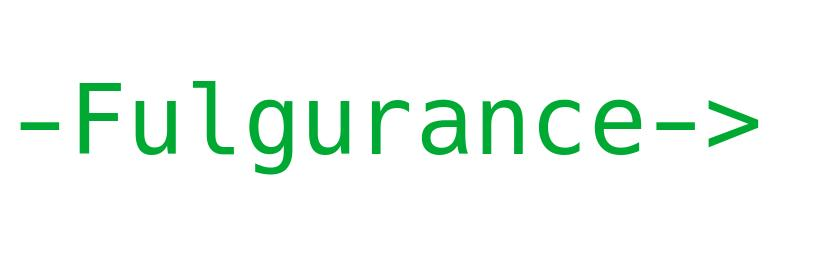

<h1>Fulgurance</h1>

<strong>Modern Data Science and ML in pure C++</strong> — a header-only library that unifies
data management, statistics, linear algebra, and machine learning, built entirely from scratch with zero external dependencies.

<h2>Why Fulgurance?</h2>
<ul>
  <li><strong>Header-only</strong>: include it and start using it — no builds, linking, or external tools required.</li>
  <li><strong>From-scratch engine</strong>: custom implementations for DataFrames, matrices, statistical functions and even JSon parsing tools.</li>
  <li><strong>Fast and practical</strong>: efficient CPU algorithms with optional CUDA acceleration for matrix operations.</li>
  <li><strong>Always evolving, never breaking</strong>: Fulgurance expands continuously with new features — especially in machine learning and combinatorial mathematics — while keeping all existing functionality stable.</li>
  <li><strong>Pure C++20+</strong>: designed with modern C++ templates, RAII, and STL-based internals for clarity and performance.</li>
</ul>

<h2>What’s Inside</h2>
<table>
  <thead>
    <tr>
      <th>Domain</th>
      <th>Highlights</th>
    </tr>
  </thead>
  <tbody>
    <tr>
      <td><strong>Data Management</strong></td>
      <td>Full-featured <code>DataFrame</code> with automatic type conversions, flexible transformations, sorting, filtering, joins, and aggregation — all through simple, consistent C++ functions.</td>
    </tr>
    <tr>
      <td><strong>Statistics</strong></td>
      <td>Comprehensive suite of probability distributions (PDF, CDF, quantiles, RNG) and core statistical utilities (mean, variance, correlation, etc.).</td>
    </tr>
    <tr>
      <td><strong>Linear Algebra</strong></td>
      <td>Custom <code>Matrix</code> class with multiple CPU algorithms and GPU acceleration via CUDA kernels.</td>
    </tr>
    <tr>
      <td><strong>Machine Learning</strong></td>
      <td>Expanding collection of ML algorithms built directly on Fulgurance’s math layer — fully integrated with data management and statistics.</td>
    </tr>
    <tr>
      <td><strong>Combinatorics & Utilities</strong></td>
      <td>Native tools for permutations, combinations, parsing, binary and date handling, geographical calculations.</td>
    </tr>
  </tbody>
</table>

<em>Documentation:</em> <a href="https://julienlargetpiet.tech/static/files/fulgurance.html">Read the official docs</a>

<h2>Stability & Evolution Policy</h2>

<strong>No breaking changes.</strong> Fulgurance grows by continuous addition — new modules, new functions, and deeper integrations — while keeping existing APIs valid and behavior stable.
Focus areas include <strong>machine learning algorithms</strong> and <strong>combinatorial mathematics for data management</strong>.

<h2>Key Principles</h2>
<ul>
  <li><strong>Readable APIs</strong> — consistent, intuitive function-based design.</li>
  <li><strong>Zero dependencies</strong> — portable and lightweight by design.</li>
  <li><strong>Performance-first</strong> — optimized for efficiency and clarity.</li>
  <li><strong>Backward-compatible growth</strong> — existing code always remains valid.</li>
</ul>

<h2>Roadmap (Always Additive)</h2>
<ul>
  <li>New machine learning algorithms and data utilities.</li>
  <li>Extended combinatorial and statistical modules.</li>
  <li>Enhanced GPU and multi-core computation capabilities.</li>
</ul>

<em>Fulgurance is a living project — a continuously evolving C++ ecosystem for high-performance data science.</em>

